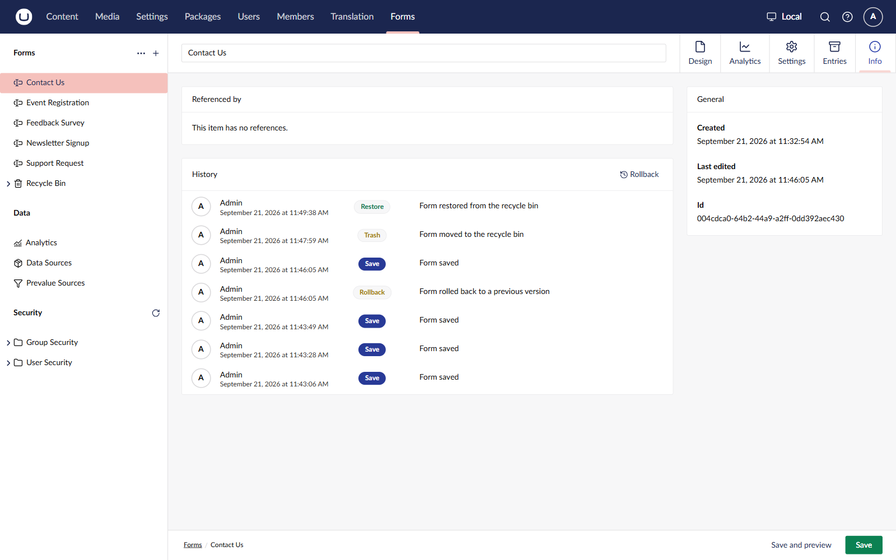

# Form History

Umbraco Forms records each change made to a form. The record is kept for the life of the form and is shown in the backoffice.

## View the history of a form

1. Go to the **Forms** section.
2. Select the form you want to view.
3. Go to the **Info** tab.

The **History** section lists each change, newest first. Each entry shows the date, the user who made the change, and what the change was.

A form that has not changed since it was created shows no entries.

## Types of change

| Change | Description |
| --- | --- |
| Create | The form was created |
| Save | The form was saved |
| Trash | The form was moved to the recycle bin |
| Restore | The form was restored from the recycle bin |
| Rollback | The form was rolled back to an earlier version |
| Delete | The form was permanently deleted |

## Roll back from the history

The **History** section has a **Rollback** action in its header. Selecting the action opens the same window as the **Rollback** entry in the form's **Actions** menu.

For details, see the [Rollback to a Previous Version](rollback-to-a-previous-version.md) article.


The history and the version list are separate. The history records every change to a form, including changes that store no version, such as moving the form to the recycle bin. The version list holds the saved copies you can roll back to.

