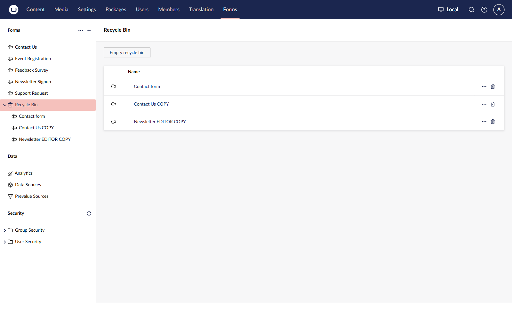
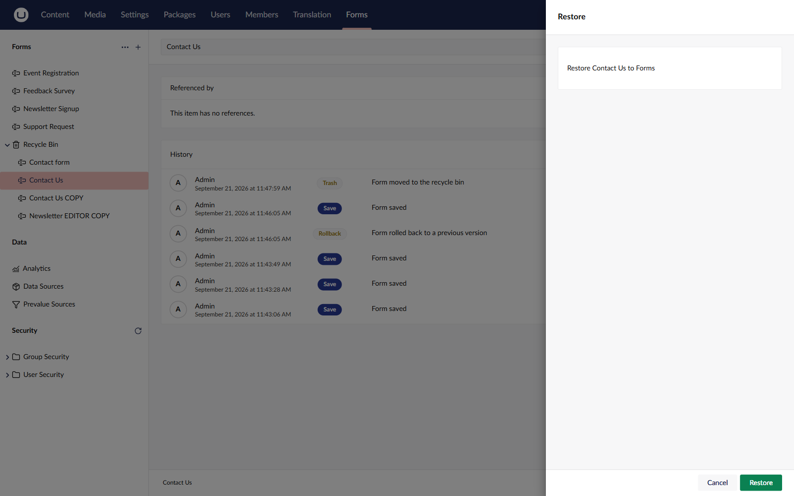

# Recycle Bin

Deleting a form or a folder moves it to the recycle bin. Nothing is removed from the database until you delete it from the bin.

The **Recycle Bin** sits below the form tree in the **Forms** section.

## Move a form or folder to the recycle bin

1. Go to the **Forms** section.
2. Select the form or folder you want to delete.
3. Open the **Actions** menu and select **Trash**.
4. Confirm the move.

Deleting a folder moves the folder and everything inside it to the recycle bin.


A form in the recycle bin no longer renders on your website. A page that uses the form renders nothing in its place, and the Forms API returns a "not found" response for it.

Restore the form, or point the page at another form, to show a form again.


The entries submitted to a form are kept while the form is in the recycle bin.

## Restore a form or folder

1. Go to the **Forms** section.
2. Open the **Recycle Bin**.
3. Select the form or folder you want to restore.
4. Open the **Actions** menu and select **Restore**.
5.  A panel opens, naming the item and the folder it returns to. Select **Restore**.

    

The item returns to the folder it was deleted from. If that folder is itself still in the recycle bin, the item returns to the root of the **Forms** tree instead.

If another form or folder in the destination already uses the same name, Umbraco Forms adds a suffix to keep the names unique.

## Delete a form or folder for good

1. Go to the **Forms** section.
2. Open the **Recycle Bin**.
3. Select the form or folder you want to remove.
4. Open the **Actions** menu and select **Delete**.
5. Confirm the deletion.

To remove everything in the bin at once, open the **Recycle Bin** and select **Empty recycle bin**.


Deleting a form from the recycle bin cannot be undone. The form is removed along with its entries, its workflows, its stored versions, and its user permissions.

Export the entries you need before you delete a form. For details, see the [Viewing and Exporting Entries](../viewing-and-exporting-entries.md) article.

