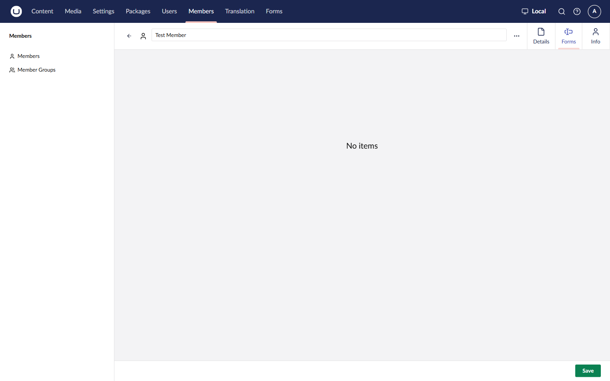
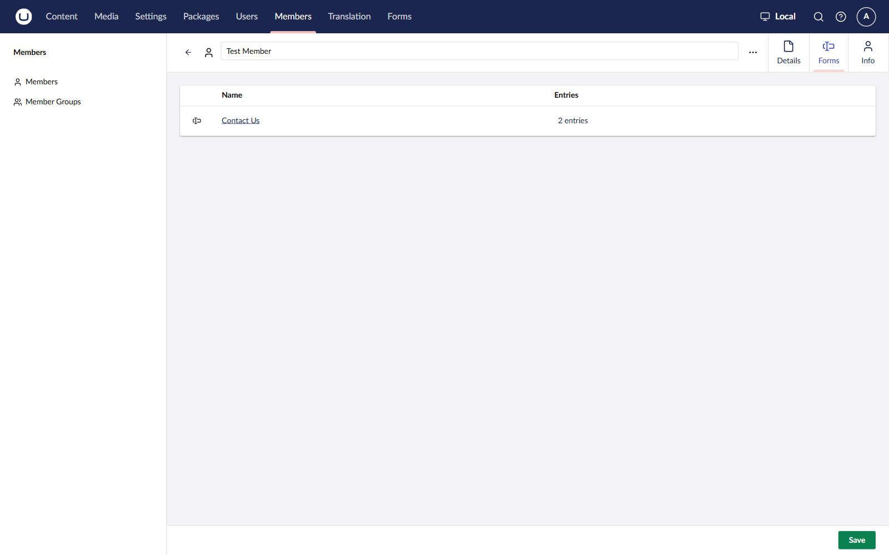

# Member Form Submissions


This feature is available from Umbraco Forms 17.5 and 18.1.


The member editor in the **Members** section includes a **Forms** tab. The tab lists the forms a member has submitted and lets you open their entries without leaving the Members section.

## The Forms tab

Open a member in the **Members** section. The **Forms** tab appears alongside the member's other tabs.

The tab is hidden in two cases:

* The member is new and has not been saved. A new member has no entries.
* You do not have access to the **Forms** section.

## Listing forms

The tab lists every form the member has at least one entry for, with the number of entries per form.

Forms the member has not submitted are not listed. Forms you do not have permission to access are not listed either.

When the member has no entries for any form, the tab shows a standard empty state.

## Navigating to entries

From the list you can drill into the member's activity:

* Select a **form name** to open the form's details in the **Forms** section.
* Select the **entry count**, or **View entries for this form**, to open the member's entries for that form.
* Select an **entry** to open the entry details.

The entries and entry details reuse the same views as [Viewing And Exporting Entries](../viewing-and-exporting-entries.md), filtered to the current member.

## Permissions

The Forms tab respects Forms permissions.

* The tab is hidden when you do not have access to the **Forms** section.
* Forms you cannot access are filtered out of the list on the server, so they are never shown or navigable.
