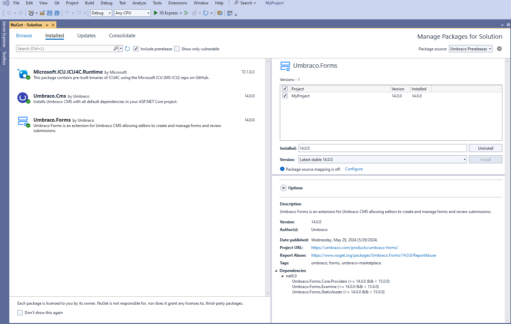

# Upgrading Umbraco Forms

This article shows how to manually upgrade Umbraco Forms to run the latest version.

When upgrading Umbraco Forms, be sure to also consult the [version specific upgrade notes](version-specific.md) to learn about potential breaking changes and common pitfalls.

## Get the latest version of Umbraco Forms

To get the latest version of Umbraco Forms, you can upgrade using:

* [NuGet](manualupgrade.md#nuget)
* [Visual Studio](manualupgrade.md#visual-studio)

### NuGet

* NuGet installs the latest version of the package when you use the `dotnet add package Umbraco.Forms` command unless you specify a package version: `dotnet add package Umbraco.Forms --version <VERSION>`
* After you have added a package reference to your project by executing the `dotnet add package Umbraco.Forms` command in the directory that contains your project file, run `dotnet restore` to install the package.

### Visual Studio

1. Go to `Tools` -> `NuGet Package Manager` -> `Manage NuGet Packages for Solution...` in Visual Studio, to upgrade your Forms:
2. Select **Umbraco.Forms**.
3. Select the latest version from the **Version** drop-down and click **Install**.

<figure><figcaption></figcaption></figure>

4. When the command completes, open the **.csproj** file to make sure the package reference is updated:

```xml
<ItemGroup>
  <PackageReference Include="Umbraco.Forms" Version="xx.x.x" />
</ItemGroup>
```
