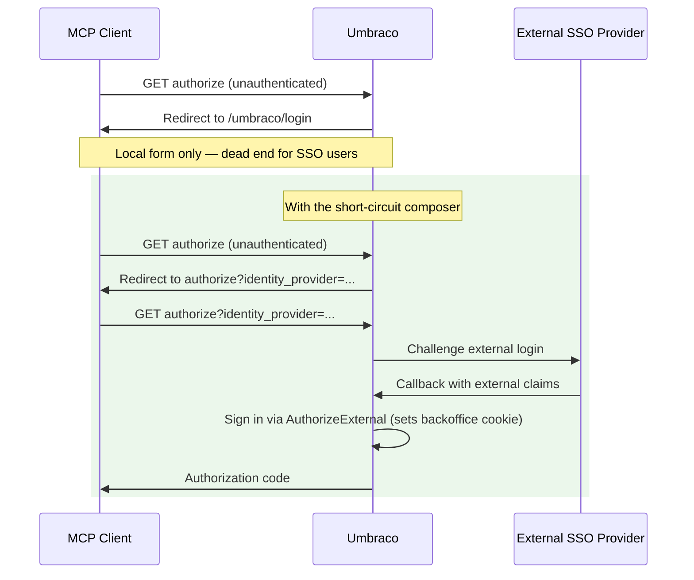

# External Login Short Circuit

This composer fixes a cold-start authentication problem. It affects any Umbraco backoffice that signs users in through an external SSO provider, not only Umbraco Cloud.

Umbraco Cloud is used below as the worked example (`identity.umbraco.com`), because it's the most common case. If your backoffice uses a different external identity provider, the same technique applies — adapt the code to your provider's scheme name.


If your backoffice only ever uses local Umbraco username/password login, you don't need this composer. The standalone login form already works for that case.



Deploying a pre-built Editor or Developer MCP on Umbraco Cloud? [`Umbraco.Mcp.HostedAuth`](../../../hosted-mcp-setup/cloud-quickstart.md) applies this short-circuit for you automatically — no composer needed. The manual approach below is for building a custom MCP server, or for a non-Cloud SSO provider the package doesn't know about.


## The Problem

The standalone Umbraco login page (`/umbraco/login`) only renders the local username/password form — it doesn't render external providers. A hosted MCP client's first authorization request hits this page unauthenticated. A user signing in via external SSO gets stuck on a form they can't use.



The composer intercepts the dead-end redirect and bounces the user back to the same authorize URL with `identity_provider=<your-scheme>` appended (`Umbraco.UmbracoId` for Cloud). That second request routes through `BackOfficeController.AuthorizeExternal`, which challenges the external provider, converts the resulting claims into a backoffice cookie sign-in, and completes the OAuth flow. Challenging the provider directly (skipping `AuthorizeExternal`) never sets that cookie and causes an authentication loop instead.

## Add the Composer

Create a file in your Umbraco project (for example, `McpExternalLoginShortCircuitComposer.cs`). The example below targets Umbraco Cloud's `Umbraco.UmbracoId` scheme — replace `ExternalLoginScheme` with your own provider's scheme name if you're not on Cloud.


```csharp
using Microsoft.AspNetCore.Authentication;
using Microsoft.AspNetCore.Authentication.Cookies;
using Microsoft.AspNetCore.Http;
using Microsoft.AspNetCore.WebUtilities;
using Microsoft.Extensions.DependencyInjection;
using Microsoft.Extensions.Logging;
using Microsoft.Extensions.Options;
using Umbraco.Cms.Core;
using Umbraco.Cms.Core.Composing;
using Umbraco.Cms.Core.DependencyInjection;

public class McpExternalLoginShortCircuitComposer : IComposer
{
    public void Compose(IUmbracoBuilder builder)
    {
        builder.Services
            .AddSingleton<IPostConfigureOptions<CookieAuthenticationOptions>,
                McpExternalLoginShortCircuitCookieOptions>();
    }
}

internal sealed class McpExternalLoginShortCircuitCookieOptions
    : IPostConfigureOptions<CookieAuthenticationOptions>
{
    private const string OAuthAuthorizePath =
        "/umbraco/management/api/v1/security/back-office/authorize";

    private const string IdentityProviderParam = "identity_provider";

    // Registered by Umbraco.Cloud.Cms via AddUmbracoId.
    private const string ExternalLoginScheme = "Umbraco.UmbracoId";

    private readonly ILogger<McpExternalLoginShortCircuitCookieOptions> _logger;

    public McpExternalLoginShortCircuitCookieOptions(
        ILogger<McpExternalLoginShortCircuitCookieOptions> logger)
    {
        _logger = logger;
    }

    public void PostConfigure(string? name, CookieAuthenticationOptions options)
    {
        if (name != Constants.Security.BackOfficeAuthenticationType)
        {
            return;
        }

        Func<RedirectContext<CookieAuthenticationOptions>, Task> previousLogin =
            options.Events.OnRedirectToLogin;

        options.Events.OnRedirectToLogin = ctx =>
        {
            string path = ctx.Request.Path.Value ?? string.Empty;
            bool isOAuthAuthorize = path.StartsWith(
                OAuthAuthorizePath,
                StringComparison.OrdinalIgnoreCase);
            bool isHtmlGet = HttpMethods.IsGet(ctx.Request.Method)
                && ctx.Request.Headers.Accept.ToString().Contains(
                    "text/html",
                    StringComparison.OrdinalIgnoreCase);
            bool alreadyHasIdentityProvider =
                ctx.Request.Query.ContainsKey(IdentityProviderParam);

            if (!isOAuthAuthorize || !isHtmlGet || alreadyHasIdentityProvider)
            {
                return previousLogin(ctx);
            }

            string pathAndQuery = ctx.Request.Path + ctx.Request.QueryString;
            string redirectUrl = QueryHelpers.AddQueryString(
                pathAndQuery,
                IdentityProviderParam,
                ExternalLoginScheme);

            _logger.LogInformation(
                "[McpAuth] Adding identity_provider to OAuth authorize. Redirect={RedirectUrl}",
                redirectUrl);

            ctx.Response.Redirect(redirectUrl);
            return Task.CompletedTask;
        };
    }
}
```


## Scope of the Interception

The composer only rewrites the redirect when all three conditions are met:

| Condition | Reason |
|-----------|--------|
| The path starts with `/umbraco/management/api/v1/security/back-office/authorize` | Limits the rewrite to the OAuth authorize endpoint |
| The request is an HTML `GET` (`Accept: text/html`) | Targets browser requests, not API or AJAX calls |
| `identity_provider` is not already in the query string | Prevents redirect loops when `AuthorizeExternal` falls back to the default |

Other unauthenticated requests fall through to the previous `OnRedirectToLogin` handler, which preserves the default behaviour for non-MCP traffic.

## Troubleshooting

### Cold-start authentication lands on the local username and password form

**Cause**: The composer is not registered, or (on Cloud) `Umbraco.Cloud.Cms` is not installed in the project.

**Fix**: Confirm the composer file is present in the project and, on Cloud, that the project references `Umbraco.Cloud.Cms`. Restart the project and try again.

### Authentication loops between the project's authorize endpoint and the external provider

**Cause**: The OIDC callback is not converting the external sign-in to a backoffice cookie. The composer might be challenging the OIDC scheme directly instead of routing through `AuthorizeExternal`.

**Fix**: Confirm the composer appends `identity_provider=<your-scheme>` to the redirect URL. Direct OIDC challenges bypass the cookie sign-in and cause the loop.

## Related Articles

- [Umbraco Setup](umbraco-setup.md) — register the OAuth client used by the Worker.
- [URL-Based Routing](url-based-routing.md) — connect multiple Cloud projects through one hosted Worker.
