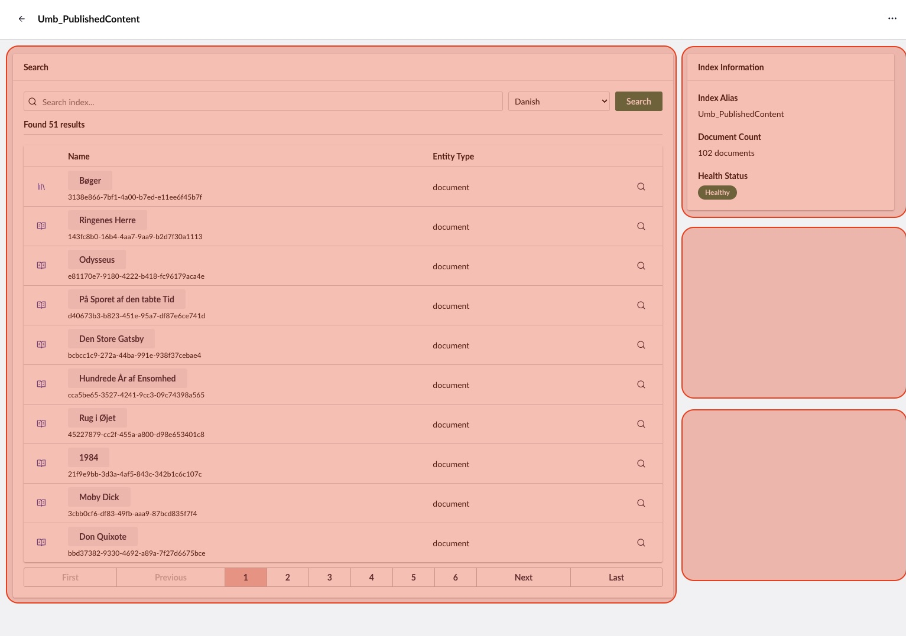

---
description: >-
  Developer guide for adding detail boxes, entity actions, workspace views, and routable modals.
---

# Extending the search backoffice

This guide is for **extension developers** and **search provider developers** who want to add custom UI to the Umbraco Search backoffice.

## Adding a detail box to the search workspace

<figure>
    
    <figcaption><p>The marked areas illustrate locations of search index detail boxes.</p></figcaption>
</figure>

The index detail view uses an extension slot for composable UI. You can register a `searchIndexDetailBox` extension to add a custom box to any index's detail page.

### The `ManifestSearchIndexDetailBox` type

```typescript
interface ManifestSearchIndexDetailBox extends ManifestElement, ManifestWithDynamicConditions {
  type: 'searchIndexDetailBox';
  meta?: MetaSearchIndexDetailBox;
}

interface MetaSearchIndexDetailBox {
  label?: string;
  column?: 'left' | 'right';
}
```

- `label` - The box heading. Supports localization keys (for example `#myPackage_myLabel`).
- `column` - Which column to place the box in. `'left'` places it in the main content column; omitting or setting `'right'` places it in the sidebar column.

### Registering a detail box manifest

```typescript
export const manifests: Array<UmbExtensionManifest> = [
  {
    type: 'searchIndexDetailBox',
    alias: 'My.SearchIndexDetailBox.Custom',
    name: 'My Custom Detail Box',
    weight: 50,
    element: () => import('./my-custom-box.element.js'),
    meta: {
      label: 'My Custom Box',
      column: 'right',
    },
  },
];
```

### Creating the box element


```typescript
import { UMB_SEARCH_WORKSPACE_CONTEXT } from '@umbraco-cms/search/settings';
import { css, customElement, html, state } from '@umbraco-cms/backoffice/external/lit';
import { UmbLitElement } from '@umbraco-cms/backoffice/lit-element';

@customElement('my-custom-box')
export class MyCustomBoxElement extends UmbLitElement {
  @state()
  private _documentCount?: number;

  @state()
  private _healthStatus?: string;

  constructor() {
    super();

    this.consumeContext(UMB_SEARCH_WORKSPACE_CONTEXT, (context) => {
      // The index alias (unique identifier)
      const indexAlias = context.getUnique();

      // Observable properties
      this.observe(context.documentCount, (count) => {
        this._documentCount = count;
      });
      this.observe(context.healthStatus, (status) => {
        this._healthStatus = status;
      });
    });
  }

  override render() {
    return html`
      <uui-box>
        <p>Documents: ${this._documentCount ?? 'Loading...'}</p>
        <p>Health: ${this._healthStatus ?? 'Loading...'}</p>
      </uui-box>
    `;
  }
}
```


### Workspace context properties

The `UMB_SEARCH_WORKSPACE_CONTEXT` provides the following observables and methods:

| Property / Method | Type | Description |
|-------------------|------|-------------|
| `documentCount` | Observable | Number of documents in the index |
| `healthStatus` | Observable | Current health status string |
| `state` | Observable | UI state (`'idle'`, `'loading'`, `'error'`) |
| `selectedCulture` | Observable | Currently selected culture |
| `getUnique()` | Method | Returns the index alias |
| `getSelectedCulture()` | Method | Returns the current culture string |
| `setSelectedCulture(culture)` | Method | Sets the selected culture |
| `setState(state)` | Method | Sets the UI state |

### Two-column layout

The detail view renders two columns:

- **Left column** (`column: 'left'`) - The main content area (wider). Used for the search box.
- **Right column** (`column: 'right'` or omitted) - The sidebar (350px). Used for the stats box.

## Adding an entity action to search documents

> [!NOTE]
> `entityAction` is a standard Umbraco extension type. See the [official Umbraco docs](https://docs.umbraco.com/umbraco-cms/customizing/extending-overview/extension-types/entity-actions) for the full API. This section covers what is specific to Umbraco Search.

### Search entity types

Umbraco Search defines two entity types for entity actions:

| Entity type | Constant | Used for                                         |
|-------------|----------|--------------------------------------------------|
| `search-document` | `UMB_SEARCH_DOCUMENT_ENTITY_TYPE` | Per-document actions in the search results table |
| `search-index` | `UMB_SEARCH_INDEX_ENTITY_TYPE` | Per-index actions (for example Rebuild Index)    |

These constants are exported from `@umbraco-cms/search/global`.

### Registering a document entity action

```typescript
import { UMB_SEARCH_DOCUMENT_ENTITY_TYPE } from '@umbraco-cms/search/global';

export const manifests: Array<UmbExtensionManifest> = [
  {
    type: 'entityAction',
    kind: 'default',
    alias: 'My.EntityAction.SearchDocument',
    name: 'My Search Document Action',
    weight: 100,
    api: () => import('./my-action.js'),
    forEntityTypes: [UMB_SEARCH_DOCUMENT_ENTITY_TYPE],
    meta: {
      icon: 'icon-search',
      label: 'My Action',
      additionalOptions: false,
    },
  },
];
```

The `forEntityTypes` array determines where the action appears. Use `'search-document'` for per-document actions in the results table, or `'search-index'` for per-index actions in the collection and workspace header.

### Consuming workspace context from an entity action

Entity actions can access the workspace context to get the current index alias and selected culture:


```typescript
import { UmbEntityActionBase } from '@umbraco-cms/backoffice/entity-action';
import { UMB_SEARCH_WORKSPACE_CONTEXT } from '@umbraco-cms/search/settings';

export class MySearchDocumentEntityAction extends UmbEntityActionBase<never> {
  override async execute() {
    // The document unique (ID) from the table row
    const documentUnique = this.args.unique;

    // Get the workspace context for the index alias and culture
    const workspaceContext = await this.getContext(UMB_SEARCH_WORKSPACE_CONTEXT);
    const indexAlias = workspaceContext?.getUnique();
    const culture = workspaceContext?.getSelectedCulture();

    // ... perform your action
  }
}

export default MySearchDocumentEntityAction;
```


### Using `getHref()` for routable links

If your entity action should render as a navigable link (rather than triggering an immediate action), implement `getHref()` instead of `execute()`. This allows `umb-entity-actions-table-column-view` to render it as a standard `<a>` link:

```typescript
export class MyRoutableEntityAction extends UmbEntityActionBase<never> {
  override async getHref() {
    const unique = this.args.unique;
    // Return a URL string
    return `/some/path/${unique}`;
  }

  override execute(): Promise<void> {
    // No-op when using getHref()
    return Promise.resolve(undefined);
  }
}
```

See [Routable modals](#routable-modals) for a complete example using this pattern.

The Examine provider's "Show Fields" action ([`show-fields.entity-action.ts`](../src/Umbraco.Cms.Search.Provider.Examine/Client/src/show-fields.entity-action.ts)) is a real-world reference implementation.

## Adding a workspace view to the search workspace

> [!NOTE]
> `workspaceView` is a standard Umbraco extension type. See the [official Umbraco docs](https://docs.umbraco.com/umbraco-cms) for the full API. This section covers what is specific to Umbraco Search.

A workspace view adds an entirely new tab to the search workspace. Use this when you need a full-page view rather than a box within the existing "Details" tab.

### Registering a workspace view

Target the search workspace using the `UMB_WORKSPACE_CONDITION_ALIAS` condition:

```typescript
import { UMB_SEARCH_WORKSPACE_ALIAS } from '@umbraco-cms/search/global';
import { UMB_WORKSPACE_CONDITION_ALIAS } from '@umbraco-cms/backoffice/workspace';

export const manifests: Array<UmbExtensionManifest> = [
  {
    type: 'workspaceView',
    alias: 'My.WorkspaceView.Search.Analytics',
    name: 'Search Analytics View',
    element: () => import('./my-analytics-view.element.js'),
    weight: 100,
    meta: {
      label: 'Analytics',
      pathname: 'analytics',
      icon: 'icon-chart',
    },
    conditions: [
      {
        alias: UMB_WORKSPACE_CONDITION_ALIAS,
        match: UMB_SEARCH_WORKSPACE_ALIAS,
      },
    ],
  },
];
```

The `match` value must be `'Umbraco.Search.Workspace'` (or use the `UMB_SEARCH_WORKSPACE_ALIAS` constant from `@umbraco-cms/search/global`).

### Creating the view element


```typescript
import { UMB_SEARCH_WORKSPACE_CONTEXT } from '@umbraco-cms/search/settings';
import { customElement, html, state } from '@umbraco-cms/backoffice/external/lit';
import { UmbLitElement } from '@umbraco-cms/backoffice/lit-element';

@customElement('my-analytics-view')
export class MyAnalyticsViewElement extends UmbLitElement {
  @state()
  private _indexAlias?: string;

  constructor() {
    super();

    this.consumeContext(UMB_SEARCH_WORKSPACE_CONTEXT, (context) => {
      this._indexAlias = context.getUnique();
    });
  }

  override render() {
    return html`<p>Analytics for index: ${this._indexAlias}</p>`;
  }
}
```


### Workspace view vs. detail box

| Aspect | Workspace View | Detail Box |
|--------|---------------|------------|
| Appears as | A new tab in the workspace | A box within the "Details" tab |
| Extension type | `workspaceView` | `searchIndexDetailBox` |
| Use when | You need a full-page layout | You need a compact summary widget |

## Routable modals

For provider developers who need deep-linkable modals (for example viewing detailed document information), Umbraco Search supports a routable modal pattern. This uses a non-visual `searchIndexDetailBox` as a route registration host, combined with an entity action that provides navigable URLs.

### The three pieces

#### 1. Route provider element

A non-visual element registered as a `searchIndexDetailBox` that sets up the modal route:


```typescript
import type { MyModalData } from './types.js';
import { UmbModalRouteRegistrationController } from '@umbraco-cms/backoffice/router';
import type { UmbModalRouteBuilder } from '@umbraco-cms/backoffice/router';
import { UMB_ENTITY_WORKSPACE_CONTEXT } from '@umbraco-cms/backoffice/workspace';
import { customElement, nothing } from '@umbraco-cms/backoffice/external/lit';
import { UmbLitElement } from '@umbraco-cms/backoffice/lit-element';

const MODAL_ALIAS = 'My.Modal.DocumentDetails';

/** Module-level export shared with the entity action for URL construction. */
export let myRouteBuilder: UmbModalRouteBuilder | undefined;

@customElement('my-route-provider')
export class MyRouteProviderElement extends UmbLitElement {
  constructor() {
    super();

    this.consumeContext(UMB_ENTITY_WORKSPACE_CONTEXT, (context) => {
      const indexAlias = context.getUnique();

      new UmbModalRouteRegistrationController<MyModalData>(this, MODAL_ALIAS)
        .addAdditionalPath(':documentUnique/:culture')
        .onSetup((params) => ({
          modal: { type: 'sidebar', size: 'large' },
          data: {
            documentUnique: params.documentUnique,
            indexAlias: indexAlias ?? '',
            culture: params.culture,
          },
          value: undefined,
        }))
        .observeRouteBuilder((routeBuilder) => {
          myRouteBuilder = routeBuilder ?? undefined;
        });
    });
  }

  override disconnectedCallback() {
    super.disconnectedCallback();
    myRouteBuilder = undefined;
  }

  override render() {
    return nothing;
  }
}
```


Key points:
- The element renders `nothing` &mdash; it exists solely to register the modal route.
- The route builder is exported as a **module-level variable** so the entity action can import it directly.
- `addAdditionalPath()` takes a **single string** with all parameters combined (for example `':documentUnique/:culture'`). Calling it twice overwrites the first value.
- It is cleaned up in `disconnectedCallback()`.

#### 2. Modal manifest

Register the modal as a standard Umbraco modal extension:

```typescript
export const manifests: Array<UmbExtensionManifest> = [
  // The non-visual route provider (registered as searchIndexDetailBox)
  {
    type: 'searchIndexDetailBox',
    alias: 'My.RouteProvider',
    name: 'My Route Provider',
    weight: 0,
    element: () => import('./my-route-provider.element.js'),
  },
  // The modal itself
  {
    type: 'modal',
    alias: 'My.Modal.DocumentDetails',
    name: 'My Document Details Modal',
    element: () => import('./my-modal.element.js'),
  },
];
```

The route provider is registered as a `searchIndexDetailBox` so it loads inside the detail view, where it has access to the workspace context.

#### 3. Entity action with `getHref()`


```typescript
import { myRouteBuilder } from './my-route-provider.element.js';
import { UmbEntityActionBase } from '@umbraco-cms/backoffice/entity-action';
import { UMB_SEARCH_WORKSPACE_CONTEXT } from '@umbraco-cms/search/settings';

export class MyDocumentDetailsEntityAction extends UmbEntityActionBase<never> {
  override async getHref() {
    const unique = this.args.unique ?? null;
    if (!unique) return '#';

    const workspaceContext = await this.getContext(UMB_SEARCH_WORKSPACE_CONTEXT);
    const culture = workspaceContext?.getSelectedCulture() ?? 'none';

    return myRouteBuilder?.({ documentUnique: unique, culture }) ?? '#';
  }

  override execute(): Promise<void> {
    return Promise.resolve(undefined);
  }
}
```


The entity action imports `myRouteBuilder` directly from the route provider module and calls it with the required parameters to generate a URL. Using `getHref()` renders the action as a navigable link.

### Why this pattern?

- **Deep linking**: Modal URLs include parameters, so users can bookmark or share links directly to a document's detail view.
- **Module-level route builder**: The route builder is exported at module level (not via a context or event bus) because the entity action and route provider are always loaded together as part of the same bundle. This is the simplest way to share the builder.
- **Non-visual `searchIndexDetailBox`**: Registering the route provider as a detail box ensures it loads inside the workspace context, where it has access to the index alias via `UMB_ENTITY_WORKSPACE_CONTEXT`.

The Examine provider's implementation ([`fields-route-provider.element.ts`](../src/Umbraco.Cms.Search.Provider.Examine/Client/src/fields-route-provider.element.ts) and [`show-fields.entity-action.ts`](../src/Umbraco.Cms.Search.Provider.Examine/Client/src/show-fields.entity-action.ts)) is a complete working reference.

## Cross-package type augmentation

When building a search provider as a separate npm package/bundle, you need to make TypeScript recognize extension types defined in the Core Client (like `searchIndexDetailBox`).

### Declaring the extension type

Add a global type augmentation in your manifests file:

```typescript
import type { ManifestElement } from '@umbraco-cms/backoffice/extension-api';

// Make TypeScript recognize the searchIndexDetailBox type in this package
declare global {
  interface UmbExtensionManifestMap {
    mySearchIndexDetailBox: ManifestElement & { type: 'searchIndexDetailBox' };
  }
}

export const manifests: Array<UmbExtensionManifest> = [
  {
    type: 'searchIndexDetailBox',
    alias: 'My.SearchIndexDetailBox',
    name: 'My Detail Box',
    element: () => import('./my-box.element.js'),
  },
  // ... other manifests
];
```

This is a minimal declaration &mdash; it does not import Core Client types, just tells TypeScript that `'searchIndexDetailBox'` is a valid extension type.

### tsconfig path mappings

To import from `@umbraco-cms/search/settings` (for example `UMB_SEARCH_WORKSPACE_CONTEXT`) in your provider package, add path mappings in your `tsconfig.json`:

```json
{
  "compilerOptions": {
    "paths": {
      "@umbraco-cms/search/settings": [
        "../../Umbraco.Cms.Search.Core.Client/Client/src/settings/index.ts"
      ],
      "@umbraco-cms/search/global": [
        "../../Umbraco.Cms.Search.Core.Client/Client/src/global/index.ts"
      ]
    }
  }
}
```

Both `settings` and `global` paths are required because `settings` depends on `global` transitively. Adjust the relative paths to match your project layout.

At build time, Vite externalizes `@umbraco-cms/*` imports (they are not bundled). At runtime, the browser resolves them via the Core Client's importmap.

