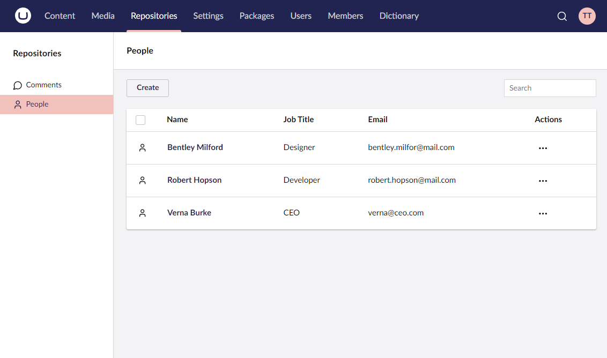

# Umbraco UI Builder Documentation

Umbraco UI Builder is a tool for creating custom Backoffice User Interfaces (UIs) in Umbraco using a fluent API.

If you have a custom data store that you want to manage within Umbraco, you can use Umbraco UI Builder. With few lines of code, you can configure a custom administration UI, and reuse many core components with a consistent look and feel.

With Umbraco UI Builder, custom backoffice integrations can now be set up in minutes rather than days.

## Using The Documentation

This documentation is intended for **developers** with a basic understanding of Umbraco and C#/MVC principles.

If you are new to Umbraco UI Builder, it is recommended to start with the [Getting Started](getting-started/requirements.md) section. This section covers system requirements and installation instructions.

Once you have Umbraco UI Builder installed, explore the [Guides](guides/creating-your-first-integration.md) section. This section provides a quick-start example on configuring Umbraco UI Builder.

Use the main menu to explore features in detail and navigate directly to topics of interest.

For additional resources and best practices, visit the [Miscellaneous](miscellaneous/conventions.md) section.

## Getting Help

If you need assistance, refer to our support channels for help and troubleshooting.
