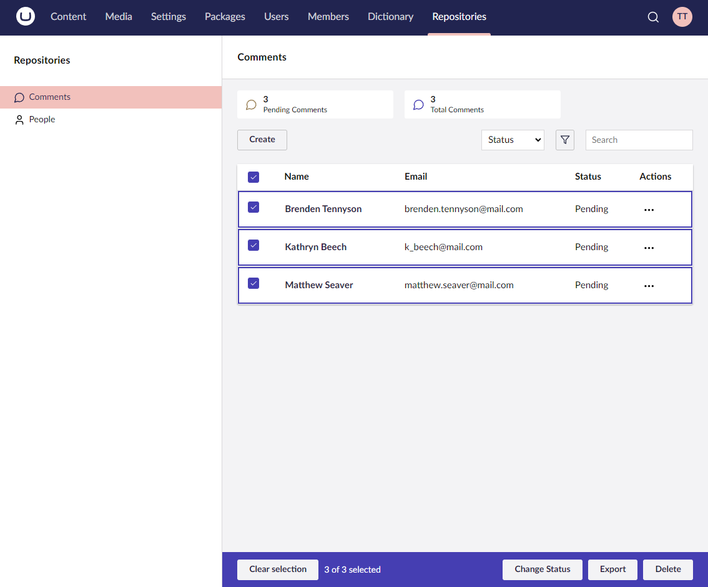

# Actions

Actions allow you to perform custom tasks on collections and their entities from different areas in the UI. For Example: menu actions, bulk actions, or individual table row actions.

To get started with actions, check out the basics:


[the-basics.md](the-basics.md)

