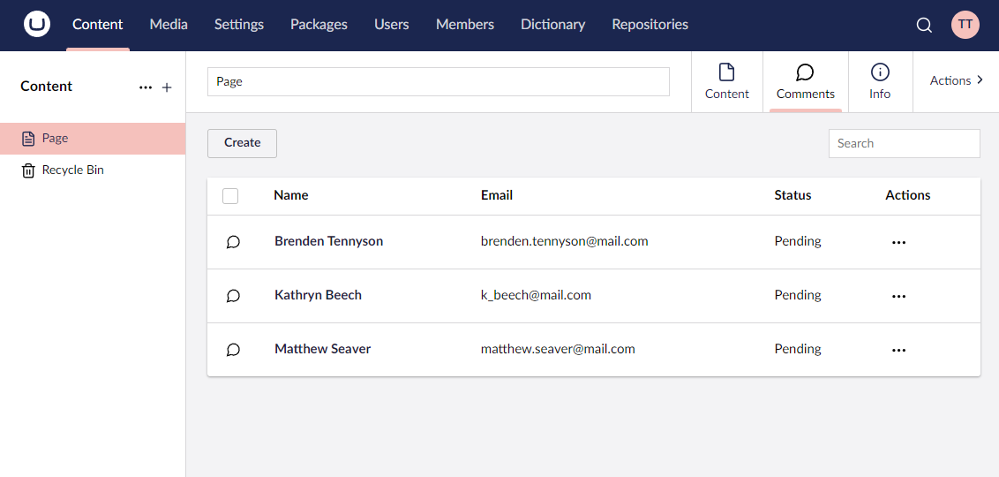

# Context Apps

Context Apps in Umbraco UI Builder function similarly to Workspace Views (previously called as Content Apps). They provide contextual applications within the content editor UI. By defining context apps, you can expose collections that are directly related to the content in question. For example, blog post comments can be linked to their respective blog posts and managed in context through a Workspace View.



## Defining a Context App

You can define a context app by calling one of the `AddContextApp` methods on a [`WithTreeConfigBuilder`](trees.md#extending-an-existing-tree) instance.

### Using the `AddContextApp()` Method

Adds a context app with the specified name and default icon.

#### Method Syntax

```cs
AddContextApp(string name, Lambda contextAppConfig = null) : ContextAppConfigBuilder
```

#### Example

```csharp
withTreeConfig.AddContextApp("Comments", contextAppConfig => {
    ...
});
```

### Using the `AddContextApp()` Method with Custom Icon

Adds a context app with the specified name and custom icon.

#### Method Syntax

```cs
AddContextApp(string name, string icon, Lambda contextAppConfig = null) : ContextAppConfigBuilder
```

#### Example

```csharp
withTreeConfig.AddContextApp("Comments", "icon-chat", contextAppConfig => {
    ...
});
```

### Using the `AddContextAppBefore()` Method

Adds a context app with the specified name and default icon before another context app specified by its alias.

#### Method Syntax

```cs
AddContextAppBefore(string beforeAlias, string name, Lambda contextAppConfig = null) : ContextAppConfigBuilder
```

#### Example

```csharp
withTreeConfig.AddContextAppBefore("umbContent", "Comments", contextAppConfig => {
    ...
});
```

### Using the `AddContextAppBefore()` Method with a Custom Icon

Adds a context app with the specified name and custom icon before another context app specified by its alias.

#### Method Syntax

```cs
AddContextAppBefore(string beforeAlias, string name, string icon, Lambda contextAppConfig = null) : ContextAppConfigBuilder
```

#### Example

```csharp
withTreeConfig.AddContextAppBefore("umbContent", "Comments", "icon-chat", contextAppConfig => {
    ...
});
```

### Using the `AddContextAppAfter()` Method

Adds a context app with the specified name and default icon after another context app specified by its alias.

#### Method Syntax

```cs
AddContextAppAfter(string afterAlias, string name, Lambda contextAppConfig = null) : ContextAppConfigBuilder
```

#### Example

```csharp

withTreeConfig.AddContextAppAfter("umbContent", "Comments", contextAppConfig => {
    ...
});
```

### Using the `AddContextAppAfter()` Method with a Custom Icon

Adds a context app with the specified name and custom icon after another context app specified by its alias.

#### Method Syntax

```cs
AddContextAppAfter(string afterAlias, string name, string icon, Lambda contextAppConfig = null) : ContextAppConfigBuilder
```

#### Example

```csharp
withTreeConfig.AddContextAppAfter("umbContent", "Comments", "icon-chat", contextAppConfig => {
    ...
});
```

## Changing a Context App Alias

### Using the `SetAlias()` Method

Sets the alias of the context app. By default, an alias is automatically generated from the context app's name. You can use the `SetAlias` method to specify a custom alias.
 
#### Method Syntax

```cs
SetAlias(string alias) : ContextAppConfigBuilder
```

#### Example

```csharp
contextAppConfig.SetAlias("comments");
```

## Changing a Context App Icon Color

### Using the `SetIconColor()` Method

Sets the context app icon color to the given color. The available colors are: `black`, `green`, `yellow`, `orange`, `blue` or `red`.

#### Method Syntax

```cs
SetIconColor(string color) : ContextAppConfigBuilder
```

#### Example

````csharp
contextAppConfig.SetIconColor("blue");
````

## Changing Context App Visibility

Context app visibility is controlled by a delegate that takes a `ContextAppVisibilityContext` instance. This method contains a `Source` property which holds a reference to the source object that the Workspace View is being displayed on (i.e., an `IContent` instance). It also holds a reference to a `UserGroups` collection of the currently logged-in user's user groups. You can use these values to determine when the context app should be displayed.

By default, context apps are pre-filtered to only appear on the tree they are defined in. This default behavior is combined with the SetVisibility configuration to control visibility.

### Using the `SetIconColor()` Method

Defines the visibility of the context app based on a delegate expression.

#### Method Syntax

```cs
SetVisibility(Func<ContextAppVisibilityContext, bool> visibilityExpression) : ContextAppConfigBuilder
```

#### Example

````csharp
contextAppConfig.SetVisibility(appCtx => appCtx.Source is IContent content && content.ContentType.Alias == "blogPost");
````

## Adding a Collection to a Context App

Context apps can consist of one or more collections. If a context app contains multiple collections, the collection list views will be displayed in tabs within the context app.

### Using the `AddCollection<>()` Method

Adds a collection to the current context app with the specified names, descriptions, and default icons. Each collection requires an ID field and a foreign key field, linking to Umbraco node UDI values. For more details, see the [Collections](../collections/overview.md) article.

#### Method Syntax

```cs
AddCollection<TEntityType>(
    Lambda idFieldExpression, 
    Lambda fkFieldExpression, 
    string nameSingular, 
    string namePlural, 
    string description, 
    Lambda collectionConfig = null
) : ContextAppConfigBuilder
```

#### Example

```csharp
contextAppConfig.AddCollection<Comment>(
    p => p.Id, 
    p => "Comment", 
    "Comments", 
    "A collection of comments", 
    collectionConfig => {
        // Collection configuration here
    }
);
```

### Using the `AddCollection<>()` Method with Custom Icon

**AddCollection&lt;TEntityType&gt;(Lambda idFieldExpression, Lambda fkFieldExpression, string nameSingular, string namePlural, string description, string iconSingular, string iconPlural, Lambda collectionConfig = null) : ContextAppConfigBuilder**

Adds a collection to the current context app with the specified names, descriptions, and custom icons. Each collection requires an ID field and a foreign key field, linking to Umbraco node UDI values. For more details, see the [Collections](../collections/overview.md) article.

#### Method Syntax

```cs
AddCollection<TEntityType>(
    Lambda idFieldExpression, 
    Lambda fkFieldExpression, 
    string nameSingular, 
    string namePlural, 
    string description, 
    string iconSingular, 
    string iconPlural, 
    Lambda collectionConfig = null
) : ContextAppConfigBuilder
```

#### Example

```csharp
contextAppConfig.AddCollection<Comment>(
    p => p.Id, 
    "Comment", 
    "Comments", 
    "A collection of comments", 
    "icon-chat", 
    "icon-chat", 
    collectionConfig => {
        // Collection configuration here
    }
);
```
