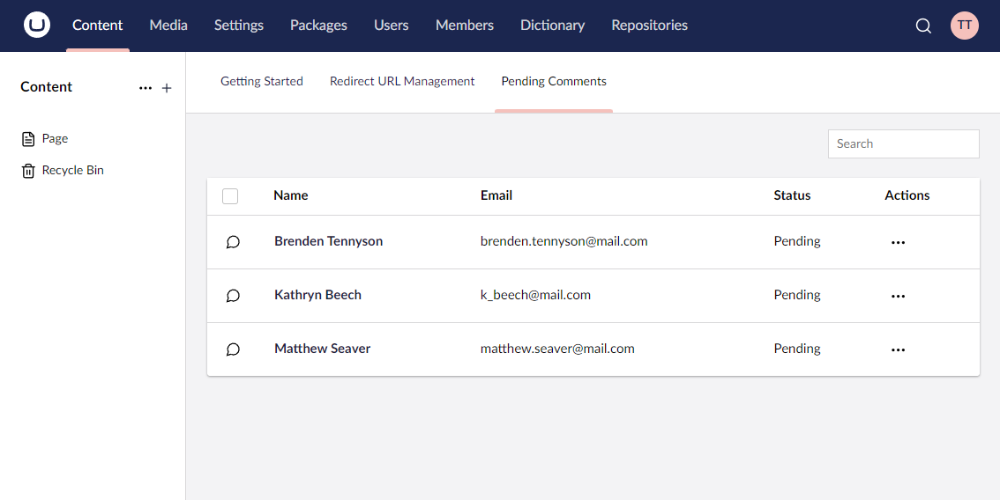

# Dashboards

Dashboards in Umbraco UI Builder provide an intuitive way to present important information and tools at the root of a section within the Umbraco backoffice. They serve as a starting point for users, offering quick access to relevant data, insights, or actions. Dashboards can be customized, reordered, and configured to display for specific user groups, making them a flexible tool for enhancing the backoffice experience. When multiple dashboards are available in a section, they appear in a tabbed layout for navigation.



## Defining a Dashboard

You can define a dashboard by calling one of the `AddDashboard` methods on a [`SectionConfigBuilder`](sections.md) or a [`WithSectionConfigBuilder`](sections.md#extending-existing-sections) instance.

### Using the `AddDashboard()` Method

Adds a dashboard with the specified name.

#### Method Syntax

```cs
AddDashboard(string name, Lambda dashboardConfig = null) : DashboardConfigBuilder
```

#### Example

```csharp
sectionConfig.AddDashboard("Team", dashboardConfig => {
    ...
});
```

### Using the `AddDashboardBefore()` Method

Adds a dashboard with the specified name before the dashboard with the given alias.

#### Method Syntax

```cs
AddDashboardBefore(string beforeAlias, string name, Lambda dashboardConfig = null) : DashboardConfigBuilder
```

#### Example

```csharp
sectionConfig.AddDashboardBefore("contentIntro", "Team", dashboardConfig => {
    ...
});
```

### Using the `AddDashboardAfter()` Method

Adds a dashboard with the specified name after the dashboard with the given alias.

#### Method Syntax

```cs
AddDashboardAfter(string afterAlias, string name, Lambda dashboardConfig = null) : DashboardConfigBuilder
```

#### Example

```csharp
sectionConfig.AddDashboardAfter("contentIntro", "Team", dashboardConfig => {
    ...
});
```

## Setting a Custom Dashboard Alias

### Using the `SetAlias()` Method

Sets the alias of the dashboard. By default, an alias is automatically generated based on the supplied name. If a specific alias is required, the `SetAlias` method can be used to override the default.

#### Method Syntax

```cs
SetAlias(string alias) : DashboardConfigBuilder
```

#### Example

```csharp
dashboardConfig.SetAlias("team");
```

## Controlling Dashboard Visibility

Dashboard visibility can be controlled using `ShowForUserGroup` and `HideForUserGroup`, which specify which user groups can see the dashboard. These settings can be applied multiple times for different user roles.

By default, dashboards are pre-filtered to display only in their defined section. This filtering is combined with the `SetVisibility` method to control when a dashboard appears.

### Using the `SetVisibility()` Method

Defines visibility rules for the dashboard.

#### Method Syntax

```cs
SetVisibility(Lambda visibilityConfig) : DashboardConfigBuilder
```

#### Example

````csharp
dashboardConfig.SetVisibility(visibilityConfig => visibilityConfig
    .ShowForUserGroup("admin")
    .HideForUserGroup("translator")
);
````

## Assigning a Collection to a Dashboard

A dashboard can display only one collection. To display multiple collections, multiple dashboards must be configured.

### Using the `SetCollection<>()` Method

Assigns a collection to the dashboard with the specified names, descriptions, and default icons. The ID property must be defined. For more details, see the [Collections](../collections/overview.md) article.

#### Method Syntax

```cs
SetCollection<TEntityType>(
    Lambda idFieldExpression, 
    string nameSingular, 
    string namePlural, 
    string description, 
    Lambda collectionConfig = null
) : ContextAppConfigBuilder
```

#### Example

```csharp
dashboardConfig.SetCollection<Comment>(
    p => p.Id, 
    "Team Member", 
    "Team Members", 
    "A collection of team members", 
    collectionConfig => {
        ...
    }
);
```

### Using the `SetCollection<>()` Method with Custom Icons

Assigns a collection to the dashboard with the specified names, descriptions, and custom icons. The ID property must be defined. For more details, see the [Collections](../collections/overview.md) article.

#### Method Syntax

```cs
SetCollection<TEntityType>(
    Lambda idFieldExpression, 
    Lambda fkFieldExpression, 
    string nameSingular, 
    string namePlural, 
    string description, 
    string iconSingular, 
    string iconPlural, 
    Lambda collectionConfig = null
) : ContextAppConfigBuilder
```

#### Example

```csharp
dashboardConfig.SetCollection<Comment>(
    p => p.Id, 
    p => p.ForeignKey, 
    "Team Member", 
    "Team Members", 
    "A collection of team members", 
    "icon-umm-user", 
    "icon-umb-user", 
    collectionConfig => {
        ...
    }
);
```
