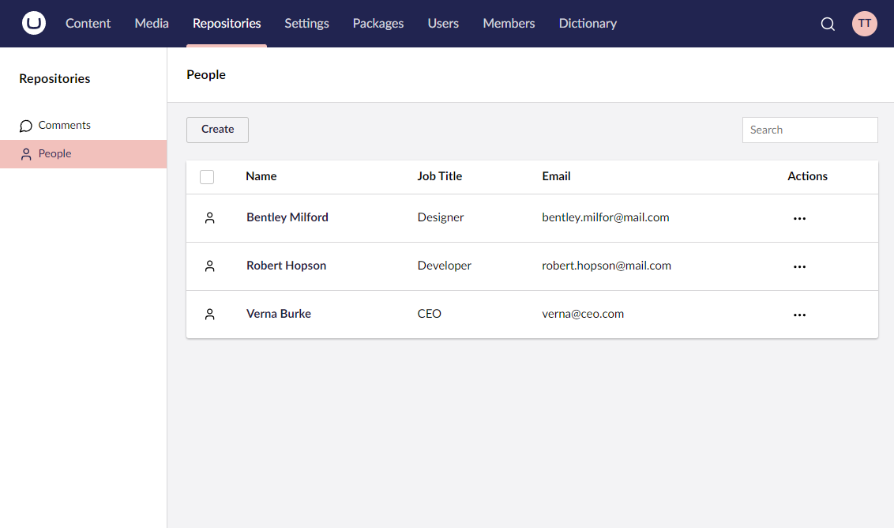

# List Views

A list view displays a collection entity in a list format and includes features like pagination, custom data views, searching, and bulk actions.



## Configuring a List View

The list view configuration is a sub-configuration of a [`Collection`](the-basics.md) config builder instance and can be accessed via the `ListView` method.

### Using the `ListView()` Method

Accesses the list view configuration for the specified collection.

#### Method Syntax

```cs
ListView(Lambda listViewConfig = null) : ListViewConfigBuilder<TEntityType>
```

#### Example

````csharp
collectionConfig.ListView(listViewConfig => {
    ...
});
````

## Adding a Field to the List View

### Using the `AddField()` Method

Adds a specified property to the list view.

#### Method Syntax

```cs
AddField(Lambda propertyExpression, Lambda fieldConfig = null) : ListViewFieldConfigBuilder<TEntityType, TValueType>
```

#### Example

````csharp
listViewConfig.AddField(p => p.FirstName, fieldConfig => {
    ...
});
````

## Changing the Heading of a Field

### Using the `SetHeading()` Method

Sets the heading for a field in the list view.

#### Method Syntax

```cs
SetHeading(string heading) : ListViewFieldConfigBuilder<TEntityType, TValueType>
```

#### Example

````csharp
fieldConfig.SetHeading("First Name");
````

## Formatting the Value of a Field

### Using the `SetFormat()` Method

Sets the format expression to the field in the list view.

#### Method Syntax

```cs
SetFormat(Lambda formatExpression) : ListViewFieldConfigBuilder<TEntityType, TValueType>
```

#### Example

````csharp
fieldConfig.SetFormat((v, p) => $"{v} years old");
````

## Setting the View of a Field

You can customize the field's markup with field views, allowing richer visualizations of the content. For more details, see the [Field Views](field-views.md) article.

### Using the `SetView()` Method

Sets the view component for the list view field.

#### Method Syntax

```cs
SetView(string viewComponentName) : ListViewFieldConfigBuilder<TEntityType, TValueType>
```

#### Example

````csharp
fieldConfig.SetView("ImageFieldView");
````

### Using the `SetView<TView>()` Method

Sets the view component for the list view field.

#### Method Syntax

```cs
SetView<TView>() : ListViewFieldConfigBuilder<TEntityType, TValueType>
```

#### Example

````csharp
fieldConfig.SetView<ImageFieldView>();
````

## Setting the Visibility of a Field

### Using the `SetVisibility()` Method

Controls the runtime visibility of a field in the list view.

#### Method Syntax

```cs
SetVisibility(Predicate<ListViewFieldVisibilityContext> visibilityExpression) : ListViewFieldConfigBuilder<TEntityType, TValueType>
```

#### Example

````csharp
fieldConfig.SetVisibility(ctx => ctx.UserGroups.Any(x => x.Alias == "editor"));
````

## Changing the Page Size

### Using the `SetPageSize` Method

Sets the number of items per page for the list view.

#### Method Syntax

```cs
SetPageSize(int pageSize) : ListViewConfigBuilder<TEntityType>
```

#### Example

````csharp
listViewConfig.SetPageSize(20);
````
