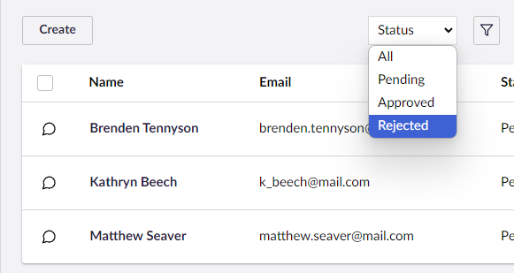

# Data Views

Data views allow you to define multiple pre-filtered views of the same data source. This is useful when entities exist in different states and you need a way to toggle between them.



## Defining Data Views

Data views are defined via the [Collections](../collections/overview.md) settings.

### Using the `AddDataView()` Method

Creates a data view with the specified name and a where clause filter expression. The expression must return a `boolean` value.

#### Method Syntax

```cs
AddDataView(string name, Lambda whereClauseExpression) : CollectionConfigBuilder<TEntityType>
```

#### Example

````csharp
collectionConfig.AddDataView("Active", p => p.IsActive);
````

### Using the `AddDataView()` Method with Group

Creates a data view within a specified group, using a where clause filter expression. The expression must return a  `boolean` value.

#### Method Syntax

```cs
AddDataView(string group, string name, Lambda whereClauseExpression) : CollectionConfigBuilder<TEntityType>
```

#### Example

````csharp
collectionConfig.AddDataView("Status", "Active", p => p.IsActive);
````

### Using the `AddAllDataView` Method

Enables the `All` option for data views in the collection. The method can take an empty string, which will display the CMS localized `All` value, plain text, or a localized string.

#### Method Syntax

```cs
collectionConfig.AddAllDataView(string? label)
```

