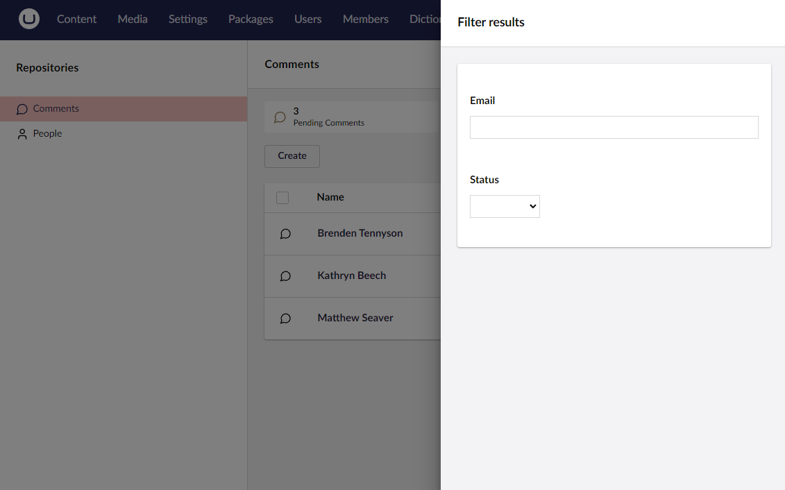

# Filterable Properties

Umbraco UI Builder dynamically constructs a filter dialog by choosing appropriate editor views based on basic property configurations. Properties of numeric or date types become range pickers, enums become select/checkbox lists, and other properties are text input filters.



## Defining Filterable Properties

Defining filterable properties is controlled via the [Collections](../collections/overview.md) settings.

### Using the `AddFilterableProperty()` Method

Adds a given property to the filterable properties collection.

#### Method Syntax

```cs
AddFilterableProperty(Lambda filterablePropertyExpression, Lambda filterConfig = null) : CollectionConfigBuilder<TEntityType>
```

#### Example

````csharp
collectionConfig.AddFilterableProperty(p => p.FirstName, filterConfig => filterConfig 
    // ...
);
````

## Changing the Label of a Filterable Property

### Using the `SetLabel()` Method

Sets the label for the filterable property.

#### Method Syntax

```cs
SetLabel(string label) : FilterablePropertyConfigBuilder<TEntityType, TValueType>
```

#### Example

````csharp
filterConfig.SetLabel("First Name");
````

## Adding a Description to a Filterable Property

### Using the `SetDescription()` Method

Sets a description for the filterable property.

#### Method Syntax

```cs
SetDescription(string description) : FilterablePropertyConfigBuilder<TEntityType, TValueType>
```

#### Example

````csharp
filterConfig.SetDescription("The first name of the person");
````

## Defining Basic Options for a Filterable Property

### Using the `SetOptions()` Method

Defines basic options for a filterable property.

#### Method Syntax

```cs
SetOptions(IDictionary<TValueType, string> options) : FilterablePropertyConfigBuilder<TEntityType, TValueType>
```

#### Example

````csharp
filterConfig.SetOptions(new Dictionary<string, string> {
    { "Option1", "Option One" },
    { "Option2", "Option Two" }
});
````

## Defining Options with Custom Compare Clauses for a Filterable Property

### Using the `AddOption()` Method

Defines options with custom comparison clauses for a filterable property.

#### Method Syntax

```cs
AddOption(object key, string label, Lambda compareExpression) : FilterablePropertyConfigBuilder<TEntityType, TValueType>
```

#### Example

````csharp
filterConfig.AddOption("Option1", "Option One", (val) => val != "Option Two");
````

## Configuring the Mode of a Filterable Property

For filterable properties with options, you can configure whether the options should allow multiple or single selections.

### Using the `SetMode()` Method

Configures the mode of a filterable property (multiple or single choice).

#### Method Syntax

```cs
SetMode(FilterMode mode) : FilterablePropertyConfigBuilder<TEntityType, TValueType>
```

#### Example

````csharp
filterConfig.SetMode(FilterMode.MultipleChoice);
````
