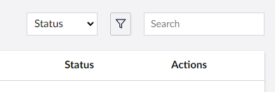

# Overview

Umbraco UI Builder includes a search API for filtering and locating specific entities within a collection. This enhances usability, especially in collections with large datasets.

Get started by reviewing how to define searchable properties.


[searchable-properties.md](searchable-properties.md)

