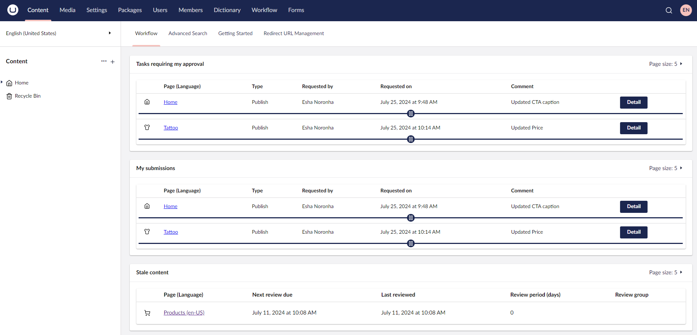
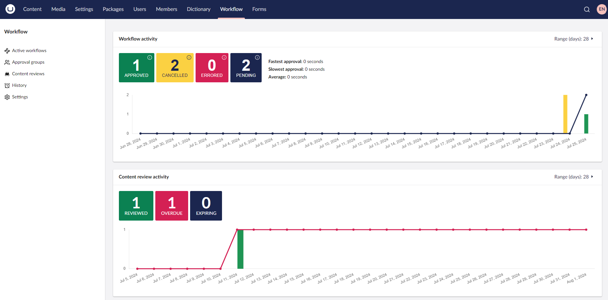

# Dashboards and Buttons

Umbraco Workflow has its default Dashboards. By default, when you install Umbraco Workflow, you receive two Dashboards: the _User Dashboard_ and the _Admin Dashboard_. Additionally, Umbraco Workflow replaces the default Umbraco button set in the editor drawer.

## Dashboards

Umbraco Workflow adds two Dashboards to your Umbraco project:

* **User Dashboard** - This Workflow Dashboard is added in the **Content** section. It displays the tasks requiring approval from the user, current user’s submissions, and stale content (content that needs to be reviewed).

    
* **Admin Dashboard** - This Workflow Dashboard is the default view in the **Workflow** section. It displays a chart of recent workflow activity, chart of content review activity, licensing details, and any relevant upgrade-related messages. You can also view the workflow and content review activity chart for the specified range of days.

    

## Buttons

When a workflow is active on the current node, the **Publish** button is replaced, linking to the workflow content app.

When no workflow is active, the button state is determined by the current user's permissions.

Umbraco Workflow overrides Umbraco's User/Group publishing permissions. If the user has permission to update the node, they will be able to initiate a workflow process on that node. Umbraco Workflow shifts Umbraco from a centrally administered publishing model (controlled by a site administrator) to a distributed model. In this model, editors publish content based on their responsibilities assigned during the workflows.

In cases, where the content is already in a workflow, a notification is displayed at the top of the editor. Depending on the Workflow **Settings**, you can enable/disable editing access on a content node in a workflow.

For nodes where the workflow has been disabled, the default Umbraco options are displayed.

