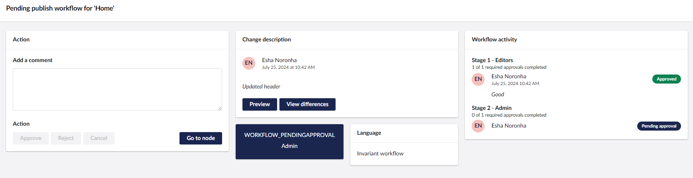
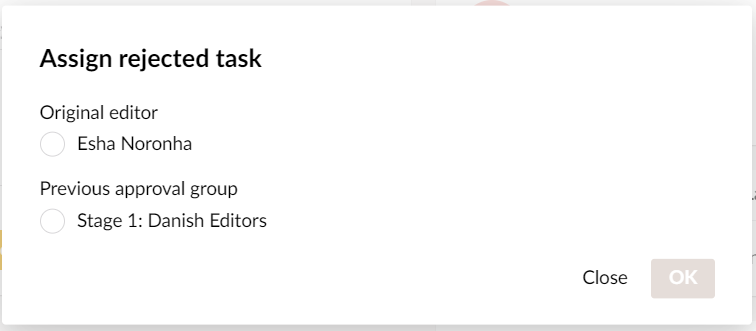

# Workflow Detail Dialog

The Workflow detail dialog provides the interface for managing active workflow processes.

When the current node is pending workflow approval, the **Workflow Detail** dialog displays detailed information such as:

* Option to [approve, reject, or cancel pending workflow tasks](workflow-workspace-view.md#approve-reject-or-cancel-pending-workflow-tasks).
* View change description and track differences across pending and completed workflows.
* View the group responsible for approving the pending workflow.
* View pending language variant(s) workflow.
* View the workflow activity (eg. pending approval/task approvals/rejects) for the current workflow process.

You can access Active Workflows from two places - the **Content** section and the **Workflow** section (depending on your user permission). Workflow Administrators (those users with access to the Workflow section) can access workflows assigned to a different group. In the **Workflow History**, these are noted as being performed by the admin.

### Approve, Reject, or Cancel pending workflow tasks

#### Approve Workflow Tasks

To approve a Workflow task, click on the **Approve** button in the Action section.

#### Reject Workflow Tasks

To reject a Workflow task, click on the **Reject** button in the Action section. Depending on the approval stage, the reviewer can decide where to send the rejected task.

For first-stage approvals, the rejected task is sent back to the original editor/author. For second-stage approvals and above, the reviewer can send the rejected task either to the original editor or any other previous workflow group.

#### Cancel pending Workflow Tasks

To cancel a pending Workflow task, click on the **Cancel** button in the Action section.
