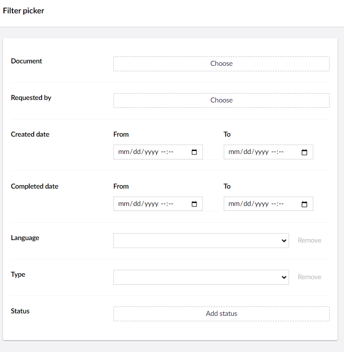
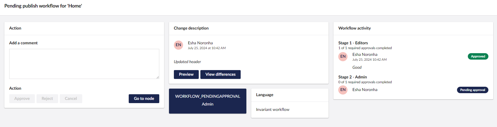

# Active Workflows

The Active Workflows view in the **Workflow** section provides an administrator view of the active Workflows. It displays a table containing the following details:

* Page name/Node with the Language variant.
* Type of Publish.
* Date the workflow was requested on.
* Comment describing the changes.

You can also **Filter** the records based on the Node, Requested by, Created date, Completed date, Page Language, Workflow Type, and Workflow Status.

Additionally, you can adjust the total number of records displayed on a page.

The **Detail** button at the end of the record displays an overlay with content similar to the [Active workflow](../getting-started/workflow-content-app.md#active-workflow) sub-section.

