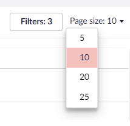

# Content Reviews

Content reviews is a tool that allows content editors to keep their content up-to-date. **Content reviews** adds a new dashboard to the **Workflow** section. By default, Content reviews are disabled and can be enabled from **Content reviews Settings** in the **Workflow** section.

## Video overview


Watch this video to learn how to use the Content Review feature in Umbraco Workflow


## Content Reviews Dashboard

The Content Reviews Dashboard provides an overview of the expired content. The dashboard displays a table containing the following details:

* Page name/Node with the Language variant
* Next review due date
* Last reviewed date
* Review period in days
* Review group

Selecting a content node takes you to the content node in the **Content** section, where you can see the Content review banner. The Content review banner is displayed only when the node has passed its review date. Also, the review banner is displayed only to users assigned as reviewers for the node. For more information, see the [Content Reviews Permissions](../getting-started/content-review-settings.md#content-review-permissions) section

Clicking on **Mark as reviewed** allows the review group member to mark the content as reviewed. Optionally, the review group member can also set the next review date on the content node. The next review date must fall inside the review period set in the **Content Reviews Settings**.

You can also **Filter** the records based on the Document Type, Review Group, Next review due date, Last reviewed date, and Expired review Status.

Additionally, you can adjust the total number of records displayed on a page.

Read the [Content Review Settings](../getting-started/content-review-settings.md) article to learn how to configure reviews.
