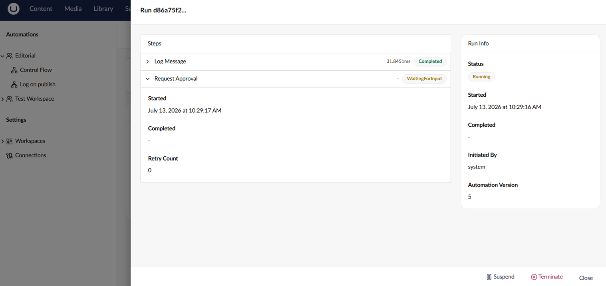
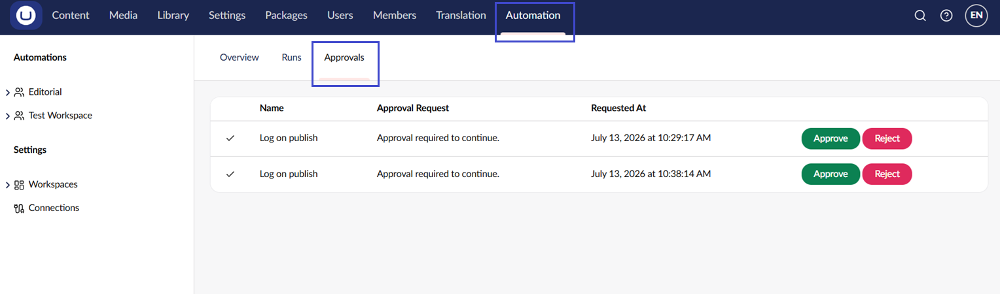

# Use Approvals

The **Request Approval** action pauses an automation and waits for a user to approve or reject before the run continues. Use it to add a human checkpoint to an automation, for example, before publishing AI-generated content.

<figure><figcaption>
Request approval stage
</figcaption></figure>

## How It Works

1. The automation reaches a **Request Approval** step.
2. The run is suspended and an approval entry is created with the configured prompt.
3. A user with access to the workspace opens the approval and chooses **Approve** or **Reject**.
4. On **Approve**, the run resumes from the next step. The approver's user key and any comment are recorded on the step output.
5. On **Reject**, the approval step fails. The run's configured error behavior on that step then decides whether to retry, suspend, terminate, or compensate.

## Request Approval Settings

| Setting             | Description                                                                                                  |
| ------------------- | ------------------------------------------------------------------------------------------------------------ |
| **Prompt**          | The message shown to approvers explaining what needs approval. Supports [bindings](../concepts/bindings.md). |
| **Timeout (hours)** | Optional. If set, the step auto-rejects when no decision is made within this many hours.                     |

## Approver Permissions

A user can act on an approval if they are a member of a user group that the workspace allows access to. See [Manage Workspaces](workspaces.md).

## Finding Pending Approvals

The **Approvals** dashboard in the Automate section lists every approval awaiting a decision across the workspaces you can access. Click an approval to open the decision dialog.

<figure><figcaption>
Approvals dashboard
</figcaption></figure>

## See Also

* [Build an Automation](building-an-automation.md)
* [Manage Workspaces](workspaces.md)
* [Bindings](../concepts/bindings.md)
