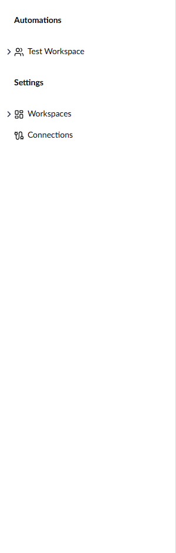
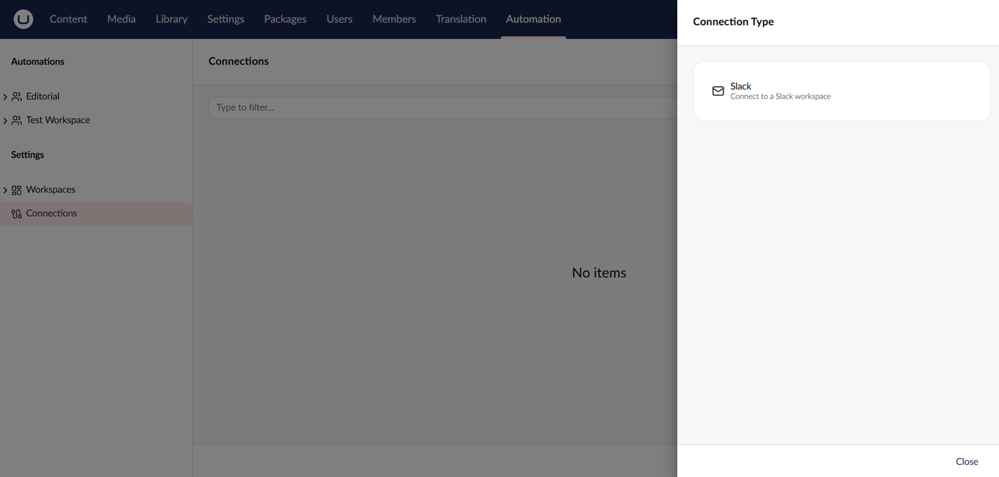

# Manage Connections

A connection stores the credentials an action needs to talk to an external service. See [Connections](../concepts/connections.md) for the underlying concept.

## Where Connections Live

Connections are managed from the **Settings** sidebar in the **Automation** section. The Settings sidebar is only visible to administrators.

<figure><figcaption>
Connections live under the Settings menu in the Automation sidebar.
</figcaption></figure>

## Create a Connection

1. Open the **Automation** section.
2. Go to **Connections** in the tree.
3. Click **+**. The **Connection Type** picker opens.
4. Pick a connection type from the picker, for example **Slack**.
5. **Enter a name** and configure the type-specific settings.
6. Click **Authenticate** to verify the credentials.
7. Click **Save**.

<figure><figcaption>
Creating a connection.
</figcaption></figure>

## Allow a Connection in a Workspace

A connection only appears in an action's connection picker when its workspace has explicitly allowed it.

1. Open the workspace that needs the connection.
2. On the **Settings** tab, find the **Allowed Connections** field.
3. Pick the connection from the connection picker.
4. Save the workspace.

## Authenticate a Connection

The **Authenticate** button calls the connection type's validator. For OAuth connections, this confirms the access token is still valid and can reach the provider's API. For credential-based connections, it attempts a real call.

A failed test shows the error message so you can correct the settings before saving. Connection types that do not implement a validator return a warning instead of a success.

## Use a Connection in an Action

When you configure an action that requires a connection, the connection picker only shows connections of the matching type that the current workspace has allowed.

## Delete a Connection

Open the connection from the Settings sidebar and click **Delete**. Any automation step that uses the deleted connection will fail at runtime until the step is reconfigured.

## Environment Safety

Connection definitions can transfer between environments via Umbraco Deploy, but sensitive credential values are stripped by default. See [Transfer Automations](../add-ons/deploy/transferring-automations.md) for the rules Deploy applies.

## See Also

* [Connections](../concepts/connections.md)
* [Transfer Automations](../add-ons/deploy/transferring-automations.md)
