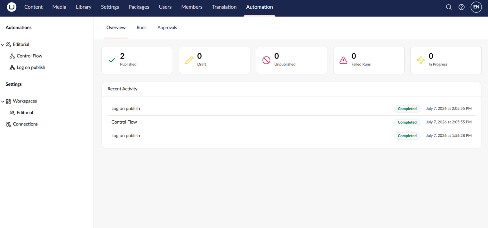

# Use the Dashboard

The dashboard is the landing page of the **Automation** section. Use it to get an at-a-glance view of automation activity across all workspaces you can access.

<figure><figcaption>
The Automation dashboard.
</figcaption></figure>

## Status Cards

The dashboard shows a row of cards that count automations and runs across the workspaces you can access:

| Card            | Shows                                                                   |
| --------------- | ----------------------------------------------------------------------- |
| **Published**   | Automations that are currently published.                               |
| **Draft**       | Automations that have unpublished changes or have never been published. |
| **Inactive**    | Automations that have been explicitly disabled.                         |
| **Failed Runs** | Recent runs that ended in the Failed state.                             |
| **In Progress** | Recent runs that are still Running or Suspended.                        |

## Recent Activity

Below the cards, the **Recent Activity** list shows the most recent runs across all your workspaces. Each entry shows the automation name, the run status, and when the run started. Click an entry to open the run detail view.

## First-Run Welcome

When you open Automation for the first time and no automations exist, the dashboard shows a welcome panel that links straight to creating a workspace.

## See Also

* [Review Runs](runs.md)
* [Use Approvals](approvals.md)
* [Create Your First Automation](../getting-started/first-automation.md)
