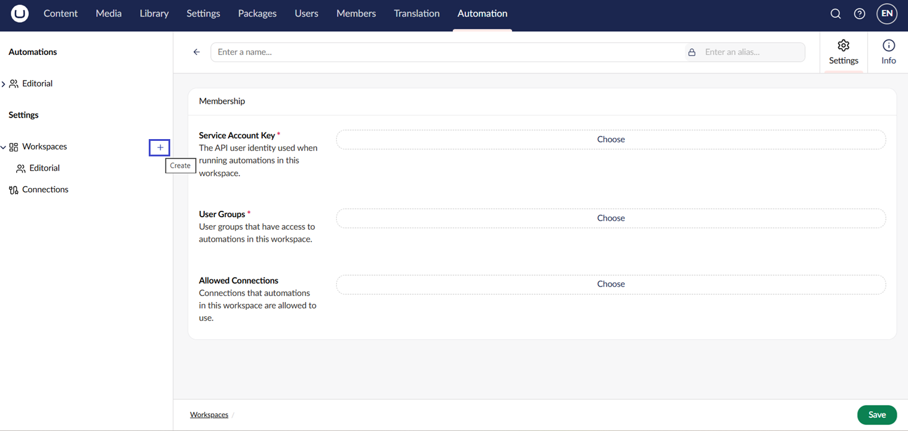
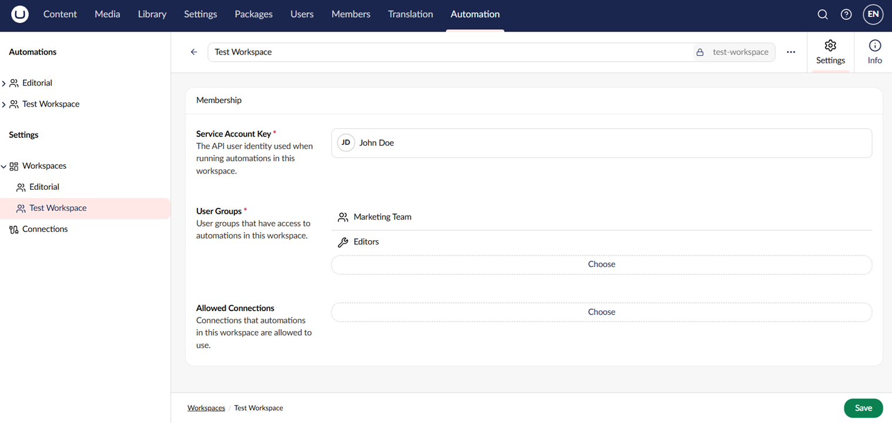

# Managing Workspaces

A workspace groups related automations and controls which connections and users have access. See [Workspaces](../concepts/workspaces.md) for the underlying concept.

## Create a Workspace

1. Open the **Automation** section.
2. Click **+** next to Workspaces.
3. **Enter a name** for the Workspace.
4. Choose the **Service Account Key** and **user Groups**.
5. Click **Save**.

<figure><figcaption>
Creating a workspace.
</figcaption></figure>

## Workspace Editor

Open a workspace from the tree. The workspace editor has two tabs:

| Tab          | Purpose                                                                          |
| ------------ | -------------------------------------------------------------------------------- |
| **Settings** | Configure the workspace service account, user groups, and allowed connections. |
| **Info**     | View the workspace version history, ID, and alias.                             |

### Settings

The **Settings** tab has three fields:

| Field                   | Purpose                                                                                                                                                                                                                                                                                                      |
| ----------------------- | ------------------------------------------------------------------------------------------------------------------------------------------------------------------------------------------------------------------------------------------------------------------------------------------------------------ |
| **Service Account**     | The Umbraco user identity that the automations in this workspace run as. Required. The account's section access, start node, and per-resource membership decide which triggers and actions the workspace can use — see [Service-Account Permissions](../concepts/workspaces.md#service-account-permissions). |
| **User Groups**         | The Umbraco user groups whose members can view, edit, and run the automations in this workspace. Required.                                                                                                                                                                                                   |
| **Allowed Connections** | The connections that the automations in this workspace can use.                                                                                                                                                                                                                                              |

<figure><figcaption>
Configuring workspace settings.
</figcaption></figure>


Changing the service account on a workspace with published automations can take them offline.

Events the new account isn't authorized for are silently skipped at dispatch. Actions that need permissions it doesn't have fail with an authentication error.

Review the **Runs** tab after any service-account change.


## Workspace Groups

Workspaces can be organized into **workspace groups** — folders in the tree. To create a workspace group, right-click the root of the tree and select **Create workspace group**. Workspace groups are organizational only; they do not affect access.

## Delete a Workspace

Right-click a workspace and select **Delete**. Deleting a workspace deletes its automations and run history.


Workspace deletion is permanent. Export any automations you want to keep before deleting.


## See Also

* [Workspaces](../concepts/workspaces.md)
* [Managing Connections](connections.md)
