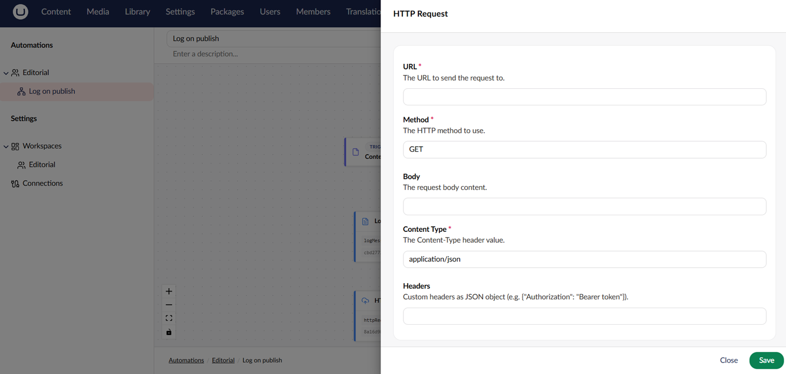

# Actions

An action is a reusable unit of work. You add actions to an automation as steps and configure each step with its own settings.

## Available Built-in Actions

Use built-in actions to send data, update Umbraco entities, and control automation flow.

### General

| Action               | Purpose                                                                        |
| -------------------- | ------------------------------------------------------------------------------ |
| **HTTP Request**     | Send an HTTP request to an external URL.                                       |
| **Send Email**       | Send an email to one or more recipients.                                       |
| **Log Message**      | Write a message to the application log. Useful for debugging.                  |
| **Delay**            | Pause the automation for a configurable duration.                              |
| **Set Variable**     | Output a named value that downstream steps can bind to.                        |
| **Notify Editor**    | Send a realtime toast to any backoffice user currently editing a content item. |
| **Request Approval** | Suspend the run and wait for a user to approve or reject.                      |

### Content

| Action                      | Purpose                                                                        |
| --------------------------- | ------------------------------------------------------------------------------ |
| **Publish Content**         | Publish an Umbraco content item.                                               |
| **Unpublish Content**       | Unpublish an Umbraco content item.                                             |
| **Get Content**             | Fetch a published content item and expose its properties for downstream steps. |
| **Find Content**            | Find content items by name, optionally filtered by content type.               |
| **Get Content Property**    | Read a single property value from a published content item.                    |
| **Update Content Property** | Write a single property value on a content item (draft save).                  |

### Media

| Action                    | Purpose                                        |
| ------------------------- | ---------------------------------------------- |
| **Update Media Property** | Write a single property value on a media item. |

Add-on packages contribute additional actions. See [Add-ons](../add-ons/) for the catalogue.

## Action Settings

Each action exposes its own settings. The settings panel is generated from the action's settings model. Many settings support [Bindings](bindings.md) so values can be pulled in from the trigger or previous steps at runtime.

<figure><figcaption><p>Configuring an action's settings.</p></figcaption></figure>

## Action Output

Actions can produce output that downstream steps can bind to. For example, the HTTP Request action outputs the response status code and body:

```
${ steps.callApi.statusCode }
${ steps.callApi.responseBody }
```

The step's alias (`callApi` in the example) is set in the step settings panel.


The HTTP Request action rejects responses larger than `Execution:MaxHttpResponseBodyBytes` (10 MB by default). The step fails with a terminal error that names the response size and the limit. Raise the limit in [Configuration](../getting-started/configuration.md) for larger payloads.


## Step Behaviour

Each step has additional execution settings on the canvas:

| Setting            | Description                                                                                                                                          |
| ------------------ | ---------------------------------------------------------------------------------------------------------------------------------------------------- |
| **Error behavior** | What to do when the step fails: **Retry**, **Suspend** the run for manual intervention, **Terminate** the run, or **Compensate** before terminating. |
| **Max retries**    | When the error behavior is **Retry**, how many times the step retries before giving up.                                                              |
| **Retry interval** | When the error behavior is **Retry**, how long to wait between retries.                                                                              |

The engine-wide default step timeout is controlled by the `Execution:DefaultTimeout` setting. See [Configuration](../getting-started/configuration.md).

## See Also

* [Build an Automation](../backoffice/building-an-automation.md)
* [Connections](connections.md)
* [Create a Custom Action](../extending/custom-action.md)
