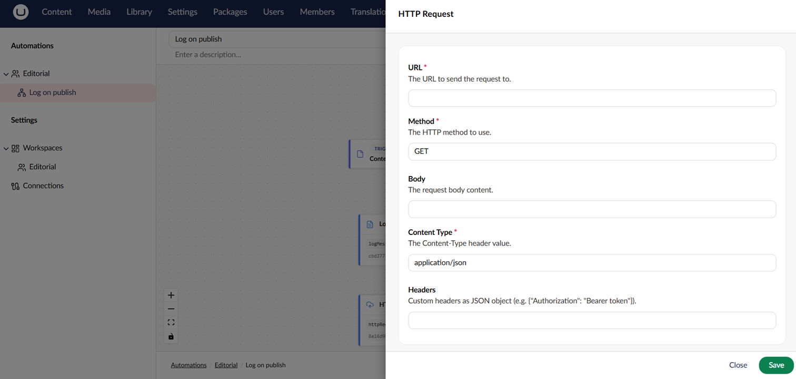

# Actions

An action is a reusable unit of work. You add actions to an automation as steps and configure each step with its own settings.

## Available Built-in Actions

Use built-in actions to send data, update Umbraco entities, and control automation flow.

### General

| Action               | Purpose                                                                                                                                                                    |
| -------------------- | -------------------------------------------------------------------------------------------------------------------------------------------------------------------------- |
| **HTTP Request**     | Send an HTTP request to an external URL.                                                                                                                                   |
| **Send Email**       | Send an email to one or more recipients.                                                                                                                                   |
| **Log Message**      | Write a message to the application log. Useful for debugging.                                                                                                              |
| **Delay**            | Pause the automation for a configurable duration.                                                                                                                          |
| **Set Variable**     | Output a named value that downstream steps can bind to.                                                                                                                    |
| **Notify Editor**    | Send a realtime toast to any backoffice user currently editing a content item.                                                                                             |
| **Request Approval** | Suspend the run and wait for a user to approve or reject.                                                                                                                  |
| **Run Script**       | Run a short JavaScript snippet in a sandbox to transform or compute data, with optional outbound `fetch` support and a configurable output schema for downstream bindings. |

### Content

| Action                      | Purpose                                                                        |
| --------------------------- | ------------------------------------------------------------------------------ |
| **Publish Content**         | Publish an Umbraco content item.                                               |
| **Unpublish Content**       | Unpublish an Umbraco content item.                                             |
| **Get Content**             | Fetch a published content item and expose its properties for downstream steps. |
| **Find Content**            | Find content items by name, optionally filtered by content type.               |
| **Get Content Property**    | Read a single property value from a published content item.                    |
| **Update Content Property** | Write a single property value on a content item (draft save).                  |

### Media

| Action                    | Purpose                                                            |
| ------------------------- | ------------------------------------------------------------------ |
| **Get Media**             | Fetch a media item and expose its properties for downstream steps. |
| **Find Media**            | Find media items by name, optionally filtered by media type.       |
| **Get Media Property**    | Read a single property value from a media item.                    |
| **Update Media Property** | Write a single property value on a media item.                     |

Add-on packages contribute additional actions. See [Add-ons](../add-ons/add-ons.md) for the catalogue.

## Action Settings

Each action exposes its own settings. The settings panel is generated from the action's settings model. Many settings support [Bindings](bindings.md) so values can be pulled in from the trigger or previous steps at runtime.

<figure><figcaption><p>Configuring an action's settings.</p></figcaption></figure>

## Action Output

Actions can produce output that downstream steps can bind to. For example, the HTTP Request action outputs the response status code and body:

```
${ steps.callApi.statusCode }
${ steps.callApi.responseBody }
```

Each step has a **Name** (its label on the canvas) and an **Alias** (`callApi` in the example). See [Step Behaviour](actions.md#step-behaviour) below for both.



The HTTP Request action rejects responses larger than `Execution:MaxHttpResponseBodyBytes` (10 MB by default). The step fails with a terminal error that names the response size and the limit. Raise the limit in [Configuration](../getting-started/configuration.md) for larger payloads.

The HTTP Request action only calls public destinations. See [Outbound Requests](../getting-started/configuration.md#outbound-requests) for the address categories Automate refuses and how it handles proxies.





The Run Script action runs in a JavaScript sandbox with a 5 MB memory cap and a 15-second total execution timeout by default. Configure both via `Scripting:*` settings. See [Configuration](../getting-started/configuration.md).

A script can only make outbound `fetch` calls when both of these are on:

* **Allow fetch** on the step. This is off for new Run Script steps, so turn it on for each step that needs `fetch`. Existing steps keep the value they were saved with.
* `Scripting:FetchEnabled` for the whole site. This is `true` by default. Set it to `false` to turn off `fetch` for every Run Script step.

To restrict which hosts scripts can call, list them in `Scripting:FetchAllowedHosts`. When the list is empty, `fetch` can call any public host. `fetch` follows the same destination rules as the HTTP Request action. See [Outbound Requests](../getting-started/configuration.md#outbound-requests).

When a `fetch` request fails, the promise rejects with a short error message, for example, `http request was blocked` or `fetch failed: connection refused`. Automate writes the full details to the server log.



## Run Script Data

A Run Script step exports a default function. The function receives a `data` argument and returns the step's output.

`data` holds the values a binding can reach, at the same paths. If a binding would use `${ steps.getMedia.properties.umbracoBytes }`, the script reads `data.steps.getMedia.properties.umbracoBytes`.

| Binding                              | Script                                                           |
| ------------------------------------ | ---------------------------------------------------------------- |
| `${ trigger.<path> }`                | `data.trigger.<path>`                                            |
| `${ steps.<alias>.<path> }`          | `data.steps.<alias>.<path>`                                      |
| `${ previous.<path> }`               | `data.previous.<path>`. Not present for the first step.          |
| `${ loop.item }` / `${ loop.index }` | `data.loop.item` / `data.loop.index`. Inside a **For Each** only. |


```javascript
export default function (data) {
    const bytes = data.steps.getMedia.properties.umbracoBytes;
    return {
        name: data.trigger.contentName.toUpperCase(),
        sizeKb: Math.round(bytes / 1024)
    };
}
```


Keep the following in mind when you read from `data`:

* Property names in a script are case-sensitive, unlike bindings. Match the casing of each alias and property exactly.
* A step without an alias appears under its ID, for example `data.steps['<id>']`.
* Only steps that already ran are present. A step on a branch that did not run is missing, so guard optional paths, for example `data.steps.maybe?.result`.
* Automate does not resolve `${ ... }` bindings inside the script body. Read the values from `data` instead.
* `data` is a copy. Changing it has no effect on later steps. Return any values that later steps need.

The returned value becomes the step's `result` output. Downstream steps bind to it with `${ steps.<alias>.result }`.

## Step Behaviour

Each step has additional settings on the canvas:

| Setting            | Description                                                                                                                                                                                                   |
| ------------------ | ------------------------------------------------------------------------------------------------------------------------------------------------------------------------------------------------------------- |
| **Name**           | The step's display label on the canvas.                                                                                                                                                                       |
| **Alias**          | The identifier used to reference the step's output in bindings, for example `${ steps.callApi.responseBody }`. Automate suggests one automatically when you add the step; edit it any time before publishing. |
| **Error behavior** | What to do when the step fails: **Retry**, **Suspend** the run for manual intervention, **Terminate** the run, or **Compensate** before terminating.                                                          |
| **Max retries**    | When the error behavior is **Retry**, how many times the step retries before giving up.                                                                                                                       |
| **Retry interval** | When the error behavior is **Retry**, how long to wait between retries.                                                                                                                                       |


An alias must start with a letter and contain only letters and numbers, and must be unique within the automation. Renaming a step's **Name** after it's been added does not change its **Alias**: the two are independent once set. Publishing fails if any binding elsewhere in the automation still references an alias that no longer exists.


The engine-wide default step timeout is controlled by the `Execution:DefaultTimeout` setting. See [Configuration](../getting-started/configuration.md).

## See Also

* [Build an Automation](../backoffice/building-an-automation.md)
* [Connections](connections.md)
* [Create a Custom Action](../extending/custom-action.md)
