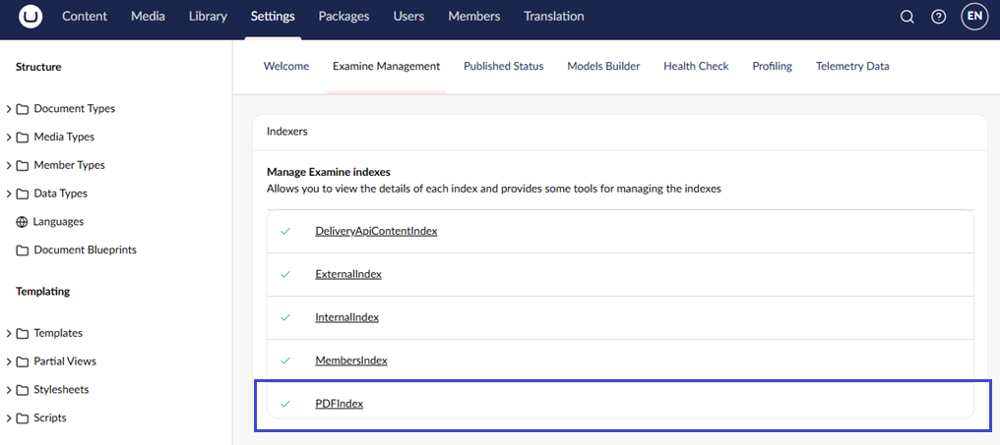
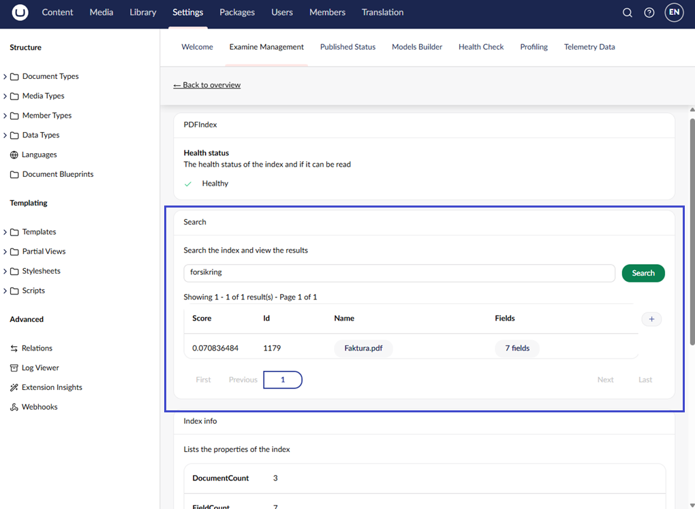
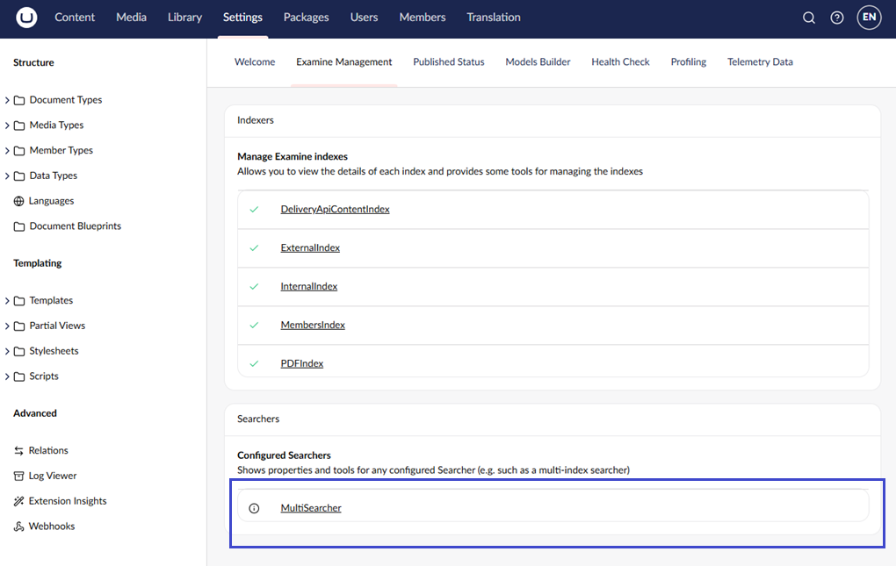

# PDF indexes and multisearchers

If you want to index PDF files and search for them, you will need to use the [UmbracoExamine.Pdf extension package](https://github.com/umbraco/UmbracoExamine.PDF).

## Installation

Install with NuGet:`dotnet add package Umbraco.ExaminePDF`

Installing the package creates a new Examine index called **PDFIndex**, which appears in the **Examine Management** dashboard under the **Settings** section. This index extracts and indexes the text content of PDF files uploaded to the Media section, not their filenames.



To get results, search for words that appear inside the PDF. Scanned or image-based PDFs have no extractable text and will return no results.



## Multi-index searchers

A multi-index searcher is a searcher that can search multiple indexes. The multi-index searcher can be helpful when you want to search both the external and internal indexes.

You can register a multi-index searcher with the ExamineManager on startup:

```csharp
using Examine;
using Umbraco.Cms.Core;
using Umbraco.Cms.Core.Composing;
using Umbraco.Cms.Core.DependencyInjection;
using UmbracoExamine.PDF;

namespace MySite.MyCustomIndex;

[ComposeAfter(typeof(ExaminePdfComposer))]
public class ExamineComposer : IComposer
{
    public void Compose(IUmbracoBuilder builder)
    {
        builder.Services.AddExamineLuceneMultiSearcher("MultiSearcher", new[] {Constants.UmbracoIndexes.ExternalIndexName, PdfIndexConstants.PdfIndexName});
    }
}
```

With this approach, the multi-index searcher will show up in the **Examine Management** dashboard.



The multi-index searcher can be resolved in code from the ExamineManager:

```csharp
if (_examineManager.TryGetSearcher("MultiSearcher", out var searcher))
{
    //TODO: use the `searcher` to search
}
```


The implementation of `IPdfTextExtractor` is `PdfSharpTextExtractor` in this library, which uses `PDFSharp` to extract the bytes to convert to text. The implementation does not deal well with Unicode text, which means when some PDF files are read, the result will be 'junk' strings.

You can replace the `IPdfTextExtractor` using your own composer:

`composition.RegisterUnique<IPdfTextExtractor, MyCustomSharpTextExtractor>();`

The `iTextSharp` library deals with Unicode in a better way but is a paid license. If you wish to use `iTextSharp` or another PDF library, you can swap out the `IPdfTextExtractor` with your own implementation.

