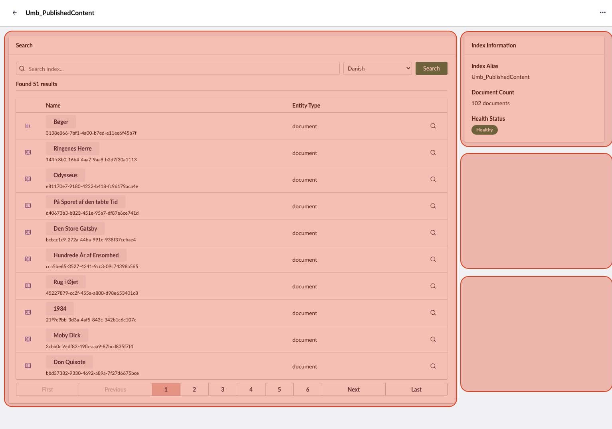

# Search Backoffice

This article is for **extension developers** and **search provider developers** who want to add custom UI to search in the backoffice.

The search UI is part of the backoffice. You extend it with the extension types you use elsewhere in Umbraco. Search adds one extension type and one condition of its own.

## Referencing the search types

The search types ship with `@umbraco-cms/backoffice`, so you do not need a separate package. Import constants, contexts, and models from the `@umbraco-cms/backoffice/search-management` entry point:


```typescript
import {
  UMB_SEARCH_INDEX_ENTITY_TYPE,
  UMB_SEARCH_WORKSPACE_CONTEXT,
  type UmbSearchIndex,
} from '@umbraco-cms/backoffice/search-management';
```


The `searchIndexDetailBox` extension type and the provider name condition are part of the global types of the backoffice. TypeScript recognizes both in your manifests without any extra declarations.

The backoffice serves the JavaScript for these imports at runtime. For how your package resolves them, see the [Vite Package Setup](../../../extend-your-project/backoffice-extensions/development-flow/vite-package-setup.md) article.

## Adding a detail box to the search workspace

<figure><figcaption><p>The marked areas show where search index detail boxes render.</p></figcaption></figure>

The index detail view uses an extension slot for composable UI. Register a `searchIndexDetailBox` extension to add a custom box to the detail page of any index.

### The `ManifestSearchIndexDetailBox` type

The backoffice defines the manifest type as follows:


```typescript
interface ManifestSearchIndexDetailBox
  extends ManifestElement, ManifestWithDynamicConditions<UmbExtensionConditionConfig> {
  type: 'searchIndexDetailBox';
  meta?: MetaSearchIndexDetailBox;
}

interface MetaSearchIndexDetailBox {
  label?: string;
  column?: 'left' | 'right';
}
```


* `label` - The box heading. Supports localization keys, for example `#myPackage_myLabel`.
* `column` - The column to place the box in. Use `'left'` for the main content column. Omit the property or use `'right'` to place the box in the sidebar.

### Registering a detail box manifest


```typescript
export const manifests: Array<UmbExtensionManifest> = [
  {
    type: 'searchIndexDetailBox',
    alias: 'My.SearchIndexDetailBox.Custom',
    name: 'My Custom Detail Box',
    weight: 50,
    element: () => import('./my-custom-box.element.js'),
    meta: {
      label: 'My Custom Box',
      column: 'right',
    },
  },
];
```


### Creating the box element

The element consumes the search workspace context to read the index it belongs to:


```typescript
import {
  UMB_SEARCH_WORKSPACE_CONTEXT,
  type UmbHealthStatusModel,
} from '@umbraco-cms/backoffice/search-management';
import { customElement, html, state } from '@umbraco-cms/backoffice/external/lit';
import { UmbLitElement } from '@umbraco-cms/backoffice/lit-element';

@customElement('my-custom-box')
export class MyCustomBoxElement extends UmbLitElement {
  @state()
  private _documentCount?: number;

  @state()
  private _healthStatus?: UmbHealthStatusModel;

  constructor() {
    super();

    this.consumeContext(UMB_SEARCH_WORKSPACE_CONTEXT, (context) => {
      if (!context) return;

      // Observe the index values so the box updates when they change
      this.observe(context.documentCount, (count) => {
        this._documentCount = count;
      });
      this.observe(context.healthStatus, (status) => {
        this._healthStatus = status;
      });
    });
  }

  override render() {
    return html`
      <uui-box>
        <p>Documents: ${this._documentCount ?? '-'}</p>
        <p>Health: ${this._healthStatus ?? '-'}</p>
      </uui-box>
    `;
  }
}

export default MyCustomBoxElement;

declare global {
  interface HTMLElementTagNameMap {
    'my-custom-box': MyCustomBoxElement;
  }
}
```


### Workspace context properties

The `UMB_SEARCH_WORKSPACE_CONTEXT` provides the following observables and methods:

| Property / Method             | Type       | Description                                                       |
| ----------------------------- | ---------- | ----------------------------------------------------------------- |
| `documentCount`               | Observable | Number of documents in the index.                                 |
| `healthStatus`                | Observable | Current health status of the index.                               |
| `providerName`                | Observable | Name of the search provider that owns the index.                  |
| `state`                       | Observable | UI state of the index: `'idle'`, `'loading'`, or `'error'`.       |
| `selectedCulture`             | Observable | Culture currently selected in the search box.                     |
| `getUnique()`                 | Method     | Returns the index alias.                                          |
| `getSelectedCulture()`        | Method     | Returns the selected culture.                                     |
| `setSelectedCulture(culture)` | Method     | Sets the selected culture.                                        |
| `setState(state)`             | Method     | Sets the UI state, for example while an operation is in progress. |

### Two-column layout

The detail view renders two columns:

* **Left column** (`column: 'left'`) - The main content area, which is the wider of the two. The search box renders here.
* **Right column** (`column: 'right'` or omitted) - The 350-pixel sidebar. The index information box renders here.

## Scoping an extension to a search provider

A search provider often adds UI that only makes sense for its own indexes. For example, the Examine provider adds a **Show Fields** action that reads the internal document format of Examine. Use the provider name condition to show an extension only on indexes that a given provider owns.

The condition compares against the provider name of the current index. The Examine provider registers its indexes under the name `search-examine-provider`.


```typescript
import {
  UMB_SEARCH_DOCUMENT_ENTITY_TYPE,
  UMB_SEARCH_INDEX_PROVIDER_NAME_CONDITION_ALIAS,
} from '@umbraco-cms/backoffice/search-management';

export const manifests: Array<UmbExtensionManifest> = [
  {
    type: 'entityAction',
    kind: 'default',
    alias: 'My.EntityAction.SearchDocument.Inspect',
    name: 'Inspect My Provider Document',
    api: () => import('./inspect.entity-action.js'),
    forEntityTypes: [UMB_SEARCH_DOCUMENT_ENTITY_TYPE],
    meta: {
      icon: 'icon-search',
      label: 'Inspect',
    },
    conditions: [
      {
        alias: UMB_SEARCH_INDEX_PROVIDER_NAME_CONDITION_ALIAS,
        match: 'my-search-provider',
      },
    ],
  },
];
```


The condition accepts one of two properties:

* `match` - A single provider name.
* `oneOf` - An array of provider names, for an extension that more than one provider shares.


The condition reads the provider name from the search workspace context. It only applies inside the workspace of an index, such as to detail boxes and to actions on search documents. In the index collection, no search workspace context exists, so an extension using the condition does not appear there.


For how conditions work in general, see the [Extension Conditions](../../../extend-your-project/backoffice-extensions/extending-overview/extension-conditions.md) article.

## Adding an entity action to search documents


`entityAction` is a standard backoffice extension type. This section covers what is specific to search. For the full API, see the [Entity Actions](../../../extend-your-project/backoffice-extensions/extending-overview/extension-types/entity-actions.md) article.


### Search entity types

Search defines two entity types for entity actions:

| Entity type       | Constant                          | Used for                                          |
| ----------------- | --------------------------------- | ------------------------------------------------- |
| `search-document` | `UMB_SEARCH_DOCUMENT_ENTITY_TYPE` | Per-document actions in the search results table. |
| `search-index`    | `UMB_SEARCH_INDEX_ENTITY_TYPE`    | Per-index actions, for example rebuilding.        |

Import the constants from `@umbraco-cms/backoffice/search-management`.

### Registering a document entity action


```typescript
import { UMB_SEARCH_DOCUMENT_ENTITY_TYPE } from '@umbraco-cms/backoffice/search-management';

export const manifests: Array<UmbExtensionManifest> = [
  {
    type: 'entityAction',
    kind: 'default',
    alias: 'My.EntityAction.SearchDocument',
    name: 'My Search Document Action',
    weight: 100,
    api: () => import('./my-search-document.entity-action.js'),
    forEntityTypes: [UMB_SEARCH_DOCUMENT_ENTITY_TYPE],
    meta: {
      icon: 'icon-search',
      label: 'My Action',
    },
  },
];
```


The `forEntityTypes` array determines where the action appears. Use `'search-document'` for per-document actions in the results table. Use `'search-index'` for per-index actions in the index collection and the workspace header.

### Consuming workspace context from an entity action

An entity action can read the index alias and the selected culture from the workspace context:


```typescript
import { UmbEntityActionBase } from '@umbraco-cms/backoffice/entity-action';
import { UMB_SEARCH_WORKSPACE_CONTEXT } from '@umbraco-cms/backoffice/search-management';

export class MySearchDocumentEntityAction extends UmbEntityActionBase<never> {
  override async execute() {
    // The unique of the document in the results table row
    const documentUnique = this.args.unique;

    // The workspace context holds the index alias and the selected culture
    const workspaceContext = await this.getContext(UMB_SEARCH_WORKSPACE_CONTEXT);
    const indexAlias = workspaceContext?.getUnique();
    const culture = workspaceContext?.getSelectedCulture();

    console.log(`Running my action on ${documentUnique} in ${indexAlias} (${culture ?? 'invariant'})`);
  }
}

export default MySearchDocumentEntityAction;
```


### Using `getHref()` for routable links

An entity action can navigate somewhere instead of running an operation. Implement `getHref()` instead of `execute()`, and the backoffice renders the action as a standard link:


```typescript
import { UmbEntityActionBase } from '@umbraco-cms/backoffice/entity-action';

export class MyRoutableEntityAction extends UmbEntityActionBase<never> {
  override async getHref() {
    return `/some/path/${this.args.unique}`;
  }

  override execute(): Promise<void> {
    // Not used: the action renders as a link to the href above
    return Promise.resolve();
  }
}

export default MyRoutableEntityAction;
```


The [Routable modals](backoffice-extensions.md#routable-modals) section contains a complete example of the pattern. The **Show Fields** action of the Examine provider, [`show-fields.entity-action.ts`](https://github.com/umbraco/Umbraco-CMS/blob/v19/dev/src/Umbraco.Web.UI.Client/src/packages/search-management/examine/show-fields.entity-action.ts), is a real-world reference implementation.

## Adding a workspace view to the search workspace


`workspaceView` is a standard backoffice extension type. This section covers what is specific to search. For the full API, see the [Workspace Views](../../../extend-your-project/backoffice-extensions/extending-overview/extension-types/workspaces/workspace-views.md) article.


A workspace view adds a new tab to the search workspace. Use a workspace view when you need a full-page view rather than a box within the existing **Details** tab.

### Registering a workspace view

Target the search workspace with the `UMB_WORKSPACE_CONDITION_ALIAS` condition:


```typescript
import { UMB_SEARCH_WORKSPACE_ALIAS } from '@umbraco-cms/backoffice/search-management';
import { UMB_WORKSPACE_CONDITION_ALIAS } from '@umbraco-cms/backoffice/workspace';

export const manifests: Array<UmbExtensionManifest> = [
  {
    type: 'workspaceView',
    alias: 'My.WorkspaceView.Search.Analytics',
    name: 'Search Analytics View',
    element: () => import('./my-analytics-view.element.js'),
    weight: 100,
    meta: {
      label: 'Analytics',
      pathname: 'analytics',
      icon: 'icon-chart',
    },
    conditions: [
      {
        alias: UMB_WORKSPACE_CONDITION_ALIAS,
        match: UMB_SEARCH_WORKSPACE_ALIAS,
      },
    ],
  },
];
```


The `UMB_SEARCH_WORKSPACE_ALIAS` constant holds the alias of the search workspace, `'Umb.Workspace.SearchIndex'`. Use the constant rather than the literal string.

### Creating the view element


```typescript
import { UMB_SEARCH_WORKSPACE_CONTEXT } from '@umbraco-cms/backoffice/search-management';
import { customElement, html, state } from '@umbraco-cms/backoffice/external/lit';
import { UmbLitElement } from '@umbraco-cms/backoffice/lit-element';

@customElement('my-analytics-view')
export class MyAnalyticsViewElement extends UmbLitElement {
  @state()
  private _indexAlias?: string;

  constructor() {
    super();

    this.consumeContext(UMB_SEARCH_WORKSPACE_CONTEXT, (context) => {
      this._indexAlias = context?.getUnique() ?? undefined;
    });
  }

  override render() {
    return html`<p>Analytics for index: ${this._indexAlias}</p>`;
  }
}

export default MyAnalyticsViewElement;

declare global {
  interface HTMLElementTagNameMap {
    'my-analytics-view': MyAnalyticsViewElement;
  }
}
```


### Workspace view vs. detail box

| Aspect         | Workspace View                | Detail Box                         |
| -------------- | ----------------------------- | ---------------------------------- |
| Appears as     | A new tab in the workspace.   | A box within the **Details** tab.  |
| Extension type | `workspaceView`               | `searchIndexDetailBox`             |
| Use when       | You need a full-page layout.  | You need a compact summary widget. |

## Routable modals

Provider developers sometimes need a deep-linkable modal, for example to show detailed information about a document. The search workspace supports a routable modal for this purpose. A non-visual `searchIndexDetailBox` hosts the route registration, and an entity action provides navigable URLs.

For how modal routes work in general, see the [Modal Route Registration](../../../extend-your-project/backoffice-extensions/extending-overview/extension-types/modals/route-registration.md) article.

### The three pieces

#### 1. Route provider element

A non-visual element registered as a `searchIndexDetailBox` sets up the modal route:


```typescript
import { customElement, nothing } from '@umbraco-cms/backoffice/external/lit';
import { UmbLitElement } from '@umbraco-cms/backoffice/lit-element';
import { UmbModalRouteRegistrationController } from '@umbraco-cms/backoffice/router';
import type { UmbModalRouteBuilder } from '@umbraco-cms/backoffice/router';
import { UMB_ENTITY_WORKSPACE_CONTEXT } from '@umbraco-cms/backoffice/workspace';

export const MY_DOCUMENT_DETAILS_MODAL_ALIAS = 'My.Modal.DocumentDetails';

export interface MyDocumentDetailsModalData {
  documentUnique: string;
  indexAlias: string;
  culture: string;
}

// Shared with the entity action, which uses it to build the modal URL
export let myRouteBuilder: UmbModalRouteBuilder | undefined;

@customElement('my-route-provider')
export class MyRouteProviderElement extends UmbLitElement {
  constructor() {
    super();

    this.consumeContext(UMB_ENTITY_WORKSPACE_CONTEXT, (context) => {
      if (!context) return;
      const indexAlias = context.getUnique() ?? '';

      new UmbModalRouteRegistrationController<MyDocumentDetailsModalData>(this, MY_DOCUMENT_DETAILS_MODAL_ALIAS)
        .addAdditionalPath(':documentUnique/:culture')
        .onSetup((params) => ({
          modal: { type: 'sidebar', size: 'large' },
          data: {
            documentUnique: params.documentUnique,
            indexAlias,
            culture: params.culture,
          },
          value: undefined,
        }))
        .observeRouteBuilder((routeBuilder) => {
          myRouteBuilder = routeBuilder ?? undefined;
        });
    });
  }

  override disconnectedCallback() {
    super.disconnectedCallback();
    myRouteBuilder = undefined;
  }

  override render() {
    return nothing;
  }
}

export default MyRouteProviderElement;

declare global {
  interface HTMLElementTagNameMap {
    'my-route-provider': MyRouteProviderElement;
  }
}
```


Key points:

* The element renders `nothing`. The element exists only to register the modal route.
* The route builder is a **module-level variable**, so the entity action can import the builder directly.
* `addAdditionalPath()` takes a **single string** that combines all parameters, for example `':documentUnique/:culture'`. A second call overwrites the first.
* `disconnectedCallback()` clears the route builder when the element is removed.

#### 2. Modal manifest

Register the route provider and the modal as extensions. Import the modal alias from the route provider module, so that the manifest and the route always agree:


```typescript
import { MY_DOCUMENT_DETAILS_MODAL_ALIAS } from './my-route-provider.element.js';

export const manifests: Array<UmbExtensionManifest> = [
  // The non-visual route provider, registered as a detail box
  {
    type: 'searchIndexDetailBox',
    alias: 'My.RouteProvider',
    name: 'My Route Provider',
    weight: 0,
    element: () => import('./my-route-provider.element.js'),
  },
  // The modal itself
  {
    type: 'modal',
    alias: MY_DOCUMENT_DETAILS_MODAL_ALIAS,
    name: 'My Document Details Modal',
    element: () => import('./my-modal.element.js'),
  },
];
```


The route provider is registered as a `searchIndexDetailBox`, so it loads inside the detail view. The detail view gives the route provider access to the workspace context.

#### 3. Entity action with `getHref()`


```typescript
import { myRouteBuilder } from './my-route-provider.element.js';
import { UmbEntityActionBase } from '@umbraco-cms/backoffice/entity-action';
import { UMB_SEARCH_WORKSPACE_CONTEXT } from '@umbraco-cms/backoffice/search-management';

export class MyDocumentDetailsEntityAction extends UmbEntityActionBase<never> {
  override async getHref() {
    const unique = this.args.unique;
    if (!unique) return undefined;

    const workspaceContext = await this.getContext(UMB_SEARCH_WORKSPACE_CONTEXT);
    const culture = workspaceContext?.getSelectedCulture() ?? 'none';

    return myRouteBuilder?.({ documentUnique: unique, culture });
  }

  override execute(): Promise<void> {
    // Not used: the action renders as a link to the href above
    return Promise.resolve();
  }
}

export default MyDocumentDetailsEntityAction;
```


The entity action imports `myRouteBuilder` from the route provider module and calls it to generate a URL. Because the action implements `getHref()`, the backoffice renders the action as a navigable link.

### Why this pattern

* **Deep linking**: Modal URLs include parameters. Users can bookmark or share a link directly to the detail view of a document.
* **Module-level route builder**: Exporting the builder from the route provider module is the simplest way to share it. Keep the entity action and the route provider in the same bundle, so that both always load together.
* **Non-visual `searchIndexDetailBox`**: Registering the route provider as a detail box makes it load inside the workspace. There it has access to the index alias through `UMB_ENTITY_WORKSPACE_CONTEXT`.

The Examine provider implements the pattern in [`fields-route-provider.element.ts`](https://github.com/umbraco/Umbraco-CMS/blob/v19/dev/src/Umbraco.Web.UI.Client/src/packages/search-management/examine/fields-route-provider.element.ts) and [`show-fields.entity-action.ts`](https://github.com/umbraco/Umbraco-CMS/blob/v19/dev/src/Umbraco.Web.UI.Client/src/packages/search-management/examine/show-fields.entity-action.ts). Together they are a complete working reference.
