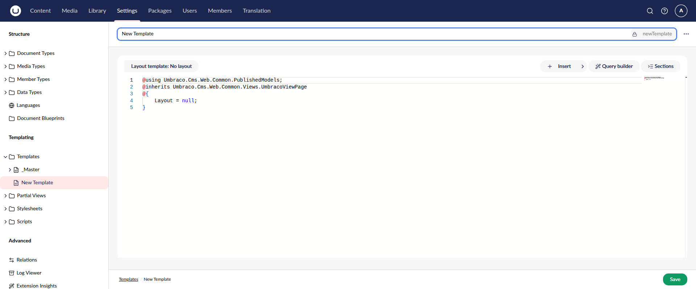
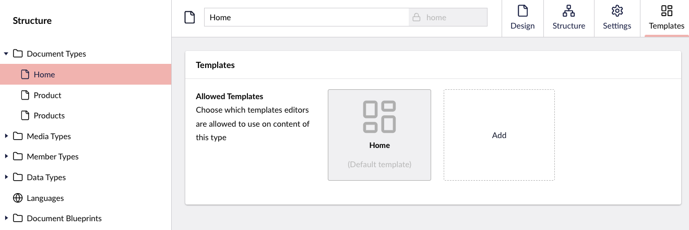
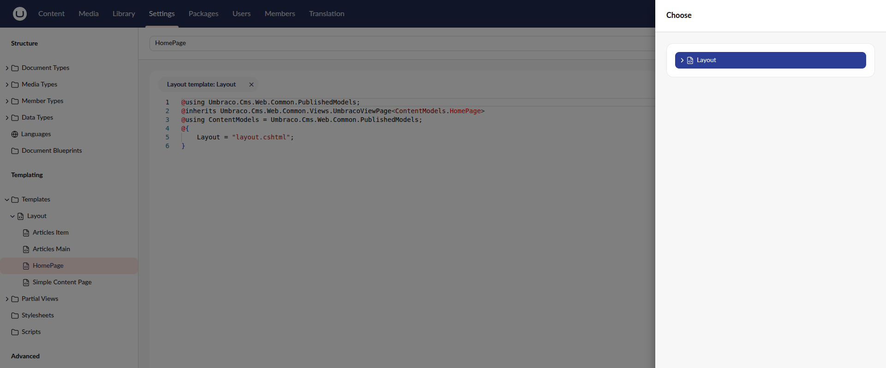
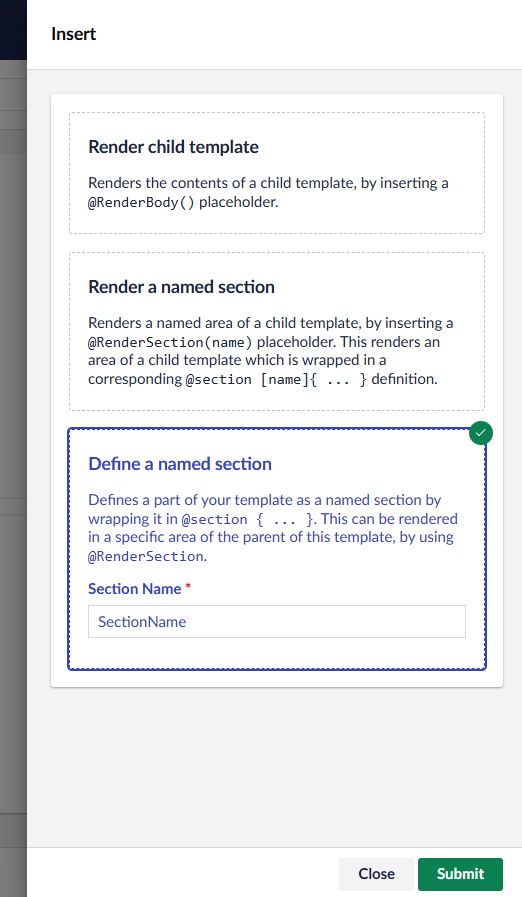
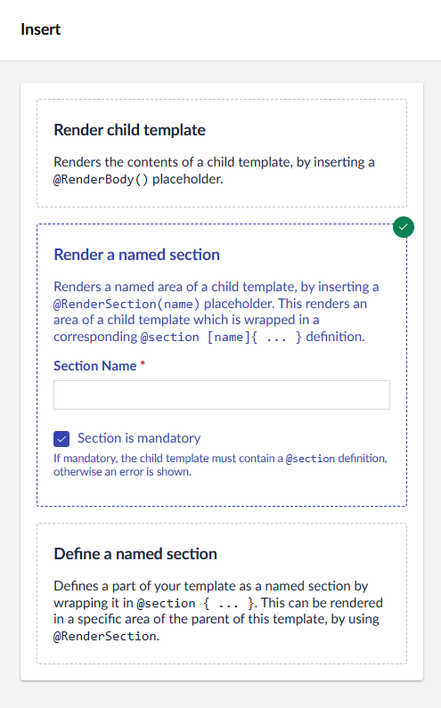
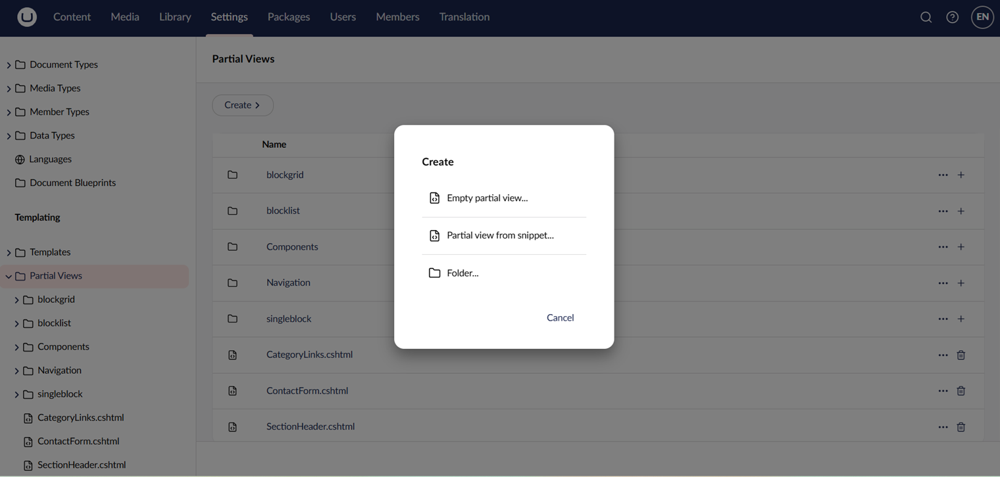

# Working with Templates

Templates are the files that control the look and feel of the frontend of your Umbraco websites. Building on the concept of MVC Razor Views, template files enable you to structure your websites using HTML, CSS, and JavaScript. When tied to a Document Type, templates are used to render your Umbraco content on the frontend.

Each Template is a `cshtml` file in the `Views` folder of your project directory. You can also manage Templates from the Settings section in the Umbraco backoffice.


Generating a Template alongside a new Document Type is a good way to scaffold a starting point. Managing Templates through the backoffice beyond that isn't the recommended approach for most projects.

The backoffice editor doesn't integrate with source control or local build tooling. The editor also gives you no IntelliSense or type checking against your models. Mistakes surface when the page renders instead of while you work.

Editing Templates in the backoffice is blocked entirely when the site runs in `Production` runtime mode. For more information, see [Runtime Modes](../../run-in-production/runtime-modes.md).

In other runtime modes, changes take effect immediately only with the Razor runtime compilation package installed. Without the package, you must rebuild and restart the site. For details, see ["InMemoryAuto models builder and Razor runtime compilation have moved into their own package"](../../get-started/upgrading-and-migrating/version-specific/README.md#umbraco-17) in the Version-specific upgrades guide.

Maintain Templates locally as `.cshtml` files in the `Views` folder using your own IDE. For more information, see [Source Control](../application-code/backend-and-custom-logic/source-control.md).


## Creating Templates

When building an Umbraco website you can automatically generate Templates when you create a new Document Type. This will ensure the connection between the two and you can jump straight from defining the content to structuring it.

Choose the option called [**Document Type with Template**](../../model-your-content/content-types-and-structure/data/defining-content/) when you create a new Document Type to automatically create a Template as well.

In some cases, you might want to create independent Templates that don't have a direct connection to a Document Type. You can follow the steps below to create a new blank Template:

1. Go to the **Settings** section inside the Umbraco backoffice.
2. Click **...** next to the **Templates** folder.
3. Choose **Create**.
4. Enter a template name.
5. Click the **Save** button.

You will now see the default template markup in the backoffice template editor.




Templates are registered in the Umbraco database, so adding a `.cshtml` file to the `Views` folder does not create one on its own.

If the file already exists, create the Template using the file name as the alias. Umbraco picks up the existing file content instead of overwriting it.


## Allowing a Template on a Document Type

To use a Template on your content, you must first allow it on the content Document Type.

1. Open the Document Type you want to use the template.
2. Open the **Templates** Workspace View.
3. Select your Template under the **Allowed Templates** section.
4. Click **Choose**.



## Inheriting a Template

A Template can use another Template as its Layout Template to reuse a shared structure, such as the header and footer, across multiple pages. This uses the Razor layout feature in .NET.

Let's say you have a Template called **MainView**, containing the following HTML:

```csharp
@inherits Umbraco.Cms.Web.Common.Views.UmbracoViewPage
@{
    Layout = null;
}
<!DOCTYPE html>
<html lang="en">
    <body>
        <h1>Hello world</h1>
        @RenderBody()
    </body>
</html>
```

This file contains the structural HTML tags for your website.

By using the Template as the "Layout Template" on your other Templates, you can ensure that they inherit the same structural HTML.

Follow these steps to use a Template file as a Layout Template:

1. Open one of your Template files.
2. Select the **Layout template: No layout** button above the editor.
3. Select the Template that should be defined as the Layout Template.
4. Click **Choose**.



Alternatively, you can manually change the value of the `Layout` variable in the Template using the name of the Template file.

The updated markup will look something like the snippet below and the Template is now referred to as a _Child Template_:

```csharp
@inherits Umbraco.Cms.Web.Common.Views.UmbracoViewPage
@{
    Layout = "MainView.cshtml";
}
<p>My content</p>
```

When a page that uses a Template with a Layout Template defined is rendered, the HTML of the two templates is merged.

The code from the Template replaces the `@RenderBody()` tag in the Layout Template. Following the examples above, the final HTML will look like the code in the snippet below:

```csharp
@inherits Umbraco.Cms.Web.Common.Views.UmbracoViewPage
@{
    Layout = null;
}
<!DOCTYPE html>
<html lang="en">
    <body>
        <h1>Hello world</h1>
        <p>My content</p>
    </body>
</html>
```

## Named Sections

Template Sections give you added flexibility when building your templates. Use the Template Section together with a Layout Template setup, to decide where sections of content are placed.

If a Child Template needs to add code to the `<head>` tag a Section must be defined and then used in the Layout Template. This is made possible by [Named Sections](https://www.youtube.com/watch?v=lrnJwglbGUA).

### Using code

Define a named section in your Template:

```csharp
@section SectionName {
    
}
```

Add your code between the curly brackets, then render the section in your Layout Template:

```csharp
@RenderSection("SectionName", false)
```

For instance, if you want to be able to add HTML to your `<head>` tags, you would add the tag there:

```csharp
@inherits Umbraco.Cms.Web.Common.Views.UmbracoViewPage
@{
    Layout = null;
}

<html>
    <head>
        <title>Title</title>
        @RenderSection("SectionName", false)
    </head>

    <body>
    </body>
</html>
```

### Using the backoffice

The **Sections** dialog writes the same `@section` and `@RenderSection()` code for you:

1. Open your Template.
2. Select the **Sections** option.
3. Choose **Define a named section**.
4. Give the section a name and click **Submit**.



5. Add your code between the curly brackets.
6. Save the changes.
7. Open the Layout Template.
8. Choose a spot for the section and set the cursor there.
9. Select the **Sections** option.
10. Choose **Render a named section**.
11. Enter the name of the section you want to add.
12. Click **Submit**.

### Making a section mandatory

Making a section mandatory means that any template using the Layout Template is required to have the section defined.


Keep in mind that whenever a mandatory named section is missing, it will result in errors on your website.


To make the section mandatory, you have two options:

* Pass `true` as the second argument: `@RenderSection("SectionName", true)`.
* Check the **Section is mandatory** field when using the **Sections** dialog in the backoffice.



## Injecting Partial Views

Another way to reuse HTML is to use partial views - which are small reusable views that can be injected into another view.

Like Templates, a partial view is a `.cshtml` file in your project, stored in the `Views/Partials` folder. You can also create one from the **Partial Views** folder in the backoffice. For more information, see [Partial Views](design/partial-views.md).



The partial view can be injected into any template using the `<partial>` tag helper, like so:

```csharp
@inherits Umbraco.Cms.Web.Common.Views.UmbracoViewPage
@{
    Layout = "MainView.cshtml";
}

<h1>My new page</h1>
<partial name="~/Views/Partials/a-new-view.cshtml" />
```

### Related Articles

* [Working with MVC](templating/mvc/README.md)
* [Rendering content](design/rendering-content.md)
* [Partial Views](design/partial-views.md)

### Tutorials

* [Creating a basic website with Umbraco](../tutorials/creating-a-basic-website/)
