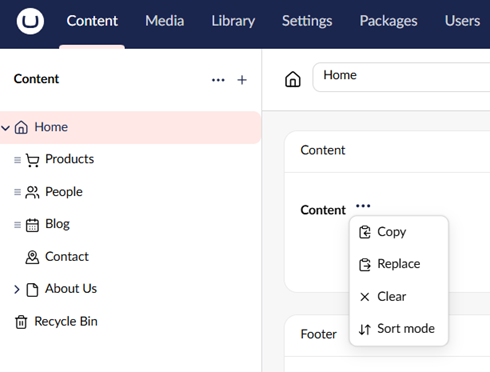

# Property Actions

Property Actions are a built-in feature in Umbraco that lets you add extra buttons or tools to any property editor in the backoffice. Think of them as handy shortcuts you can attach to a field without having to rewrite or mess with the field's actual code.

When you register an action to target a specific property editor type, Umbraco places a three-dot menu (...) right next to that field's name.

## Property Actions in the UI

Umbraco utilizes Property Actions out-of-the-box for complex data types like the Block List (providing default actions like "Copy", "Replace", or "Clear"). The exact same UI container can be dynamically injected next to fields like Textbox or Rich Text Editor.



## Registering a Property Action


Before creating a Property Action, make sure you are familiar with the [Extension Registry in Umbraco](https://docs.umbraco.com/umbraco-cms/customizing/extending-overview/extension-registry/extension-registry).


Here is how you can register a new Property Action:

```typescript
import { umbExtensionsRegistry } from '@umbraco-cms/backoffice/extension-registry';
const manifest =
  {
    type: 'propertyAction',
    kind: 'default',
    alias: 'My.propertyAction',
    name: 'My Property Action',
    forPropertyEditorUis: ["my-property-editor"], // Target specific property editor UI aliases (for example, ["Umb.PropertyEditorUi.TextBox", "Umb.PropertyEditorUi.TinyMCE"])
    api: () => import('./my-property-action.api.js'),
    weight: 10, // Order if multiple actions exist
    meta: {
      icon: 'icon-add', // Icon to display in the UI
      label: 'My property action', // Label shown to editors
    }
  };

umbExtensionsRegistry.register(manifest);
```

### Creating the Property Action Class

Every Property Action needs a class that defines what happens when the action is executed. You can extend the `UmbPropertyActionBase` class for this.

```typescript
import { UmbPropertyActionBase } from '@umbraco-cms/backoffice/property-action';
import { UMB_PROPERTY_CONTEXT } from '@umbraco-cms/backoffice/property';

export class MyPropertyAction extends UmbPropertyActionBase {
  // The execute method is called when the user triggers the action.
  async execute() {
    // Retrieve the property’s current state.
    const propertyContext = await this.getContext(UMB_PROPERTY_CONTEXT);

    // Here it's possible to modify the property or perform other actions.  In this case, setting a value.
    propertyContext.setValue("Default text here");
  }
}
export { MyPropertyAction as api };
```
