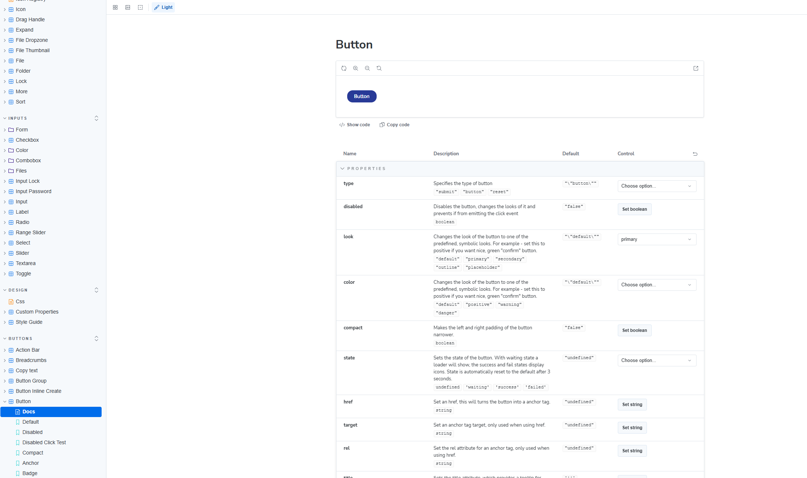
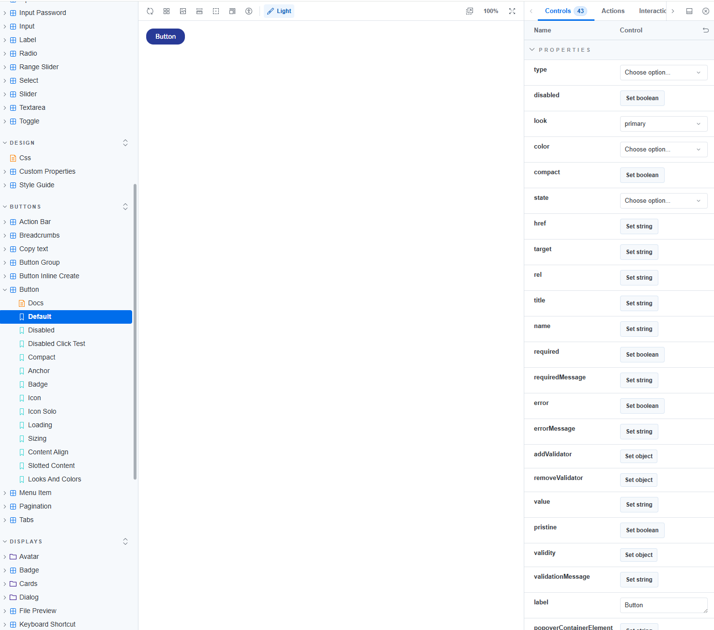

# UI Library

## UI Library and UI API

With the UI Library, you get a collection of visual building blocks that consists of pieces to build any UI in Umbraco. Each component is a building block updating its display according to the data passed to it.


**Are you looking for the AngularJS documentation?**

With Umbraco 14 the Umbraco backoffice has been rebuilt using Web Components and TypeScript. This means that AngularJS is no longer being used in Umbraco CMS, hence the removal of the corresponding documentation.


With the UI API, you get a set of collections related to modules export, interfaces, and hierarchy. This includes code examples and much more that you can use to extend the backoffice.

<table data-card-size="large" data-view="cards" data-full-width="false"><thead><tr><th></th><th></th><th data-hidden data-card-target data-type="content-ref"></th><th data-hidden data-card-cover data-type="files"></th></tr></thead><tbody><tr><td><a href="https://apidocs.umbraco.com/v18/ui/"><strong>Backoffice UI Library</strong></a></td><td>See, test, and get a feel for the familiar backoffice components built using the new UI components.</td><td><a href="https://apidocs.umbraco.com/v18/ui/">https://apidocs.umbraco.com/v18/ui/</a></td><td><a href="../../.gitbook/assets/Documentations Icons_Umbraco_CMS_Fundamentals_Backoffice.png">Documentations Icons_Umbraco_CMS_Fundamentals_Backoffice.png</a></td></tr><tr><td><a href="https://apidocs.umbraco.com/v18/ui-api/"><strong>Backoffice UI API</strong></a></td><td>Find reference documentation about all types and contexts in the Backoffice.</td><td><a href="https://apidocs.umbraco.com/v18/ui-api/">https://apidocs.umbraco.com/v18/ui-api/</a></td><td><a href="../../.gitbook/assets/Documentations Icons_Umbraco_CMS_Fundamentals_Code.png">Documentations Icons_Umbraco_CMS_Fundamentals_Code.png</a></td></tr></tbody></table>

## UI Library Storybook

The Umbraco UI Library is a set of web components that can be used to build Umbraco User Interfaces. The UI Library separates the user interface from Umbraco’s business logic and creates a unified user experience. This is done with coherent styling and naming, across all the Umbraco platforms and projects including the ones developed by you.

[Storybook](https://uui.umbraco.com/) is an application that gathers all the components together of the UI Library. It holds the documentation for the components and showcases different use case scenarios. You can explore all the components through stories reflecting their use cases.

Each story has interactive controls that allow you to change the state of the component in real time. Every publicly available property is editable in Storybook, so you can test out custom configurations and use cases.

You can also modify the custom properties in the stylesheet to see how the component will look. Every story has a code example that you can copy and paste into your project. This will allow you to implement the components in your own packages and extensions.

### Getting Started with the UI Library

The [Storybook](https://uui.umbraco.com/) is the starting point for working with the Umbraco UI Library. Components are grouped by category in the sidebar, and the search box at the top finds a component by name in a couple of keystrokes.

Each component has few entries in the sidebar:

1. `Docs` - Shows a live preview, a full property table with descriptions, and a code sample you can copy directly into your markup. If the preview ever appears empty, the code sample still shows correct usage.

    <figure><figcaption></figcaption></figure>

2. `Default`- Open a dedicated view with a live preview and a Controls panel on the right, where you can change a component's properties and see the result update immediately.

    <figure><figcaption></figcaption></figure>

### Import UI Library Components

You can also work with the components on a code level. If you want to do so here is how you import it:

```typescript
import { UUIButtonElement } from '@umbraco-cms/backoffice/external/uui';
```

This requires that your Package has the `@umbraco-cms/backoffice` dependency.
