# Installing and Uninstalling Packages

This article covers the process of installing and uninstalling packages from your Umbraco CMS website.

## Installing packages

The **Packages** section in the Umbraco Backoffice displays the [Umbraco Marketplace](https://marketplace.umbraco.com/), where you can browse community and official packages for Umbraco CMS.

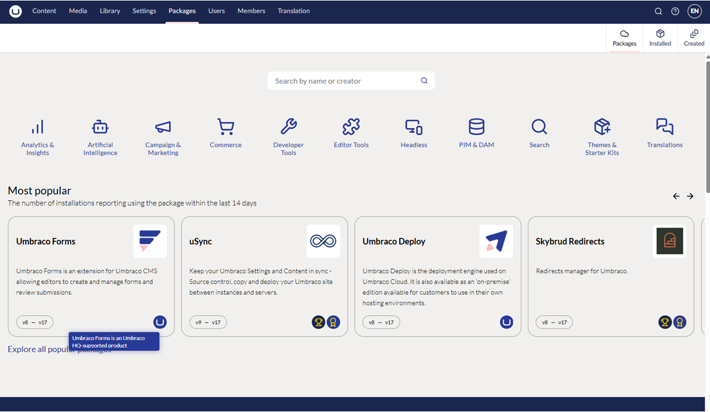

Selecting a package shows an overview and a NuGet CLI install snippet.

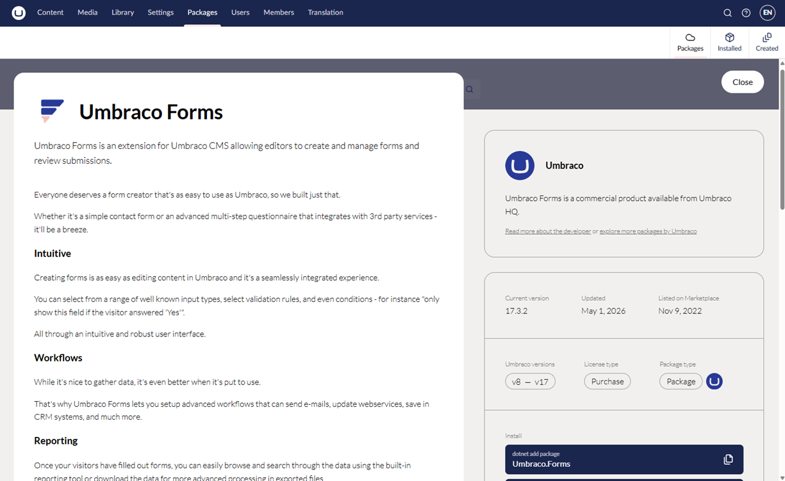

Packages can be installed using any of the following:

* **NuGet Package Manager** in Visual Studio.
* **Package Manager Console** in Visual Studio.
* **.NET CLI** from your terminal or command prompt.

For example, to install the `StarterKit` package, run the following command:

`dotnet add package Umbraco.TheStarterKit`

The NuGet Package Manager in Visual Studio is more visual, and gives you an overview of already installed packages.

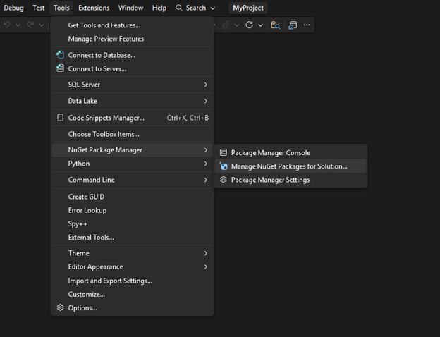

The Package Manager has an integrated search function that allows you to find any public NuGet package and install it on the project.

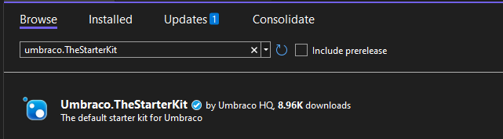

Once the package has been installed, it will show up under the **Packages** section of the backoffice, under **Installed** tab.

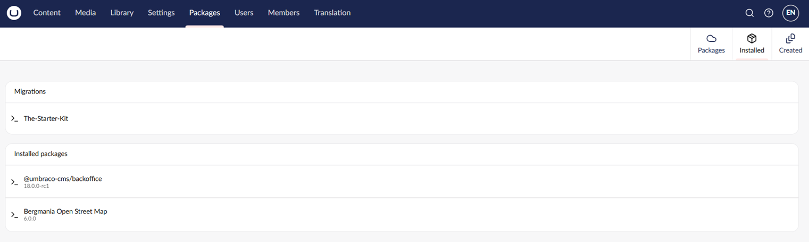

## Uninstalling Packages

Uninstalling packages is not always as straightforward as installing one. The steps vary depending on how much the package contributes to your site. Content and schema-heavy packages (like starter kits) require more cleanup than packages that only add compiled functionality.


The steps below use the Starter Kit as a concrete example, but the general approach applies to most packages. Always check the package's own documentation for any specific removal instructions.


### Step 1: Remove the NuGet package

Run the following command, or use the NuGet Package Manager in Visual Studio:

`dotnet remove package Umbraco.TheStarterKit`

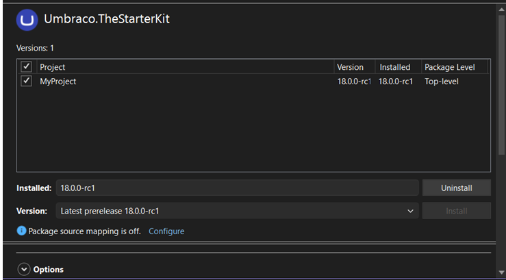

After removing the package, clean the solution to clear any cached build output:

`dotnet clean`

Alternatively, right-click the project in Visual Studio and select **Clean**.

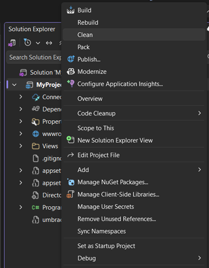

### Step 2: Remove leftover Backoffice content

Some packages, particularly starter kits, install content, media, Document Types, and templates directly into the Backoffice. These are not removed when you uninstall the NuGet package and must be deleted manually.
For guidance on deleting items in each section, refer to the [Backoffice Essentials](../../get-started/backoffice-essentials/README.md) section.

Remove content provided by the package

There is no universal way to distinguish package-provided content from custom content. In the Content section, delete the relevant nodes. If the goal is a clean slate, delete all content and empty the recycle bin.

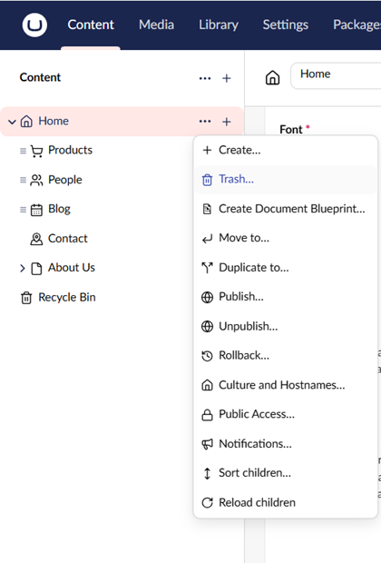

Remove media provided by the package

Delete any media items installed by the package from the Media section.

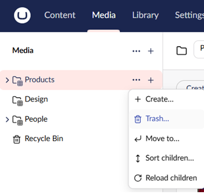

Remove Document Types

Document Types can be removed from the Settings section. A clean Umbraco installation has no Document Types by default, so all of them can be safely deleted if you are fully removing the package.

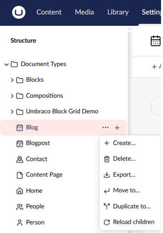

Removing Data Types

Unlike Document Types, some Data Types are included in Umbraco by default and should not be removed. Delete only items that follow the package's naming convention. Typically a Document Type prefix with multiple dashes (for example, Blog - How many posts should be shown - Slider).

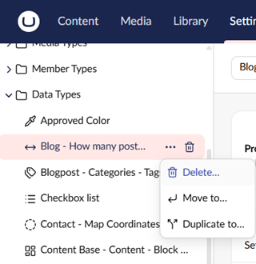

Removing Templates

No Templates are included in a default Umbraco installation, so all Templates can be safely deleted.

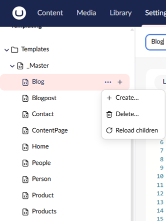

Removing Partial Views

A default installation includes a small number of views inside the `blocklist` and `grid` folders. Everything outside those folders can be safely removed.

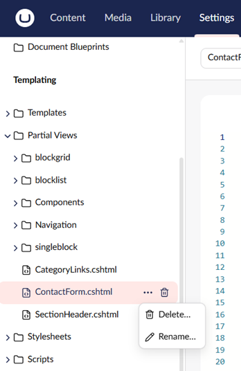

Clean up leftover files on disk

Some packages leave files in the `App_Plugins` folder after the NuGet package is removed. These include custom dashboards, editors, and scripts that are not automatically deleted. Remove the relevant package folder from `App_Plugins` manually.

Additionally, some packages install other NuGet packages as dependencies. For example, the Starter Kit also installs `Bergmania.OpenStreetMap`, which mightl still appear as installed in the Backoffice after the Starter Kit is removed. Check the **Installed** tab in the **Packages** section and remove any orphaned dependencies.

## Consequences of removing packages

If content on the website relies on having a custom Property Editor or a data source installed, those properties will default to a `label` Data Type. All previously saved content in the property will in turn be converted to a string.

Depending on the package and your implementation, frontend functionality that relies on the removed package may also stop working. Always check the frontend of your site after uninstalling a package.
