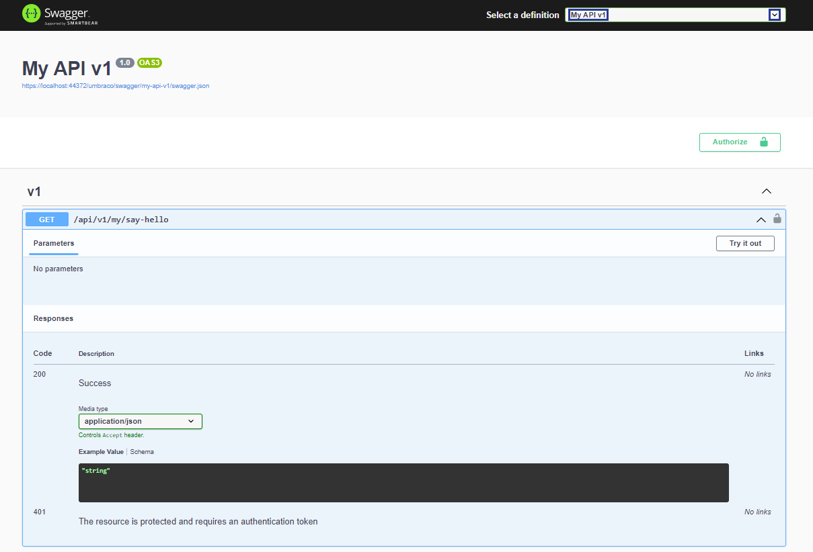
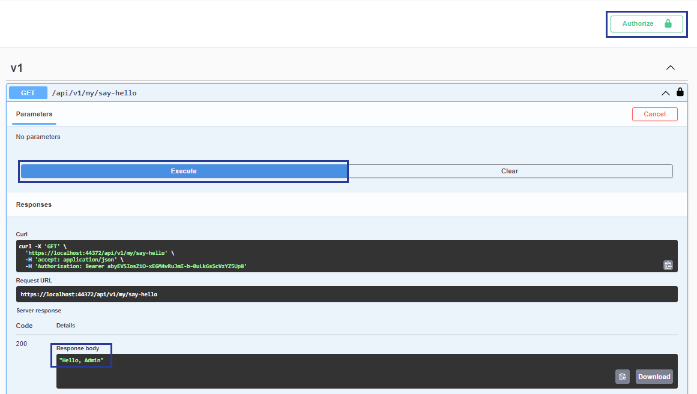

# Custom Backoffice API

This article covers how to create a Custom API controller protected by the backoffice authorization policies. It also shows how to enable authorization in Swagger UI.


Before proceeding, make sure to read the [Management API](../../develop-with-umbraco/headless-and-apis/management-api/) article. It provides information about the OpenAPI documentation and Authorization used in this article.


The following example can be a starting point for creating a secure custom API with automatic OpenAPI documentation. You can find other examples in the [API versioning and OpenAPI](api-versioning-and-openapi.md) article.



If you are building this in a class library, add the following property to the library's `.csproj`:

```xml
<PropertyGroup>
  <InterceptorsNamespaces>$(InterceptorsNamespaces);Microsoft.AspNetCore.OpenApi.Generated</InterceptorsNamespaces>
</PropertyGroup>
```

Without this property, the project fails to build with: `error CS9137: The 'interceptors' feature is not enabled in this compilation`.



1. Create a composer to register the OpenAPI document so that the new API shows in the OpenAPI documentation and Swagger UI:


```csharp
using Umbraco.Cms.Api.Common.OpenApi;
using Umbraco.Cms.Api.Management.OpenApi;
using Umbraco.Cms.Core;
using Umbraco.Cms.Core.Composing;

namespace Umbraco.Cms.Web.UI.Custom;

public class MyApiComposer : IComposer
{
    public void Compose(IUmbracoBuilder builder)
        => builder.AddBackOfficeOpenApiDocument(
            "my-api-v1",
            document => document
                .WithTitle("My API v1")
                .WithBackOfficeAuthentication()
                .WithJsonOptions(Constants.JsonOptionsNames.BackOffice));
}
```


`AddBackOfficeOpenApiDocument` registers a custom OpenAPI document with Umbraco's defaults applied:

- It includes controllers whose `[MapToApi]` attribute value matches the document name.
- It applies Umbraco's schema and operation ID conventions.
- It adds the document to the Swagger UI dropdown.

The builder methods configure additional behavior:

- `WithBackOfficeAuthentication()` enables OAuth2-based backoffice authorization in Swagger UI.
- `WithJsonOptions(Constants.JsonOptionsNames.BackOffice)` aligns schema generation with how the backoffice serializes responses at runtime.

2. Create a new file `MyApiController.cs` with the following controller:


```csharp
using Asp.Versioning;
using Microsoft.AspNetCore.Authorization;
using Microsoft.AspNetCore.Mvc;
using Umbraco.Cms.Api.Common.Attributes;
using Umbraco.Cms.Api.Common.Filters;
using Umbraco.Cms.Core;
using Umbraco.Cms.Core.Models.Membership;
using Umbraco.Cms.Core.Security;
using Umbraco.Cms.Web.Common.Authorization;

namespace Umbraco.Cms.Web.UI.Custom;

[ApiController]
[ApiVersion("1.0")]
[MapToApi("my-api-v1")]
[Authorize(Policy = AuthorizationPolicies.BackOfficeAccess)]
[JsonOptionsName(Constants.JsonOptionsNames.BackOffice)]
[Route("api/v{version:apiVersion}/my")]
public class MyApiController : Controller
{
    private readonly IBackOfficeSecurityAccessor _backOfficeSecurityAccessor;

    public MyApiController(IBackOfficeSecurityAccessor backOfficeSecurityAccessor)
        => _backOfficeSecurityAccessor = backOfficeSecurityAccessor;

    [HttpGet("say-hello")]
    [MapToApiVersion("1.0")]
    [ProducesResponseType(typeof(string), StatusCodes.Status200OK)]
    public IActionResult SayHello()
    {
        IUser currentUser = _backOfficeSecurityAccessor.BackOfficeSecurity?.CurrentUser
                            ?? throw new InvalidOperationException("No backoffice user found");
        return Ok($"Hello, {currentUser.Name}");
    }
}
```


`[JsonOptionsName(Constants.JsonOptionsNames.BackOffice)]` tells the controller to serialize responses using the backoffice JSON options. This must match the `WithJsonOptions` call in the composer so the OpenAPI schema reflects the actual serialization output.

3. Run the project and navigate to `{yourdomain}/umbraco/openapi`.
4. Choose the OpenAPI document created with the code above named **My API v1** from **Select a definition**.



Here, you can find the endpoint that was created:

```http
GET /api/v1/my/say-hello
```

5. Click on the **Authorize** button to authenticate.
6. Try out the endpoint using the **Try it out** button.
7. Click on **Execute**.



You now get the response you have set up using the code: `"Hello, <user name>"`.
