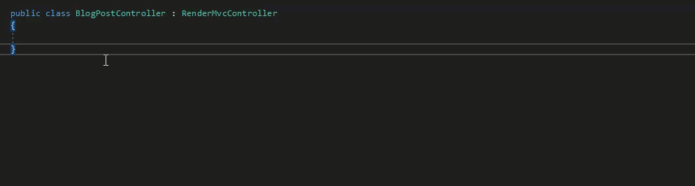

# Services and Helpers

Umbraco has a range of 'Core' Services and Helpers that act as a 'gateway' to Umbraco data and functionality to use when building Umbraco sites.

The general rule of thumb is that management Services provide access to allow the modification of Umbraco data. The services are not optimized for displaying data. Helpers on the other hand provide access to readonly data with performance of displaying data taken into consideration.



Avoid using `IContentService` in Views or Templates to fetch data; it queries the database and slows performance. Use it only for modifying content.

To display data faster, inject `IPublishedContentQueryAccessor` to access the `IPublishedContentQuery` cache.



The management Services and Helpers are all registered with Umbraco's underlying DI framework. This article aims to show examples of gaining access to utilize these resources in multiple different scenarios. There are subtle differences to be aware of depending on what part of Umbraco is being extended.

This article suggests using a similar pattern to encapsulate custom, site-specific logic in services and helpers registered with the underlying DI container. This would be to avoid repetition and promote consistency and readability within an Umbraco site solution.

## Accessing Management Services and Helpers in a Template/View

Inside a view/template or partial view, access is also provided by the DI framework, by using the `@inject` keyword.

```csharp
@inherits Umbraco.Cms.Web.Common.Views.UmbracoViewPage<ContentModels.Root>
@using ContentModels = Umbraco.Cms.Web.Common.PublishedModels;
@using Umbraco.Cms.Core.Services;
@using Umbraco.Cms.Web.Common;

@* it is really 'unlikely' to need to use a management Service in a view: *@
@inject IRelationService RelationService
@inject UmbracoHelper Umbraco

@{
    Layout = null;

    // retrieve an item from Umbraco's published cache with id 123
    IPublishedContent publishedContentItem = Umbraco.Content(123);
}
```



Avoid using `IContentService` in Views or Templates to fetch data; it queries the database and slows performance. Use it only for modifying content.

To display data faster, inject `IPublishedContentQueryAccessor` to access the `IPublishedContentQuery` cache.



## Accessing Core Services and Helpers in a Controller

Inside a [custom Controller](../../../develop-with-umbraco/application-code/backend-and-custom-logic/routing/custom-controllers.md) access is provided to Services via the `Services` property ([ServiceContext](../management/)) and the `UmbracoHelper` via the `Umbraco` property ([UmbracoHelper](../../../develop-with-umbraco/templating-and-rendering/querying/umbracohelper.md)).

```csharp
using Microsoft.AspNetCore.Mvc;
using Microsoft.AspNetCore.Mvc.ViewEngines;
using Microsoft.Extensions.Logging;
using Umbraco.Cms.Core;
using Umbraco.Cms.Core.Models.PublishedContent;
using Umbraco.Cms.Core.Services;
using Umbraco.Cms.Core.Web;
using Umbraco.Cms.Web.Common.Controllers;

namespace MyProject.Controllers;

public class BlogPostController : RenderController
{
    private readonly ILogger<BlogPostController> _logger;
    private readonly IPublishedContentQuery _publishedContentQuery;
    private readonly IRelationService _relationService;

    public BlogPostController(
        ILogger<BlogPostController> logger,
        ICompositeViewEngine compositeViewEngine,
        IUmbracoContextAccessor umbracoContextAccessor,
        IPublishedContentQuery publishedContentQuery,
        IRelationService relationService)
        : base(logger, compositeViewEngine, umbracoContextAccessor)
    {
        _logger = logger;
        _publishedContentQuery = publishedContentQuery;
        _relationService = relationService;
    }

    public override IActionResult Index()
    {
        // write helpful messages to the Umbraco logs to aid with debugging
        _logger.LogInformation("Using core logger implementation");
        // retrieve an item from Umbraco's published cache with id 123
        IPublishedContent publishedContentItem = _publishedContentQuery.Content(123);
        // it is unlikely to use a management service when rendering content from a custom controller
        //(when using relationService like this you would want to provide a layer of caching)
        var allRelatedUmbracoItems = _relationService.GetByParentId(CurrentPage.Id);

        return base.Index();
    }
}
```

## Accessing core Services and Helpers when there is no 'UmbracoContext'

Controllers and Views can access an `IUmbracoContext` by injecting the `IUmbracoContextAccessor`. This is, however, not always the case. The following common extension points are exceptions: Components, ContentFinders or Custom C# Classes.


`IUmbracoContext`, `UmbracoHelper`, and `IPublishedContentQuery` are all scoped to the current `HttpRequest`. Injecting one into a class resolved outside a request — like a Singleton service — makes Umbraco report an error at startup.


### Injecting Services into a Component

It's possible to inject management Services that do not rely on the `UmbracoContext` into the constructor of a component. This example demonstrates injecting `IMediaService` into a notification handler to auto-create a media folder when saving a landing page.

```csharp
using System.Linq;
using Umbraco.Cms.Core.Composing;
using Umbraco.Cms.Core.DependencyInjection;
using Umbraco.Cms.Core.Events;
using Umbraco.Cms.Core.Models;
using Umbraco.Cms.Core.Notifications;
using Umbraco.Cms.Core.Services;

namespace MyProject.Components;

public class SubscribeToContentSavedEventComposer : IComposer
{
    public void Compose(IUmbracoBuilder builder)
    {
        builder.AddNotificationHandler<ContentSavedNotification, SubscribeToContentSavedNotification>();
    }
}
public class SubscribeToContentSavedNotification: INotificationHandler<ContentSavedNotification>
{
    private readonly IMediaService _mediaService;

    public SubscribeToContentSavedNotification(IMediaService mediaService)
    {
        _mediaService = mediaService;
    }

    public void Handle(ContentSavedNotification notification)
    {
        foreach (var contentItem in notification.SavedEntities)
        {
            // if this is a new landing page create a folder for associated media in the media section
            if (contentItem.ContentType.Alias == "landingPage")
            {
                // we have injected in the mediaService in the constructor for the component see above.
                bool hasExistingFolder = _mediaService.GetByLevel(1).Any(f => f.Name == contentItem.Name);
                if (!hasExistingFolder)
                {
                    // let's create one (-1 indicates the root of the media section)
                    if (contentItem.Name is null) continue;        
                    IMedia newFolder = _mediaService.CreateMedia(contentItem.Name, -1, "Folder");
                    _mediaService.Save(newFolder);
                }
            }
        }
    }
}
```

See documentation on [Composing](../../../model-your-content/content-types-and-structure/composing.md) for further examples and information on Components and Composition.

### Accessing Published Content outside of a HTTP Request

Injecting types that are based on an HTTP Request such as `UmbracoHelper` into classes that are not based on an HTTP Request will trigger an error. However, there is a technique that allows the querying of the Umbraco Published Content, using the `UmbracoContextFactory` and calling `EnsureUmbracoContext()`.

Instead of returning a 404 when a user requests an unpublished page, you can serve a 410 "Page Gone" status code. Subscribe to the `ContentService` unpublishing notification, check the published content cache for its URL, and store it to serve a 410 status later.

An [IContentFinder](../../../develop-with-umbraco/application-code/backend-and-custom-logic/routing/request-pipeline/icontentfinder.md) could be placed in the ContentFinder ordered collection, right before a 404 is served. This checks the request against stored 410 URLs and serves a 410 status code if a match is found.

```csharp
using System;
using Umbraco.Cms.Core;
using Umbraco.Cms.Core.Composing;
using Umbraco.Cms.Core.DependencyInjection;
using Umbraco.Cms.Core.Events;
using Umbraco.Cms.Core.Models.PublishedContent;
using Umbraco.Cms.Core.Notifications;
using Umbraco.Cms.Core.PublishedCache;
using Umbraco.Cms.Core.Web;
using Umbraco.Extensions;

namespace MyProject.Components;

public class HandleUnPublishingEventComposer : IComposer
{
    public void Compose(IUmbracoBuilder builder)
    {
        builder.AddNotificationHandler<ContentUnpublishingNotification, HandleUnPublishingHandler>();
    }
}

public class HandleUnPublishingHandler : INotificationHandler<ContentUnpublishingNotification>  
{
    private readonly IUmbracoContextFactory _umbracoContextFactory;
    private readonly ICustomFourTenService _customFourTenService; // Your own custom service for persisting 410 URLs

    public HandleUnPublishingHandler(IUmbracoContextFactory umbracoContextFactory, ICustomFourTenService customFourTenService)
    {
        _umbracoContextFactory = umbracoContextFactory;
        _customFourTenService = customFourTenService;
    }

    public void Handle(ContentUnpublishingNotification notification)     
    {                                                                                                                                                    
        // for each item being unpublished, find the url it is currently published under and store in a database table or similar                        
        using (UmbracoContextReference umbracoContextReference = _umbracoContextFactory.EnsureUmbracoContext())                                          
        {                                                                                                                                                
            // the UmbracoContextReference provides access to the ContentCache      
            IPublishedContentCache contentCache = umbracoContextReference.UmbracoContext.Content;                                                        
                                                              
            foreach (var item in notification.UnpublishedEntities)
            {
                if (item.ContentType.Alias == "blogpost")
                {
                    // Use ContentUnpublishingNotification rather than ContentUnpublishedNotification
                    // — the pre-notification fires before the cache is updated, so the   
                    // item is still available via GetById at this point.
                    IPublishedContent? soonToBeUnPublishedItem = contentCache.GetById(item.Id);

                    if (soonToBeUnPublishedItem != null)
                    {
                        string previouslyPublishedUrl = soonToBeUnPublishedItem.Url();

                        if (!string.IsNullOrEmpty(previouslyPublishedUrl) && previouslyPublishedUrl != "#")
                        {
                            _customFourTenService.InsertFourTenUrl(previouslyPublishedUrl, DateTime.UtcNow);
                        }
                    }
                }
            }
        }
    }
}
```

#### Accessing the Published Content Cache via IPublishedContentQuery

When fetching multiple content items by ID, using `UmbracoContext.Content` is limited because it only allows retrieving one item at a time. To query multiple items efficiently, you can use `IPublishedContentQuery`. For more details, see the [IPublishedContentQuery](../../../develop-with-umbraco/templating-and-rendering/querying/ipublishedcontentquery.md) article.

#### Accessing the Published Content Cache from a Content Finder / UrlProvider

Inside a custom `IContentFinder` implementation, access to the content cache is possible by injecting `IUmbracoContextAccessor` into the constructor, provided via the `PublishedRequest` object:

```csharp
using Umbraco.Cms.Core.Routing;
using Umbraco.Cms.Core.Web;

public class MyContentFinder : IContentFinder
{
    private readonly IUmbracoContextAccessor _umbracoContextAccessor;

    public MyContentFinder(IUmbracoContextAccessor umbracoContextAccessor)
    {
        _umbracoContextAccessor = umbracoContextAccessor;
    }

    public Task<bool> TryFindContent(IPublishedRequestBuilder request)
    {
        if (!_umbracoContextAccessor.TryGetUmbracoContext(out var umbracoContext))
        {
            return Task.FromResult(false);
        }

        var someContent = umbracoContext.Content.GetById(1234);

        // ...
        return Task.FromResult(true);
    }
}
```

You can also inject `IUmbracoContextAccessor` into the constructor of a custom `IUrlProvider` implementation:

```csharp
using Umbraco.Cms.Core.Models;
using Umbraco.Cms.Core.Models.PublishedContent;
using Umbraco.Cms.Core.Routing;
using Umbraco.Cms.Core.Web;

public class MyCustomUrlProvider : IUrlProvider
{
    private readonly IUmbracoContextAccessor _umbracoContextAccessor;

    public MyCustomUrlProvider(IUmbracoContextAccessor umbracoContextAccessor)
    {
        _umbracoContextAccessor = umbracoContextAccessor ?? throw new ArgumentNullException(nameof(umbracoContextAccessor));
    }

    public string Alias => "myCustom";

    public UrlInfo? GetUrl(IPublishedContent content, UrlMode mode, string? culture, Uri current)
    {
        var umbracoContext = _umbracoContextAccessor.GetRequiredUmbracoContext();
        var someContent = umbracoContext.Content.GetById(1234);

        // ...
        return null;
    }

    public IEnumerable<UrlInfo> GetOtherUrls(int id, Uri current) => [];

    public Task<UrlInfo?> GetPreviewUrlAsync(IContent content, string? culture, string? segment) => Task.FromResult<UrlInfo?>(null);
}
```

Register the custom provider with Umbraco's underlying DI container using an `IComposer`:

```csharp
using Umbraco.Cms.Core.Composing;
using Umbraco.Cms.Core.DependencyInjection;

public class MyCustomUrlProviderComposer : IComposer
{
    public void Compose(IUmbracoBuilder builder)
    {
        builder.AddUrlProvider<MyCustomUrlProvider>();
    }
}
```


It is still possible to inject services into IContentFinder's. IContentFinders are singletons, but the example is showing you do not 'need to' in order to access the Published Content Cache.


## Customizing Services and Helpers

When implementing an Umbraco site, you often reuse code that operates on data via core management Services or Umbraco Helpers.

For example; Getting a list of the latest News Articles, or building a link to the site's News Section or Contact Us page. Repeating this kind of logic in multiple places like Views, Partial Views and Controllers, is possible. It is, however, considered good practice to consolidate this logic into a single place.

### Extension methods

One option is to add 'Extension Methods' to the `UmbracoHelper` class or `IPublishedContentQuery` interface.

```csharp
using System.Linq;
using Umbraco.Cms.Core;
using Umbraco.Cms.Core.Models.PublishedContent;
using Umbraco.Extensions;

namespace MyProject.Components;

public static class PublishedContentQueryExtensions
{
    public static IPublishedContent? GetNewsSection(this IPublishedContentQuery publishedContentQuery)
    {
        // assuming a single site with a single News Section at the top level
        IPublishedContent? siteRoot = publishedContentQuery.ContentAtRoot().FirstOrDefault();
        // make sure siteRoot isn't null, then locate first child content item with alias 'newsSection'
        return siteRoot?.FirstChild(f => f.ContentType.Alias == "newsSection");
    }
}
```

When calling an extension method that includes the namespace for `UmbracoHelper` or `IPublishedContentQuery`, invoke it directly using `_publishedContentQuery.GetNewsSection()`.

### Custom Services and Helpers

Another option, is to make use of the underlying DI framework, and create custom Services and Helpers. These can in turn have the 'core' management Services and Umbraco Helpers injected into them.

This approach enables the grouping together of similar methods within a suitably named service. It also promotes the possibility of testing this custom logic outside of Controllers and Views.


Depending on where the custom service will be utilized, we will dictate the best practice approach to accessing the 'Published Content Cache'. If it is guaranteed that the service will only be called from with an UmbracoContext, like a controller, it is safe to inject `IPublishedContentQuery`. However if the custom service is called in a location without UmbracoContext (like an notification handler) it will fail. The approach of accessing the Published Content Cache via injecting `IUmbracoContextFactory` and calling `EnsureUmbracoContext()` will provide consistency across any custom services no matter where they are utilized.



In this example, you create a custom service, that's responsible for finding key pages within a site. This could be pages like the News Section or the Contact Us page. These methods will be called in different places throughout the site, and you'll encapsulate the logic to retrieve them in a single place. This service will be called `SiteService`.

Create an interface to define the service:

```csharp
using Umbraco.Cms.Core.Models.PublishedContent;

namespace MyProject.Services;

public interface ISiteService
{
    IPublishedContent GetNewsSection();
    IPublishedContent GetContactUsPage();
}
```

Create the concrete service class that implements the interface:

```csharp
using System;
using Umbraco.Cms.Core.Models.PublishedContent;

namespace MyProject.Services;

public class SiteService : ISiteService
{
    public IPublishedContent GetNewsSection()
    {
        // TODO: implement this!
        throw new NotImplementedException();
    }

    public IPublishedContent GetContactUsPage()
    {
        // TODO: implement this!
        throw new NotImplementedException();
    }
}
```

Register the custom service with Umbraco's underlying DI container using an `IComposer`:

```csharp
using Microsoft.Extensions.DependencyInjection;
using Umbraco.Cms.Core.Composing;
using Umbraco.Cms.Core.DependencyInjection;

namespace MyProject.Services;

public class RegisterSiteServiceComposer : IComposer
{
    public void Compose(IUmbracoBuilder builder)
    {
        builder.Services.AddSingleton<ISiteService, SiteService>();
    }
}
```

#### Lifetimes

**"Transient"** services can be injected into "Transient" and below ⤵. In other words, "Transient" services can be injected anywhere.

* "Transient" means that anytime this type is needed a brand new instance of this type will be created.

**"Scope"** services can be injected into "Request"/"Scope" based lifetimes only

* "Scope" means that a single instance of this type will be created for the duration of the current HttpRequest. The instance will be disposed of at the end of the current HttpRequest.

**"Singleton"** services can be injected into "Singletons" and below ⤵.

* "Singleton" means that only a single instance of this type will ever be created for the lifetime of the application.

#### Implementing the service

**1 - The service will ONLY be used during a request like in a Controller or View**

You can avoid repeating common implementation logic in multiple controllers and views. This is done by consolidating these implementations into a custom service. If you are familiar with `IPublishedContentQuery`, injecting this into the custom service is straight forward. The only caveat is you can only use this service in a controller/view.

For example, locating the 'special' pages in the site using the familiar syntax of the `IPublishedContentQuery`:

```csharp
using System.Linq;
using Umbraco.Cms.Core;
using Umbraco.Cms.Core.Models.PublishedContent;
using Umbraco.Extensions;

namespace MyProject.Services;

public class SiteService : ISiteService
{
    private readonly IPublishedContentQuery _contentQuery;
    public SiteService(IPublishedContentQuery contentQuery)
    {
        _contentQuery = contentQuery;
    }
    public IPublishedContent GetNewsSection()
    {
        var siteRoot = _contentQuery.ContentAtRoot().FirstOrDefault();
        var newsSection = siteRoot?.FirstChild(f => f.ContentType.Alias == "newsSection") ?? null;
        return newsSection;
    }
    public IPublishedContent GetContactUsPage()
    {
        var siteRoot = _contentQuery.ContentAtRoot().FirstOrDefault();
        var contactUs = siteRoot?.FirstChild(f => f.ContentType.Alias == "contactUs") ?? null;
        return contactUs;
    }
}
```


This implementation injects `IPublishedContentQuery`, which is scoped to the current HTTP request. Register `SiteService` as `Scoped` (or `Transient`), not `Singleton`:

```csharp
builder.Services.AddScoped<ISiteService, SiteService>();
```

Registering it as a `Singleton`, as shown in the earlier registration example, causes Umbraco to fail on startup with an error similar to:

`Cannot consume scoped service 'Umbraco.Cms.Core.IPublishedContentQuery' from singleton 'MyProject.Services.ISiteService'.`


**2 - The service can be used within or outside of a web request**

In order to replicate `ContentAtRoot` outside of a web request, you can inject `IDocumentNavigationQueryService` (or `IMediaNavigationQueryService` for media). This service provides access to an in-memory store of unique keys for all root nodes within the Umbraco Content or Media trees.


This replaces the `PublishedContentCache` (or PublishedMediaCache) `GetAtRoot()` method.


```csharp
using Umbraco.Cms.Core;
using Umbraco.Cms.Core.Models.PublishedContent;
using Umbraco.Cms.Core.PublishedCache;
using Umbraco.Cms.Core.Services.Navigation;
using Umbraco.Cms.Core.Web;

namespace UmbracoExamples.Services;

public interface ISiteService
{
    IPublishedContent? GetNewsSection();

    IPublishedContent? GetContactUsPage();
}

public class SiteService : ISiteService
{
    private readonly IUmbracoContextFactory _umbracoContextFactory;
    private readonly IDocumentNavigationQueryService _documentNavigationQueryService;

    public SiteService(IUmbracoContextFactory umbracoContextFactory, IDocumentNavigationQueryService documentNavigationQueryService)
    {
        _umbracoContextFactory = umbracoContextFactory;
        _documentNavigationQueryService = documentNavigationQueryService;
    }

    public IPublishedContent? GetNewsSection() => GetFirstChildOfRoot("newsSection");

    public IPublishedContent? GetContactUsPage() => GetFirstChildOfRoot("contactUs");

    private IPublishedContent? GetFirstChildOfRoot(string contentTypeAlias)
    {
        using UmbracoContextReference umbracoContextReference = _umbracoContextFactory.EnsureUmbracoContext();
        IPublishedContentCache contentQuery = umbracoContextReference.UmbracoContext.Content;

        if (_documentNavigationQueryService.TryGetRootKeys(out IEnumerable<Guid> rootKeys) is false)
        {
            return null;
        }

        IPublishedContent? siteRoot = rootKeys
            .Select(key => contentQuery.GetById(key))
            .WhereNotNull()
            .FirstOrDefault();

        return siteRoot?.FirstChild(f => f.ContentType.Alias == contentTypeAlias);
    }
}
```

The second approach can seem 'different' or more complex at first glance, but it is the syntax and method names that are slightly different... it enables the registering of the service in Singleton Scope, and its use outside of controllers and views.

This implementation only depends on `IUmbracoContextFactory` and `IDocumentNavigationQueryService`, both of which are safe to resolve from a Singleton:

```csharp
builder.Services.AddSingleton<ISiteService, SiteService>();
```


Occasionally, you may face a situation where Umbraco fails to boot, due to a circular dependency on `IUmbracoContextFactory`. This can happen if your service interacts with third party code that also depends on an `IUmbracoContextFactory` instance (like an Umbraco package).

See the [Circular Dependencies](circular-dependencies.md) article for an example on how to get around this.


**Aside: What is the IUmbracoContextAccessor then?**

The `IUmbracoContextFactory` will obtain an `UmbracoContext` by first checking to see if one exists on the current thread using the `IUmbracoContextAccessor`. This is a singleton that can be injected anywhere and whose function is to provide access to the current UmbracoContext. On a 'non request' thread the IUmbracoContextAccessor's TryGetUmbracoContext method will return false and the IUmbracoContextFactory will create a new instance of the UmbracoContext.

To identify whether the UmbracoContext has been obtained from an existing thread, or whether it has been freshly created, you can 'inject' `IUmbracoContextAccessor` yourself. This will check if the UmbracoContext is null using the TryGetUmbracoContext method, indicating whether you are in a 'non request' thread or not. You will still need to inject and use an IUmbracoContextFactory if you subsequently want to obtain an UmbracoContext in a non-request thread.

```csharp
using System.Linq;
using Umbraco.Cms.Core.Models.PublishedContent;
using Umbraco.Cms.Core.Web;

namespace MyProject.Services;

public class SiteService : ISiteService
{
    private readonly IUmbracoContextAccessor _umbracoContextAccessor;
    private readonly IUmbracoContextFactory _umbracoContextFactory;

    public SiteService(IUmbracoContextAccessor umbracoContextAccessor, IUmbracoContextFactory umbracoContextFactory)
    {
        _umbracoContextAccessor = umbracoContextAccessor;
        _umbracoContextFactory = umbracoContextFactory;
        bool hasUmbracoContext = _umbracoContextAccessor.TryGetUmbracoContext(out _);
    }
}
```

NB: With the `IUmbracoContextAccessor` and `IUmbracoContextFactory` you should never have to inject the UmbracoContext itself directly into any of your constructors.

#### Using the custom SiteService inside a Controller

Because the SiteService is registered with Umbraco's underlying DI framework you can inject the service into your controller's constructor. This is done in the same way as 'core' Services and Helpers.

```csharp
using Microsoft.AspNetCore.Mvc;
using Microsoft.AspNetCore.Mvc.ViewEngines;
using Microsoft.Extensions.Logging;
using Umbraco.Cms.Core.Web;
using Umbraco.Cms.Web.Common.Controllers;
using MyProject.Services;

namespace MyProject.Controllers;

public class BlogPostController : RenderController
{
    private readonly ISiteService _siteService;

    public BlogPostController(
        ILogger<RenderController> logger,
        ICompositeViewEngine compositeViewEngine,
        IUmbracoContextAccessor umbracoContextAccessor,
        ISiteService siteService)
        : base(logger, compositeViewEngine, umbracoContextAccessor)
    {
        _siteService = siteService;
    }
    public override IActionResult Index()
    {
        var newsSection = _siteService.GetNewsSection();
        var blogPostViewModel = new BlogPostViewModel(CurrentPage);
        blogPostViewModel.HasNewsSection = false;
        if (newsSection != null)
        {
            blogPostViewModel.HasNewsSection = true;
            blogPostViewModel.NewsSection = newsSection;
        }

        // etc
        // Do other stuff here!, then return the custom viewmodel to the template view.
        return CurrentTemplate(blogPostViewModel);
    }
}
```

You can generate this controller in Visual Studio by using either ctrl + . or alt + enter when your cursor is on the base class:

<figure><figcaption></figcaption></figure>

#### Using the SiteService inside a View

If strictly following the paradigm of MVC, calling custom Services from Views might feel like an anti-pattern. However there isn't necessarily one single 'best practice' approach to working with Umbraco. A lot depends on circumstance, expertise and pragmatism. Allowing Umbraco to handle the flow of incoming requests to a particular page + template, and writing implementation logic in Views/Templates, is  a common approach. There are circumstances, where the custom implementation logic shared is 'View' specific. Some custom logic is purely about how something displays in a specific view. For example, generating alt text for an image, or picking the right image URL for a responsive `srcset`. A custom Helper or Service called directly from the view is often simpler than hijacking the route with a custom controller and ViewModel. Custom Services called from Views, can help separate the concerns, even if the 'plumbing' isn't pure MVC.

To access the service directly from a view, use the Razor `@inject` directive to reference its registered implementation from DI:

```csharp
@using MyProject.Services

@inject ISiteService SiteService
@inherits UmbracoViewPage
@{

    IPublishedContent newsSection = SiteService.GetNewsSection();
}
<section class="section">
    <div class="container">
        <article>
```

### Handle routes as server-side requests

Sometimes you might want to request, for example "/sitemap.xml" from your server. Since this has a file extension it will be treated as a client-side request and will not work. You can configure routes to be handled as server-side requests in your program.cs.

**For a single route:**

```csharp
...
builder.Services.Configure<UmbracoRequestOptions>(options =>
{
    options.HandleAsServerSideRequest = httpRequest =>
    {
        return httpRequest.Path.StartsWithSegments("/sitemap.xml");
    };
});

WebApplication app = builder.Build();
```

**For multiple routes:**

```csharp
builder.Services.Configure<UmbracoRequestOptions>(options =>
{
    string[] allowList = new[] {"/sitemap.xml", "robots.txt", ...};
    options.HandleAsServerSideRequest = httpRequest =>
    {
        foreach (string route in allowList)
        {
            if (httpRequest.Path.StartsWithSegments(route))
            {
                return true;
            }
        }

        return false;
    };
});
```
