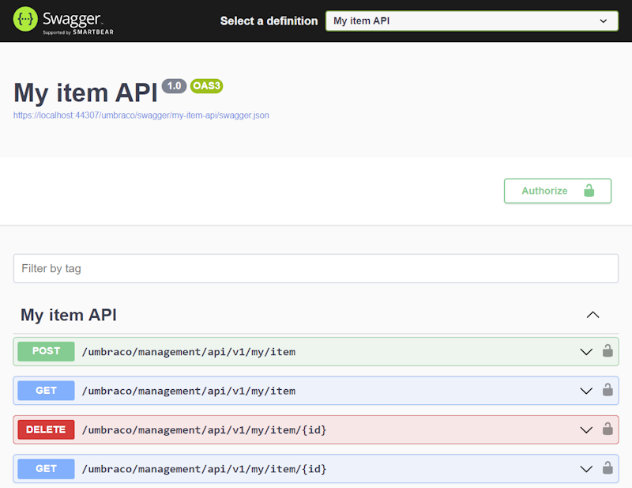

# Adding a custom OpenAPI document

By default, all controllers based on `ManagementApiControllerBase` are included in the default Management API OpenAPI document. To put them in a dedicated document instead, register an OpenAPI document with `AddBackOfficeOpenApiDocument` and tag your controllers with `[MapToApi]`.

Register the document in a composer:


```csharp
using Umbraco.Cms.Api.Common.OpenApi;
using Umbraco.Cms.Api.Management.OpenApi;
using Umbraco.Cms.Core.Composing;

namespace My.Custom.ItemApi;

public class MyItemApiComposer : IComposer
{
    public void Compose(IUmbracoBuilder builder)
        => builder.AddBackOfficeOpenApiDocument(
            "my-item-api",
            document => document
                .WithTitle("My item API")
                .WithBackOfficeAuthentication());
}
```


`AddBackOfficeOpenApiDocument` applies Umbraco's defaults to the document. It includes any controller tagged with `[MapToApi("my-item-api")]`, applies the schema and operation ID conventions, and adds the document to the Swagger UI dropdown. `WithBackOfficeAuthentication()` wires up backoffice authentication.

See [API versioning and OpenAPI](../../server-side-extensions/api-versioning-and-openapi.md) for the underlying `AddOpenApi` primitive and other configuration options.

Tag your controller with `[MapToApi]` to route it into the document. Because `ManagementApiControllerBase` already carries `[MapToApi("management")]`, the attribute on your controller overrides that and moves the endpoint out of the default Management document.


```csharp
using Umbraco.Cms.Api.Common.Attributes;
using Umbraco.Cms.Api.Management.Controllers;

namespace My.Custom.ItemApi;

[MapToApi("my-item-api")]
public class MyItemApiController : ManagementApiControllerBase
{
    // your endpoints here
}
```


When you visit the Swagger UI, "My item API" has its own OpenAPI document:




Swagger UI sometimes has persistent caching, which can prevent the new definition from appearing immediately. If this happens, enable **Disable cache** in the **Network** tab of your browser's developer tools.

