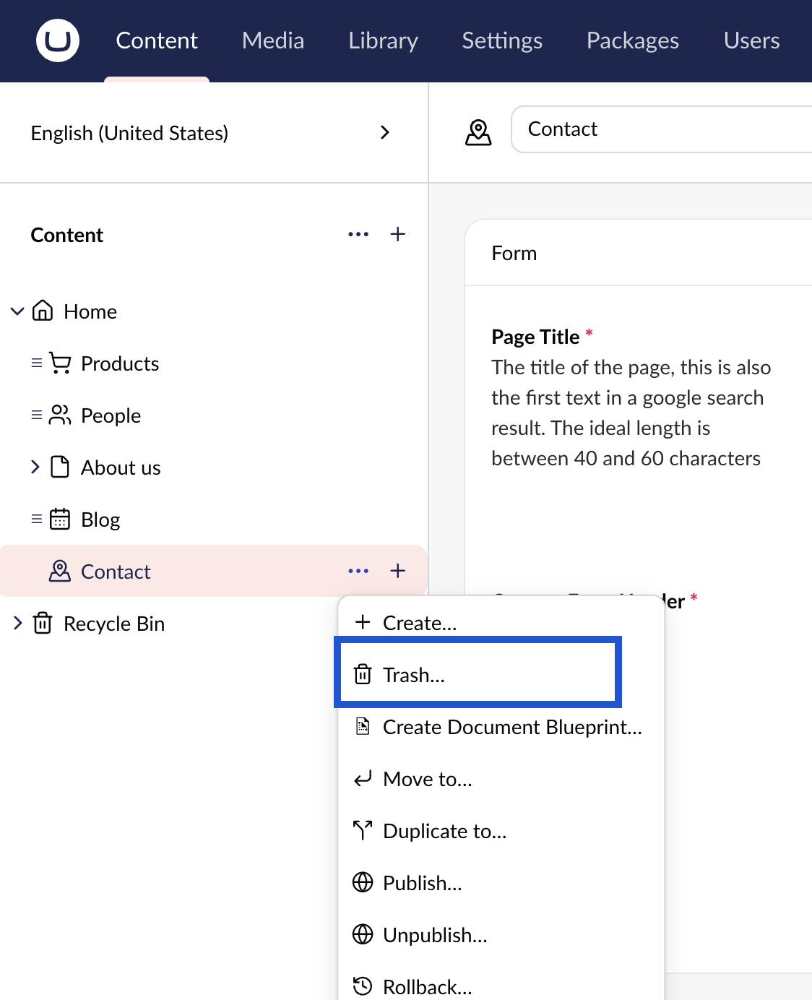
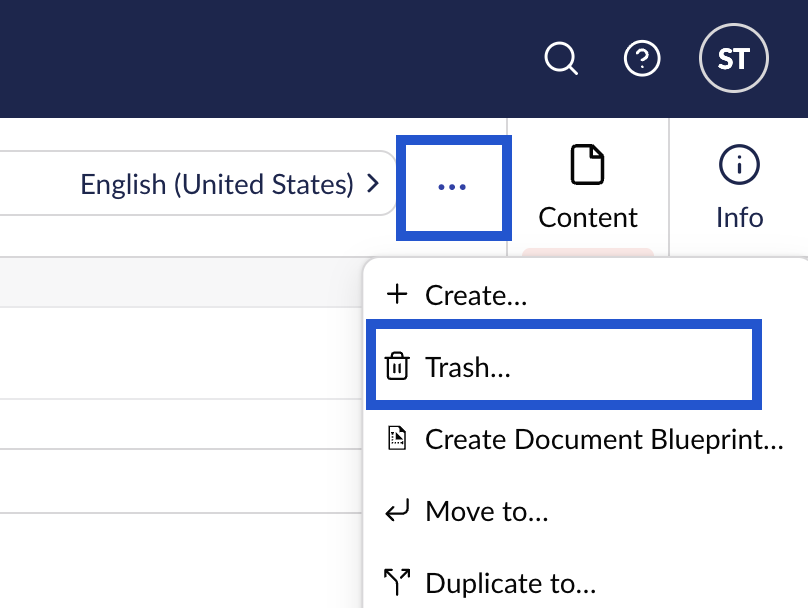
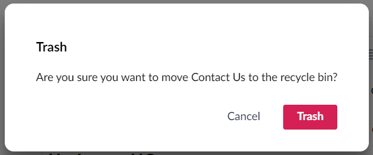
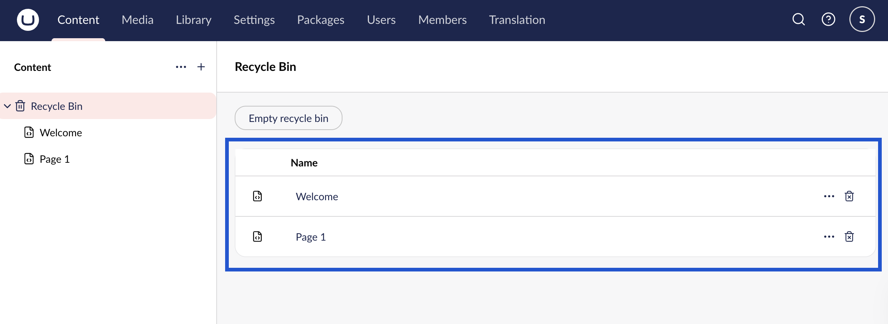
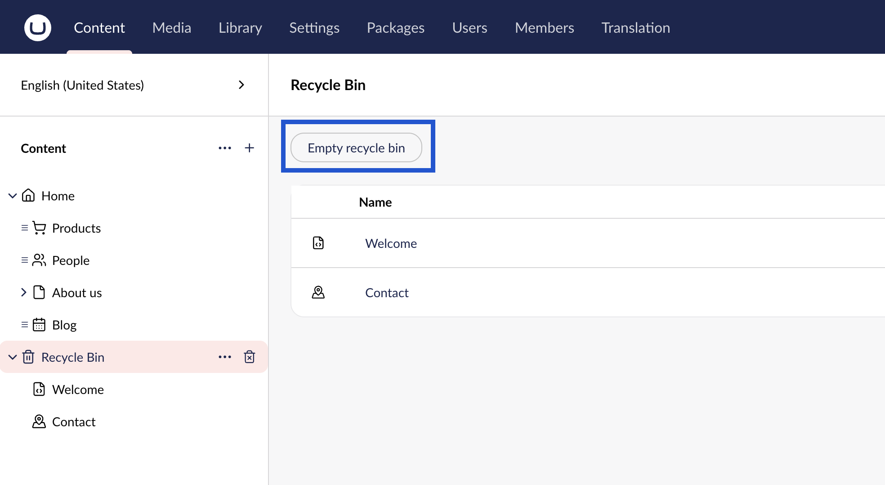
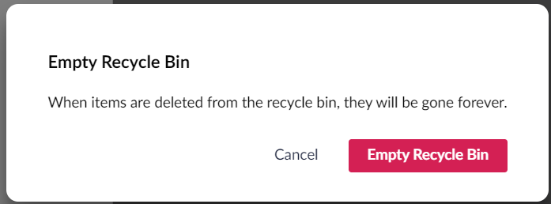
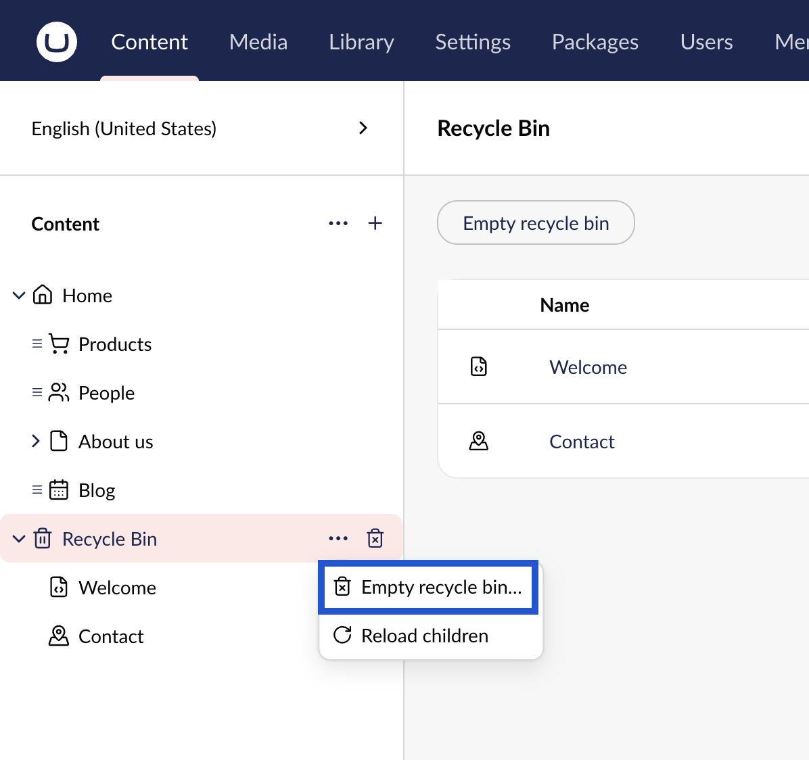
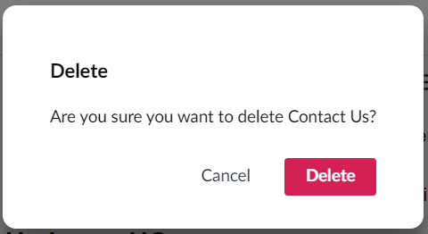

# Deleting and Restoring Pages

If you have pages that are no longer required for your website, you can delete them. Upon deletion, the page is moved to the **Recycle Bin** and is not deleted permanently.

In case you wish to restore the page, you can restore them from the **Recycle Bin**. You also have the option to empty the Recycle Bin which permanently deletes all the items.

## Deleting a Page

To delete a page:

1. Go to **Content**.
2. Click **...** next to the page you wish to delete.
3.  Select **Trash**.

Alternatively, click on the **...** next to the title field and select **Trash**.

4. A window appears confirming if you want to delete the page.

5. Click **OK**.
6. A confirmation message appears. Click **OK** to dismiss the confirmation message.

## Managing the Recycle Bin

The **Recycle Bin** is a separate tree list which can be found at the bottom of the section tree view. Selecting the Recycle Bin page, opens a list view with all deleted content. Clicking the arrow to the left of the Recycle Bin icon in the tree will also list any pages that have been deleted.

### Restore Deleted Pages

To restore deleted pages from the Recycle Bin:

1. Click **•••** next to the page in the list and select **Restore**.

You can also click on the **...** next to the page in tree and select **Restore**.

2. A window appears confirming if you want to restore the page.
3. Click **Restore**.
4. A confirmation message appears. Click **OK** to dismiss the confirmation message.


To display the page on the website, it must first be **Saved and published**.


### Emptying the Recycle Bin

If you are confident you no longer require any pages in the **Recycle Bin**, you can permanently delete it. You can delete pages one by one or empty the Recycle Bin in one go.


After deleting the pages from the **Recycle Bin**, you will **not** be able to retrieve any data associated with that page.


To empty the Recycle Bin:

1. Select the **Recycle Bin** and click on **Empty recycle bin** above the list.

2. A message appears confirming if you want to empty the recycle bin.

3. Click **OK**.

Alternatively. click on the **...** when hovering the Recycle Bin, and select **Empty recycle bin...** from the menu.

### Delete Individual Pages from the Recycle Bin

To delete individual pages from the Recycle Bin:

1. Select the Recycle Bin to open the list of deleted items.
2. Click on the trash bin icon next to the content you want to permanently delete.

You can also open the page and click the **...** next to the title field and select **Delete**.

3. A message appears confirming if you want to delete the page.

4. Click **OK**.
5. A confirmation message appears. Click **OK** to dismiss the confirmation message.
