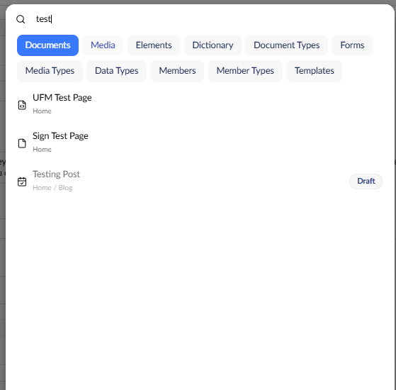

# Finding Content

The Umbraco content tree view allows you to navigate web pages through a logical site hierarchy. You can find a page by navigating through the tree itself if you know where the page is stored.

## Searching in Umbraco

To search across all the content, files, or folders in Umbraco, click the Magnifier icon in the top-right of the screen. Alternatively, you can use the keyboard shortcut **CTRL + SPACE** to access the **Search** bar.

Using the search bar, you can enter a search term to search across most content and settings data in the backoffice. This includes:

- Document Types
- Data Types
- Members
- Member Types
- Dictionary Items
- Templates, and more.

The exact set of tabs depends on your version and installed packages, such as Umbraco Forms.


By default, each word in your search matches anything it's the start of. For example, `test` also matches "Testing". Wrap your search in double quotes (for example, `"test"` or `"contact page"`) to match that exact word or phrase only, without the partial matches.

