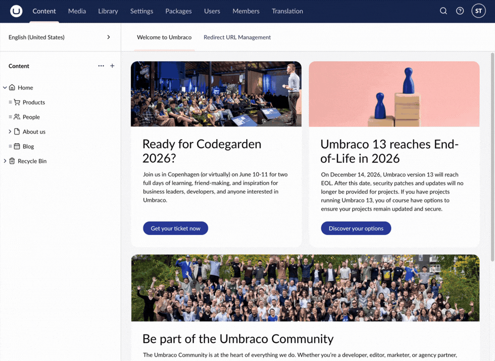

# Sidebar

This feature enables you to work with your content without losing the context of what you are doing.

Document Types are in different sections than content but the sidebar enables you to make changes to them directly from the content you are editing.

In the example showcased above, new options are being added to a Data Type, without losing the context of the content. The example also shows how you can edit images, without being sent to the 'Media' section.

## Customize

The Sidebar can be customized to improve the workflow for editors. For more information, see the [Extending Overview](../../extend-your-project/backoffice-extensions/extending-overview/README.md) article.
