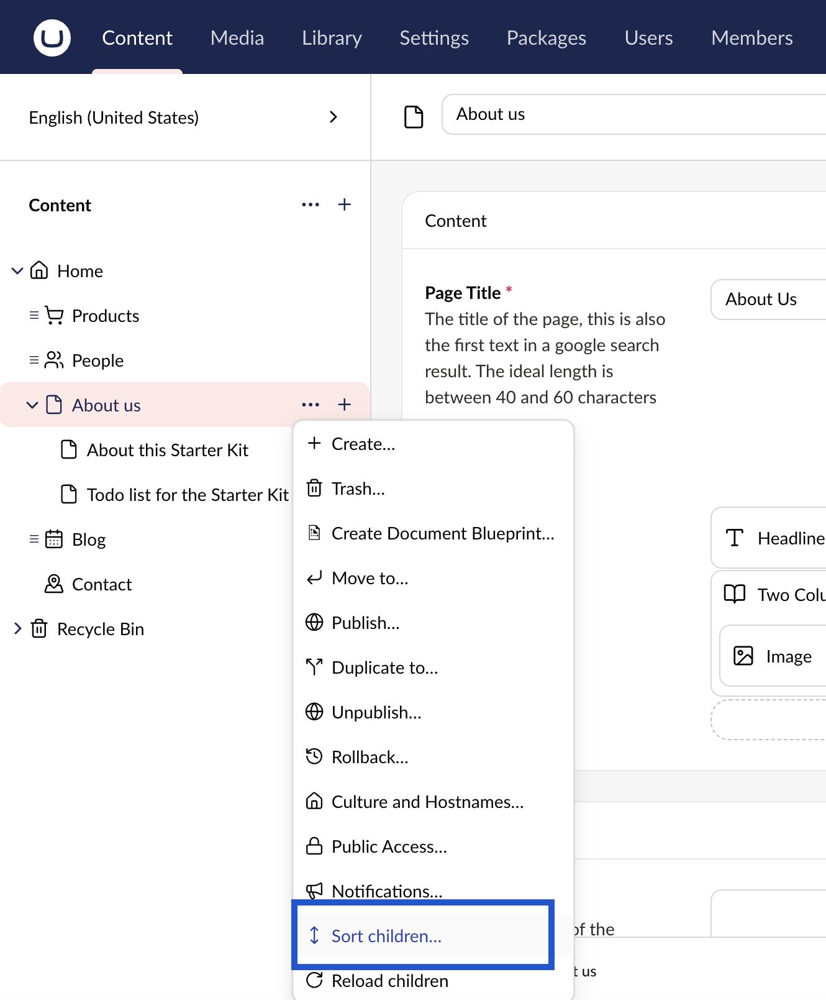
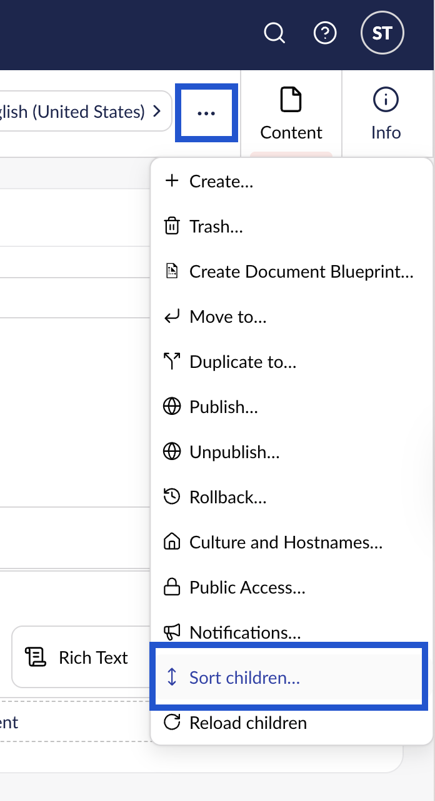
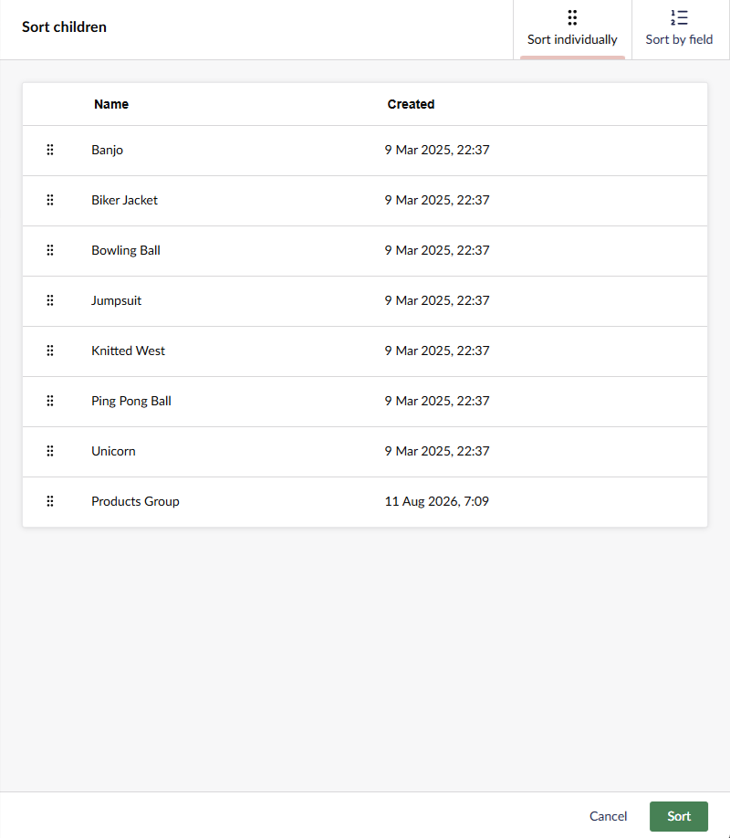

# Sorting Pages

The pages in Umbraco are placed in the tree structure according to a predefined sort order. The most recently created page is placed at the bottom of the tree structure. You can change the order of the pages by using the **Sort** function.

## Opening the Sort children dialog

You can open the dialog in two ways.

### From the content tree

1. Go to **Content**.
2. Navigate to the parent node whose child nodes you wish to sort.
3. Click **...** next to the page you wish to sort.
4. Select **Sort children of**.

### From the Actions menu

1. Go to **Content**.
2. Select the parent node whose child nodes you wish to sort.
3. Click **Actions** in the top-right corner of the screen.
4. Select **Sort children of** from the **Actions** drop-down menu.

## Sorting the child nodes

A window appears on the right-side of the screen with two tabs: **Sort individually** and **Sort by field**.

Choose the tab that matches the order you need, then click **Sort**. Click **Cancel** to close the window without changing the order.

### Sort individually

Use **Sort individually** when the order does not follow any field value. This is the option to choose when you want to hand-pick the order, such as placing a featured page at the top of a list.

1. Drag the child nodes up or down using the handle to the left of each row.
2. Click **Sort**.

You can also click the **Name** or **Created** column header to order the rows by that column. The dialog loads 50 child nodes at a time. Column headers become clickable once every child node is loaded, so click **Load more** until the full list is shown.

### Sort by field

Use **Sort by field** when the order follows a value on the pages themselves, such as an alphabetical list or a news section with the newest article first. The sort runs on the server and covers every child node, including any not yet loaded into the window. This makes it the better option for parent nodes with many children.

1. Select a field to sort by: **Name**, **Created**, or **Last edited**.
2. Select a direction: **Ascending** or **Descending**.
3. Click **Sort**.


Sorting by **Name** on a multilingual site also lets you select the language to sort by. The language selected in the backoffice is used by default.

