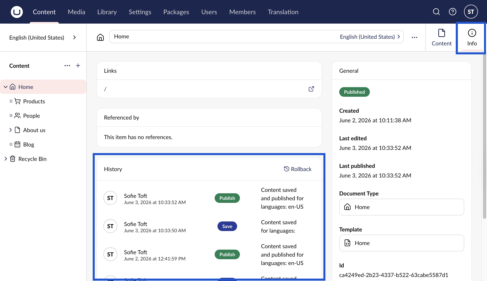

# Audit Trail

Within the **Info** content app for pages you can find the **Audit Trail** in the **History** section. Here, you can get a quick overview of the actions performed on that node, by whom, when and any additional comments.

The Audit Trail is useful to find out who made changes on a certain date.

To view the audit trail:

1. Go to the **Content** section.
2. Navigate to the page you wish to see the audit trail.
3. Go to the **Info** Workspace View.
4. Locate the **History** box.
