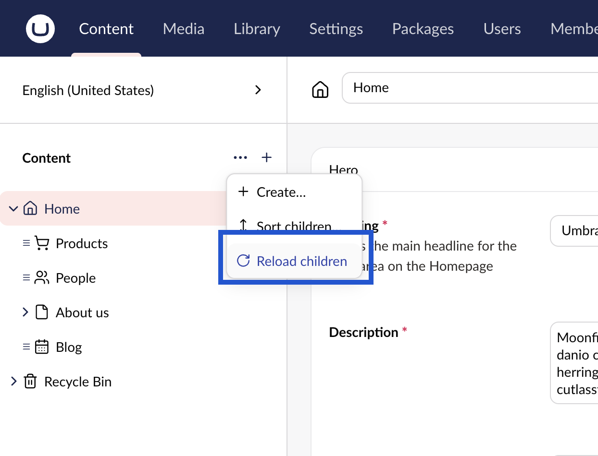

# Refreshing the Tree View

When editing content, the content tree will refresh itself when the content is saved.

You can also manually reload parts of or the entire content tree to refresh it or to load changes made by other editors.

To reload the content tree:

1. Click **...** next to the **Content** heading.
2. Choose **Reload children**.

The content is now reloaded and will reflect any new changes.
