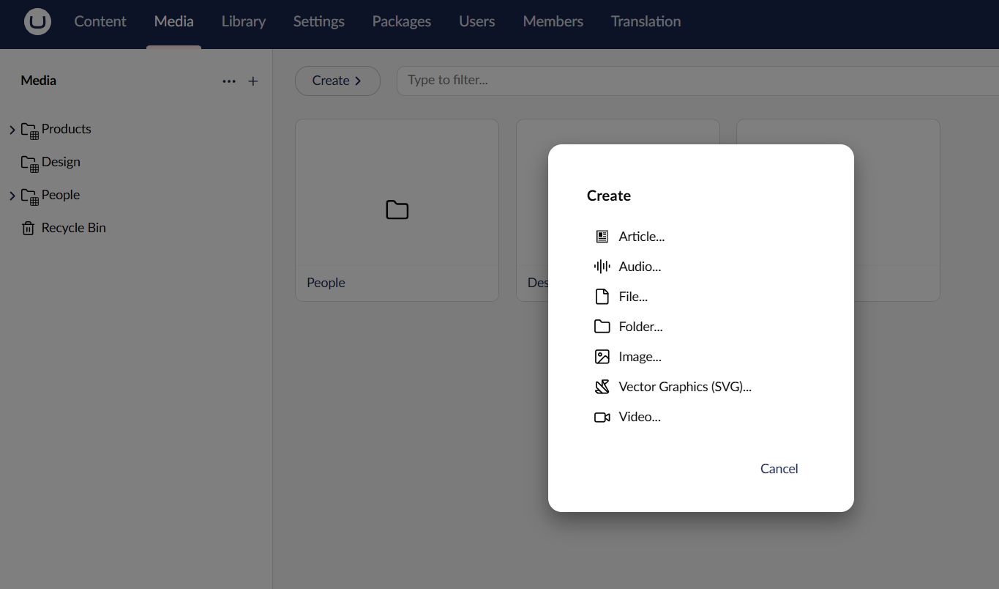
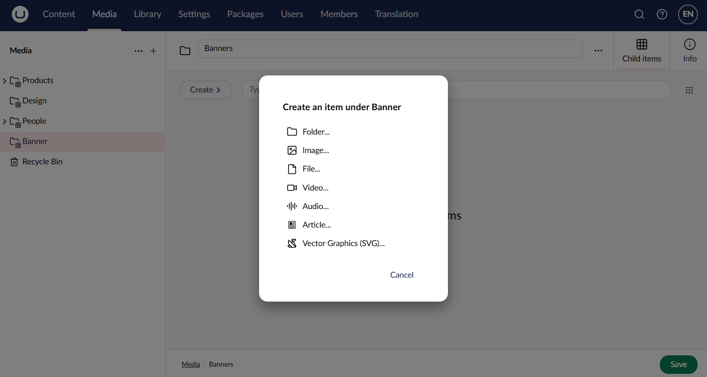
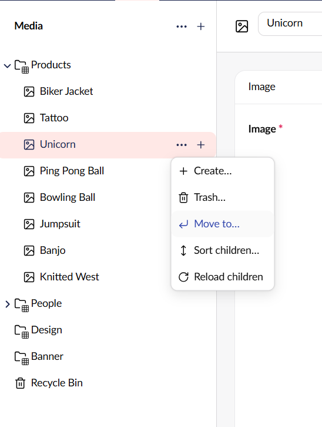
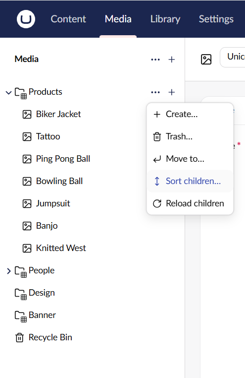
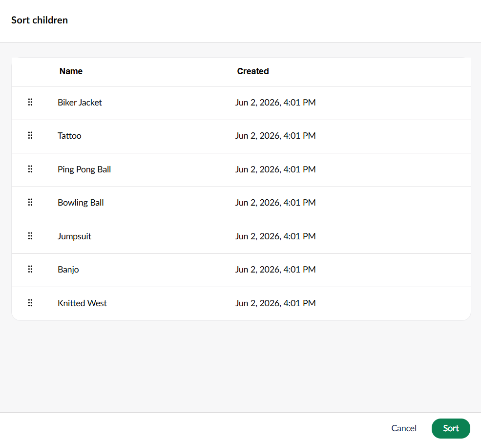
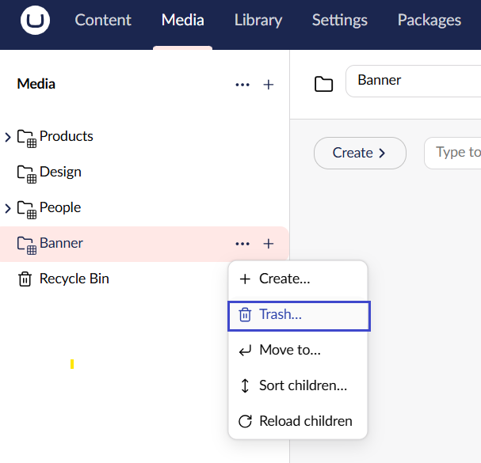
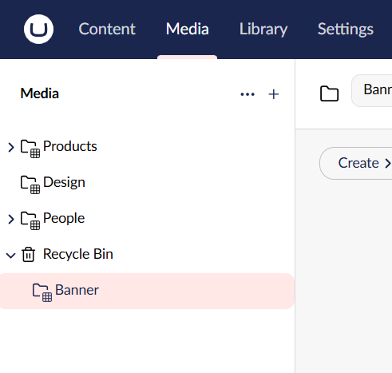
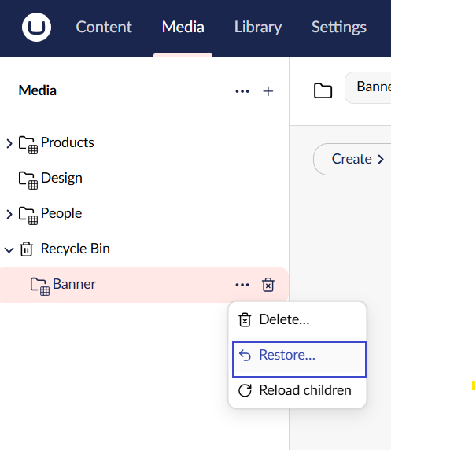

# Working with Folders

All media within your site must be loaded in the **Media** section. The Media section is a media library for the site. Within the Media section, you can create or organize files and folders as in a File Explorer.

Folders help organize the Media section and keep similar media items in a logical structure. We recommend using folders to organize your media items. When your media library starts growing, folders help in locating media quickly and easily.

## Creating a Folder

To create a folder:

1. Go to the **Media** section.
2. Click on **•••** next to Media.
3. Click **Create**.
4. Select **Folder**.

    
5. Enter a **Name** for your folder.
6. Click **Save**.


Folders are only used for sorting media items within the media section. Folders will not be part of the image URL nor be created on the server with the given name.


## Editing a Folder

To edit an existing folder:

1. Select the folder you want to edit.
2. Edit the title at the top of the page.
3. Click **Save**.

### Create an item under a Folder

To create an item under a folder:

1. Select the folder where you want to create an item.
2. Click **Create** to add another media type. Alternatively, click on **...** next to the folder title -> **Create**.

3. Select the media type you want to add.
4. Enter the media details.
5. Click Save.

## Moving a Folder

To move Folders within the Media section:

1. Click **•••** next to the folder.
2. Select **Move to...**.

    
3. Choose the location where you want to move the folder to in the tree structure.

    
4. Click **Choose**.

## Sorting the Contents of a Folder

Media items in Umbraco are sorted in the tree view according to a predefined sort order. The item that has been created most recently is placed at the bottom of the tree structure.

To sort the order of the items in a folder:

1. Click **...** next to the folder you want to sort.
2.  Select **Sort children**.

    
3.  Drag the folders, images and files into the required order. Alternatively, click on the **Name** or **Created** column header to sort the items in ascending or descending order. Clicking on a column header again reverses the sort order.

    
4. Click **Sort.**

## Deleting a Folder

If you wish to tidy up the Media section of your site, you can delete existing folders. Once you have deleted a folder, it is sent to the **Recycle Bin**. If you change your mind, you can restore the deleted folder from the Recycle Bin.

To delete a folder:

1. Select the folder you want to delete.
2.  Click **...** and select **Trash**.

    
3. Click **Trash**.


The contents of the folder are also moved to the Recycle Bin. You can restore items from the Recycle Bin in the same way as in the Content section.


### Restoring a Folder from the Recycle Bin

The Recycle Bin is a separate tree structure within the Media tree. Clicking on the arrow next to the Recycle Bin will display its contents.

To restore a Folder:

1. Click **•••** next to the Folder.
2. Select **Restore**.

    

3. Choose the location where you want to move the folder to in the tree structure.
4. Click **Restore**.
