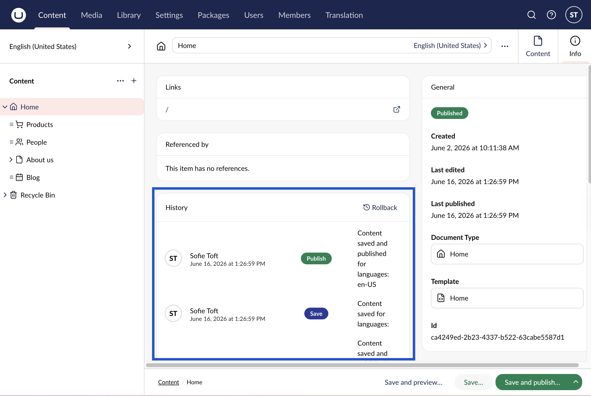
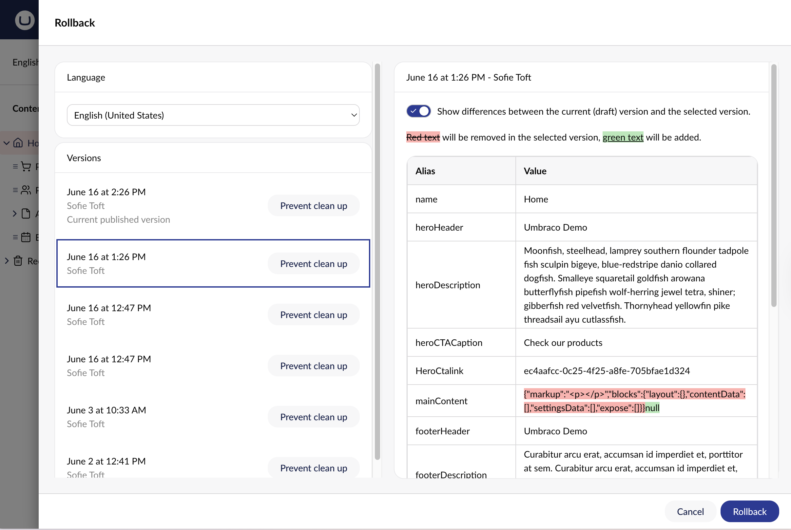

# Comparing Versions

You will never lose changes on a page because all the old versions of the page are saved in **History**.

To compare a page on the site with its previous versions:

1. Navigate to the page whose versions you wish to view.
2. Go to the **Info** Workspace View.
3. Click on the **Rollback** button in the **History** section.

4. The Rollback window opens. Select a version you wish to compare with.

After selecting the version, a comparison of the current page with the version you selected is displayed. The red, striked-out text will not appear in the selected version. Green text indicates content added if you roll back to that page version.

