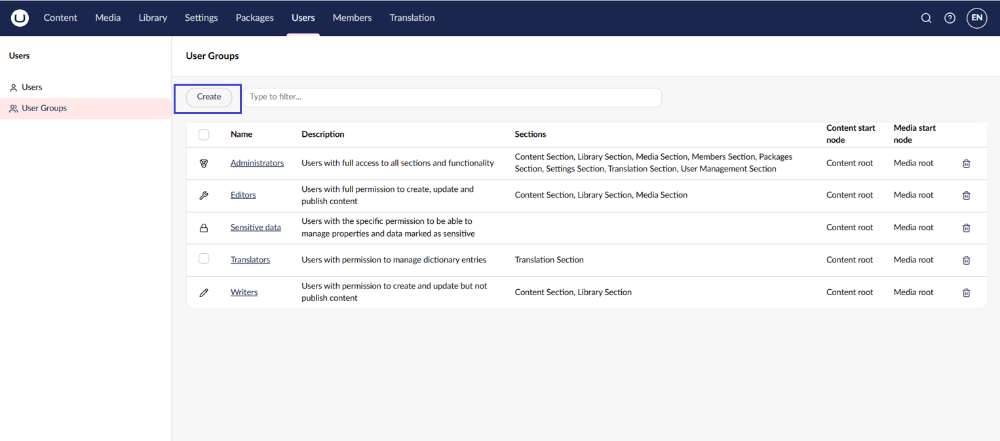
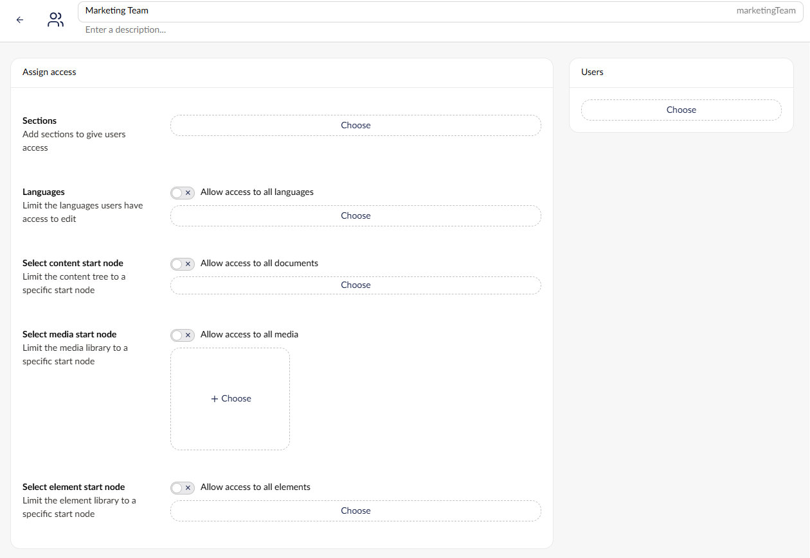
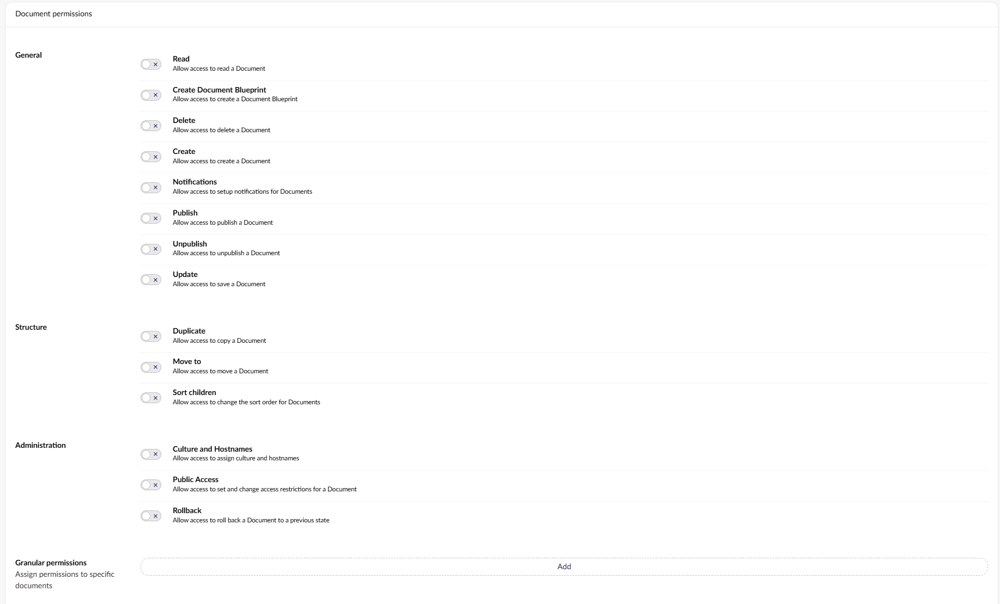
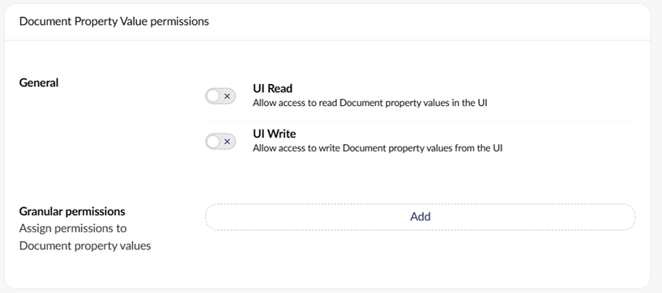
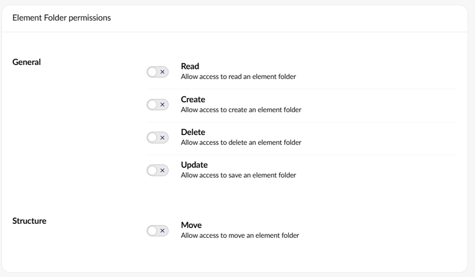
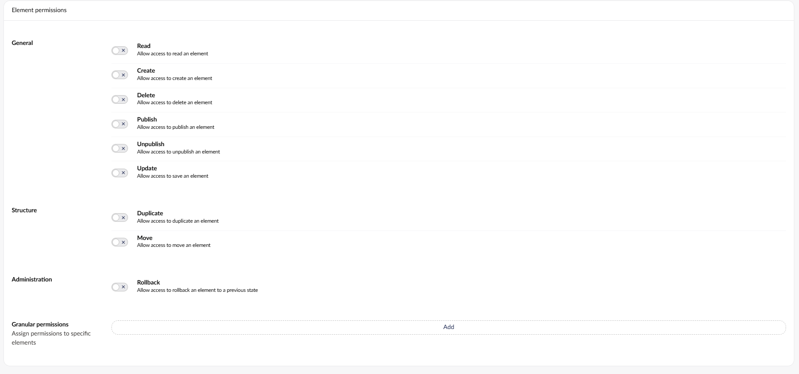

# Users

Users are people who have access to the Umbraco backoffice (not to be confused with [Members](../members.md)). These could include Content Editors, Translators, Web Designers, and Developers.

This guide will walk you through how to create and invite users, manage user profiles, work with User Groups and permissions in the backoffice.

## Creating a User

To create or invite a User:

1. Go to the **Users** section in the backoffice.
2. Select **Create -> User**. Alternatively, click **Invite...**.
3. Enter the **Name** and **Email** of the new user.
4. Select which **User group** the new user should be added to.
5. _[Optional]_ Enter a **Message** for the invitation.
6. Click **Create user** or **Send invite**.

Once you have created the user, the new user will receive a system-generated password for their initial login. This password needs to be used to access the account.

### Managing a User Profile

Open a user’s profile from the **Users** section to update:

* Profile photo.
* Email address of the user.
* UI Culture (sets the backoffice language of the user account).
* User Group (determines the scope of access in the backoffice).
* Start nodes for **Content**, **Media**, and element **Library** sections to limit access.

## Managing Users

When working with multiple users in Umbraco, the user screen provides tools to help you quickly locate and manage users using filters and layout options.

### Filter and Organize Users

At the top of the Users section, use the search bar to quickly find a user by typing their name or email address.

Use the **Status** filter to narrow down users based on their current state:

* Active – Users who have logged in and are enabled.
* Disabled – Users whose access has been explicitly turned off.
* Locked out – User has been automatically blocked after too many failed login attempts.
* Invited – User has been sent an invitation to access the backoffice.
* Inactive – Users who haven't logged in or have been disabled.

The **Groups** filter lets you view users based on the user groups they belong to. For example:

* Administrators
* Editors
* Sensitive data
* Translators
* Writers

Use **Order by** to sort users by:

* Name (A–Z)
* Name (Z-A)
* Newest
* Oldest
* Last Login

### Layout Options

Users are displayed in Cards format by default, showing:

* Initials, full name, and group membership.
* Login status (for example, “Inactive” label).
* Last login time (if applicable).

Click the Cards/Table icon (top-right corner) to switch to a more compact, table-based layout.

## Default User Groups

By default, the User Groups available to new users are **Administrators**, **Editors**, **Sensitive Data**, **Translators,** and **Writers**.

* **Administrators**: Can do anything when editing nodes in the content section (has all permissions).
* **Editors**: Allowed to create and publish content items or nodes on the website without approval from others or restrictions (has permissions to **Public Access**, **Rollback**, **Browse Node**, **Create Content Template**, **Delete**, **Create**, **Publish**, **Unpublish**, **Update**, **Copy**, **Move** and **Sort**).
* **Sensitive data**: Any users added to this User group will have access to view any data marked as sensitive. Learn more about this feature in the [Sensitive Data](../../../run-in-production/security/sensitive-data-on-members.md) article.
* **Translators**: These are used for translating your website. Translators are allowed to browse and update nodes as well as grant dashboard access. Translations of site pages must be reviewed by others before publication (has permissions to **Browse Node** and **Update**).
* **Writers**: Allowed to browse nodes, create nodes, and save content. Not allowed to publish directly but has permissions to **Browse Node**, **Create**, and **Update**.


In previous versions of Umbraco, "Send to publish" was enabled for Writers. Since Umbraco 16, approval processes can be configured using the official [Umbraco Workflow package](https://umbraco.com/products/add-ons/workflow/).


## Creating a User Group

You can also create your own custom User Groups to fit your specific access requirements.

1. Go to the **Users** section.
2. Select **User Groups**.
3. Click **Create**.

### User Group Parameters

Use the following settings to configure the User Group:

* **Name**: The name of the User Group.
* **Alias**: Used to reference the User Group in code. The alias will be auto-generated based on the name.
* **Assign access**: Define which sections and languages users will have access to, and whether they should have access to some or all content and media.

* **Document permissions**: Select the document permissions granted to users of the User Group. Depending on which User Group a user is added to, each user has a set of permissions associated with their accounts. These permissions either enable or disable a user's ability to perform their associated function. Use **Granular permissions** to assign access to specific documents. This is useful when a User Group should only have limited access to a certain page on the website. Clicking **Add** opens a dialog where you can choose between documents from the Content section.

* **Document Property Value permissions**: Configure read and write access to Document property values in the UI. Use **Granular permissions** to define both read and write permissions for individual properties on a Document Type. This is useful if a User Group should have limited access to edit the content on a specific type of document. Clicking **Add** opens a dialog where you select a Document Type, choose a Property, and set the read and write permissions.

* **Element Folder permissions**: Configure access to element folders, including the ability to read, create, update, and delete them. Use **Structure** permissions to control whether users can move element folders.

* **Element permissions**: Configure access to elements, including the ability to read, create, update, delete, publish, and unpublish them. Use **Structure** permissions to control duplication and moving, **Administration** to control rollback, and **Granular permissions** to assign access to specific elements.


Umbraco Forms has a backoffice security model integrated with Umbraco Users. You can manage the details in the **Users** section of the backoffice, within a tree named **Forms Security**. For more information, see the [Managing Forms Security](https://docs.umbraco.com/umbraco-forms/developer/security) article.

