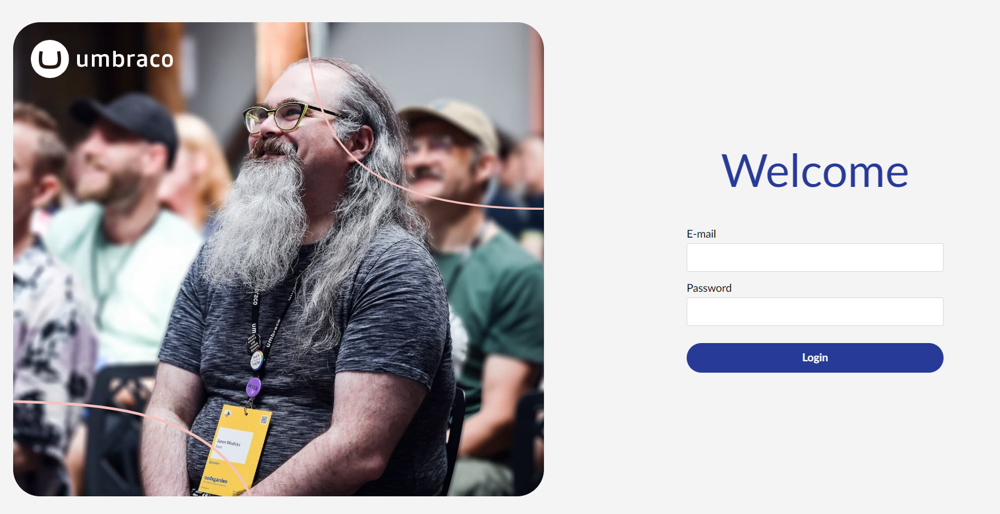

# Login

To access the backoffice, you will need to login. You can do this by adding `/umbraco` at the end of your website URL, for example `http://mywebsite.com/umbraco`.

You will be presented with a login form similar to this:



The **login** screen contains a short greeting, a **login form** and an optional **Forgotten password** link.

Below, you will find instructions on how to customize the login screen.

## Greeting

The login screen features a greeting text: The "Welcome" headline. This can be personalized by overriding the existing language translation keys.

To override the greetings, register a 'localization' manifest for the default language of your Umbraco site (usually en-US). Provide the new strings inline under `meta.localizations`:


```json
{
    "alias": "login.extensions",
    "name": "Login extensions",
    "version": "1.0.0",
    "allowPublicAccess": true,
    "extensions": [
        {
            "type": "localization",
            "alias": "Login.Localize.EnUS",
            "name": "English",
            "meta": {
                "culture": "en-US",
                "localizations": {
                    "login": {
                        "instruction": "Log in again to continue",
                        "greeting0": "Happy super Sunday",
                        "greeting1": "Happy manic Monday",
                        "greeting2": "Happy tubular Tuesday",
                        "greeting3": "Happy wonderful Wednesday",
                        "greeting4": "Happy thunderous Thursday",
                        "greeting5": "Happy funky Friday",
                        "greeting6": "Happy Caturday"
                    }
                }
            }
        }
    ]
}
```


This will override the default greetings with the ones you provide. The login screen will now display "Happy super Sunday" instead of "Welcome" on a Sunday. (These are the day-specific greetings the backoffice shipped with before v13 — a nostalgic drop-in replacement for the plain "Welcome".)


For larger overrides, declare the strings in a separate JavaScript file referenced from the manifest (for example `/App_Plugins/Login/en-us.js`). The file should export a default object with the same `{ group: { key: value } }` shape.



**`culture` must match the active UI locale.** The default is `en-US` (`GlobalSettings.DefaultUILanguage`), so on a default install your override extension must declare `culture: "en-US"` to affect the login screen. The keys themselves live in the canonical `en.ts` dictionary under the `login` group, but that does not change which override file is selected at runtime. An override declared with `culture: "en"` only applies when `en` is the active locale, or if locale fallback resolution uses it; it does not replace an active `en-US` override.



**Renamed in v18: `auth.*` → `login.*`.** Before v18 the login screen had its own dictionary under an `auth` group (`auth.greeting0`, `auth.instruction`, …). In v18 the login screen reuses the shared backoffice dictionary and the keys moved to a `login` group. Existing translation packages still shipping `auth.greeting*` overrides continue to work through v19 with a deprecation warning in the console; the legacy fallback is removed in v20. New packages should target `login.*` directly.


You can customize other text on the login screen as well. Grab the default values and keys from the [`en.ts`](https://github.com/umbraco/Umbraco-CMS/blob/main/src/Umbraco.Web.UI.Client/src/assets/lang/en.ts) dictionary in the Umbraco CMS GitHub repository — look under the `login` group. Then copy the ones you want to translate into your `en-us.js` file.

## Password reset

The **Forgotten password?** link allows your backoffice users to reset their password. To use this feature, you will need to add the following key to the `Umbraco.Cms.Security` section in the `appsettings.json` file:

```json
"Umbraco": {
    "CMS": {
      "Security": {
        "AllowPasswordReset": true
      }
   }
}
```

Set it to `true` to enable the password reset feature, and `false` to disable the feature.

You will also need to configure a Simple Mail Transfer Protocol (SMTP) server in your `appsettings.json` file. When you get a successful result on the SMTP configuration when running a health check in the backoffice, you are good to go!

An example:

```json
"Umbraco": {
    "CMS": {
      "Global": {
        "Id": "xxxxxxxx-xxxx-xxxx-xxxx-xxxxxxxxxxxx",
        "Smtp": {
          "From": "noreply@test.com",
          "Host": "127.0.0.1",
          "Username": "username",
          "Password": "password"
        }
      }
    }
}
```

## Custom background image and logo

It is possible to customize the background image and the logo for the backoffice login screen by adding the `"Content"` section in the `appsettings.json` file:

```json
"Umbraco": {
    "CMS": {
      "Content": {
        "LoginBackgroundImage": "../myImagesFolder/myLogin.jpg",
        "LoginLogoImage": "../myImagesFolder/myLogo.svg",
        "LoginLogoImageAlternative": "../myImagesFolder/myLogo.svg"
      }
   }
}
```

The `LoginBackgroundImage`, `LoginLogoImage`, and `LoginLogoImageAlternative` are referenced from the `/wwwroot/umbraco/` folder.

The `LoginLogoImage` is displayed on top of the `LoginBackgroundImage` and the `LoginLogoImageAlternative` is displayed when the `LoginLogoImage` is not available, for example on small resolutions.

## Custom CSS

You can also customize the login screen by adding a custom CSS file. To do this, you will need to add a new file inside the `~/App_Plugins` folder, for example `~/App_Plugins/Login/my-custom-login-screen.css`.

You can then add your custom CSS to the file:

```css
:root {
    --umb-login-curves-color: rgba(0, 0, 0, 0.1);
}
```

This will change the color of the SVG graphics (curves) shown on the login screen. You can also hide the curves by adding the following CSS:

```css
:root {
    --umb-login-curves-display: none;
}
```

### Load the custom CSS file

To tell Umbraco about your custom CSS file, you will need to add a `umbraco-package.json` file. The `umbraco-package.json` file should look like this:

```json
{
    "alias": "login.extensions",
    "name": "Login extensions",
    "version": "1.0.0",
    "allowPublicAccess": true,
    "extensions": [
        {
            "type": "appEntryPoint",
            "alias": "MyCustomLoginScreen",
            "name": "My Custom Login Screen",
            "js": "/App_Plugins/Login/my-custom-login-screen.js"
        }
    ]
}
```

Next add a JavaScript file, for example `~/App_Plugins/Login/my-custom-login-screen.js`, and add the following code to load the custom CSS file:

```javascript
const link = document.createElement('link');
link.rel = 'stylesheet';
link.href = '/App_Plugins/Login/my-custom-login-screen.css';
document.head.appendChild(link);
```

This will load the custom CSS file into Umbraco.


Be aware that the custom CSS file will be loaded on all Umbraco screens, not only the login screen.


### Custom CSS properties reference

The following CSS properties are available for customization:

| CSS Property                             | Description                                    | Default Value                                                                              |
| ---------------------------------------- | ---------------------------------------------- | ------------------------------------------------------------------------------------------ |
| `--umb-login-background`                 | The background of the layout                   | `#f4f4f4`                                                                                  |
| `--umb-login-primary-color`              | The color of the headline                      | `#283a97`                                                                                  |
| `--umb-login-text-color`                 | The color of the text                          | `#000`                                                                                     |
| `--umb-login-header-font-size`           | The font-size of the headline                  | `3rem`                                                                                     |
| `--umb-login-header-font-size-large`     | The font-size of the headline on large screens | `4rem`                                                                                     |
| `--umb-login-header-secondary-font-size` | The font-size of the secondary headline        | `2.4rem`                                                                                   |
| `--umb-login-image`                      | The background of the image wrapper            | The value of the [LoginBackgroundImage](login.md#custom-background-image-and-logo) setting |
| `--umb-login-image-display`              | The display of the image wrapper               | `flex`                                                                                     |
| `--umb-login-image-border-radius`        | The border-radius of the image wrapper         | `38px`                                                                                     |
| `--umb-login-content-background`         | The background of the content wrapper          | `none`                                                                                     |
| `--umb-login-content-display`            | The display of the content wrapper             | `flex`                                                                                     |
| `--umb-login-content-width`              | The width of the content wrapper               | `100%`                                                                                     |
| `--umb-login-content-height`             | The height of the content wrapper              | `100%`                                                                                     |
| `--umb-login-content-border-radius`      | The border-radius of the content wrapper       | `0`                                                                                        |
| `--umb-login-align-items`                | The align-items of the main wrapper            | `unset`                                                                                    |
| `--umb-login-button-border-radius`       | The border-radius of the buttons               | `45px`                                                                                     |
| `--umb-login-curves-color`               | The color of the curves                        | `#f5c1bc`                                                                                  |
| `--umb-login-curves-display`             | The display of the curves                      | `inline`                                                                                   |

The CSS custom properties may change in future versions of Umbraco. You can always find the latest values in the [login layout element](https://github.com/umbraco/Umbraco-CMS/blob/v16/dev/src/Umbraco.Web.UI.Login/src/components/layouts/auth-layout.element.ts) in the Umbraco CMS GitHub repository.

## The Time Out Screen


The time out screen is displayed when the user has been inactive for a certain amount of time. The screen resembles the login screen in many ways and the two are sometimes confused. The most notable difference is that the time out screen does not have a login form. It only has a message and a button to log in again with Umbraco.

If you have added more than one login provider, the users will also see this screen first. This is because they need to choose which provider to use first. In that case, the screen is also referred to as the **Choose provider screen**.

You can customize the time out screen in the same way as the login screen. From v18 both screens share the same backoffice localization dictionary. The `login.*` keys you override for the login screen automatically apply to the time out screen as well.

### Greeting

The greeting on the time out screen uses the same `login.greeting0..6` and `login.instruction` keys as the login screen — override them as shown in the [Greeting](#greeting) section above. The `instruction` key is shown when the user has timed out, and the `greeting0..6` keys are shown when the user has to choose a login provider.

### Image

You can update the image on the time out screen through a custom CSS variable. The default value is `--umb-login-image` and it is set to the same value as the login screen. You can override this value in your custom CSS file:

```css
:root {
    --umb-login-image: url(../myImagesFolder/myTimeout.jpg);
}
```
