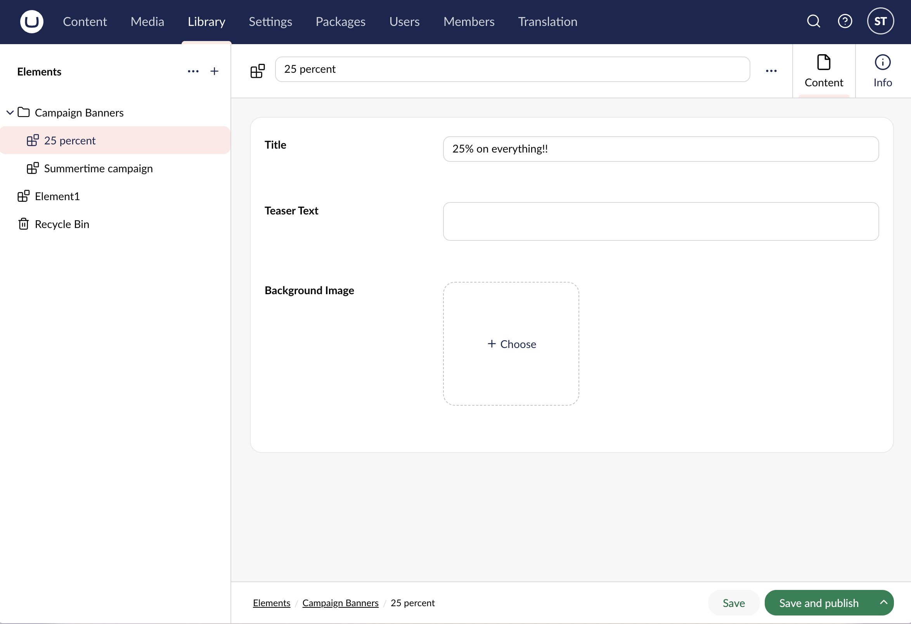
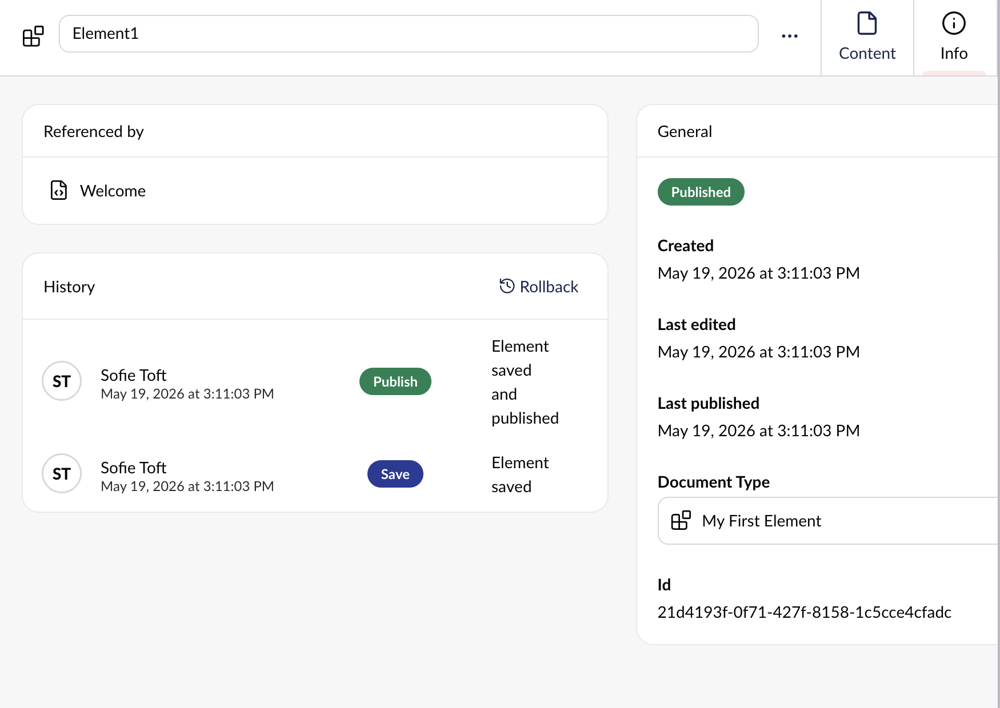
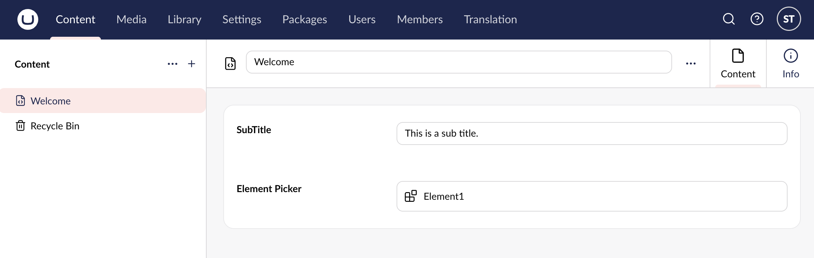

# Elements

Instead of replicating the same content on a per-page basis, Elements allow you to create reusable content. By creating your content once, you can reuse it across as many pages and documents as you need.

Elements are ideal for call-to-action blocks, banners, and other shared content that appears across multiple pages.

## Library

Elements are managed from the Library section in the Umbraco Backoffice.

The Library section is a central editorial hub for reusable content. By default all user groups except Sensitive data and Translators have access to the section.



If the project was started on versions before Umbraco 18, only the Administrators user group has access to the Library section.

Manage permissions to the Library section from the Users section in the Umbraco backoffice.



## Manage Elements

Elements are configured in the Settings section and managed from the Library section. They are referenced in your content using the Element Picker property.

### Build and Configure Elements

Elements are created as Element Types in the Settings section of the Umbraco backoffice. As with all Element Types, Elements are not routable and are not attached to a Template.

Toggle the **Allow in Library** option on the Structure Workspace View to turn your Element Type into an Element.

You can add groups, tabs, and properties like you would to any other Element and Document Type.

Since your project will contain different Document Types, group your Elements into a dedicated folder to keep your workspace organized.

### Create Elements

With your Element configured, you can start using it to create reusable content in the Library section.

1. Click the **+** icon.
2. Select which Element Type you want to base the Element on.
3. Fill in the relevant properties.
4. **Save** or **Save and Publish** once the content is ready.

To maintain an overview of your reusable content, it can be a good idea to use folders for organizing the content in your Library.

Use the **Info** workspace view to find relevant details about the element, such as history and where they element is used.

### Use Elements

Once you have created the elements in the Library section, they can be referenced anywhere an Element Picker has been configured.

You can add elements to your content in the Content section using an Element Picker. This needs to be added as a property on the Document Type. Read the [Element Picker](../../../property-editors/built-in-umbraco-property-editors/element-picker.md) article to learn more about how to use and configure it.

Making changes to an Element in the Library section, will update all instances of the content throughout the project.
