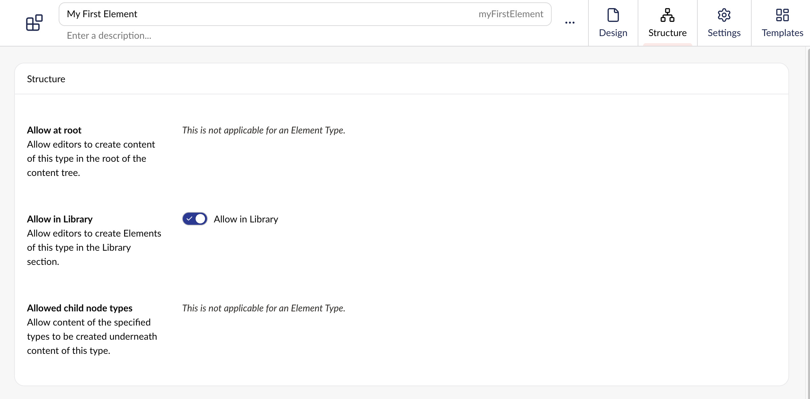

# Elements

Instead of replicating the same content on a per-page basis, Elements allows you to separate and abstract content into a single source of truth. By creating your content once, you can reuse it across as many pages and documents as you need.

Elements are ideal for call-to-action blocks, banners, and other shared content that appears across multiple pages.

## Manage Elements

Elements are configured in the Settings section and managed from the Library section. They are referenced in your content using the Element Picker property.

### Build and Configure Elements

Elements are created as Element Types in the Settings section of the Umbraco backoffice. As with all Element Types, Elements are not routable and are not attached to a Template.

Toggle the **Allow in Library** option on the Structure Workspace View to turn your Element Type into an Element.

You can add groups, tabs and properties to an Element like you would any other Document Type.

Since your project will contain different Document Types, group your Elements into a dedicated folder to keep your workspace organized.

### Create Elements

With your Element configured, you can start using it to create reusable content in the Library section.

1. Click the **+** icon.
2. Select which Element you want to create content based on.
3. Fill in the relevant properties.
4. **Save** or **Save and Publish** once the content is ready.

[Image of Library Section here.]

To maintain an overview of your reusable content, it can be a good idea to use folders for organizing the content in your Library.

### Use Elements

Once you have created the elements in the Library section, they can be used across all documents and content on your project.

[Image of an element added to a content node/document here.]

You can add elements to your content in the Content section using an Element Picker. This needs to be added as a property on the Document Type. Read the [Element Picker](../../../property-editors/built-in-umbraco-property-editors/element-picker.md) article to learn more about how to use and configure it.