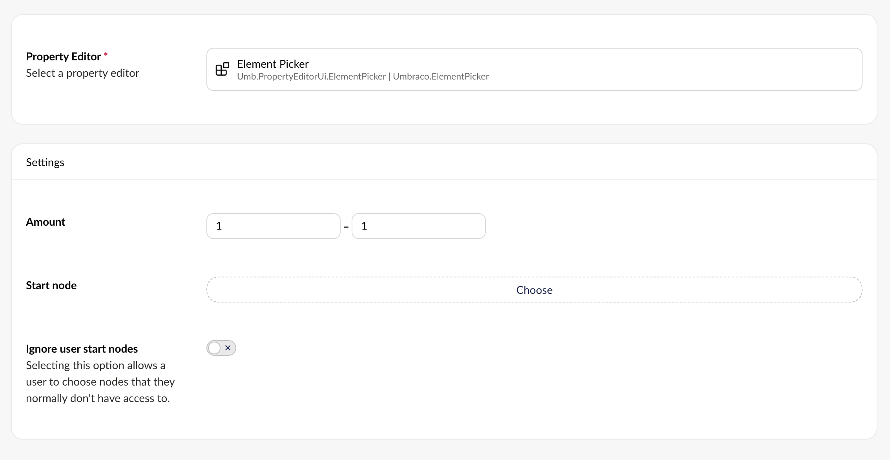

# Element Picker

`Schema Alias: Umbraco.ElementPicker`

`UI Alias: Umb.PropertyEditorUi.ElementPicker`

`Returns: IEnumerable<IPublishedElement>`

The Element Picker enables you to choose one or more elements to display as part of your content. Elements are based on [Element Types](../../content-types-and-structure/data/defining-content/elements.md) defined in the Settings section. They are created and managed in the Library section.

## Data Type Definition Example



### Amount

Define how many elements should be allowed to pick via the Element Picker.

### Start Node

Choose a start node for the Element Picker. Use this option when your Library section is organized into folders.

### Ignore User Start Nodes

Checking this field allows users to select items outside their assigned start nodes.

## MVC View Example

### Without Models Builder

```csharp
@{
    IEnumerable<IPublishedElement>? elements = Model.Value<IEnumerable<IPublishedElement>>("elementPicker");
    if (elements != null) {
        foreach (var element in elements)
        {
            <h1>@element.Name</h1>
            <p>@element.Value("featuredText")</p>
        }
    }
}
```

### With Models Builder

```csharp
@{
    IEnumerable<IPublishedElement>? elements = Model.ElementPicker;
    if (elements != null) {
        foreach (var element in elements)
        {
            <h1>@element.Name</h1>
            <p>@element.Value("featuredText")</p>
        }
    }
}
```

## Add values programmatically

The Element Picker stores an array of Element keys (`Guid[]`). The example below illustrates how an Element Picker value can be added or changed programmatically.

```csharp
using Umbraco.Cms.Core.Models;
using Umbraco.Cms.Core.Serialization;
using Umbraco.Cms.Core.Services;
namespace Umbraco.Documentation;
public class ElementPickerExample
{
    private readonly IContentService _contentService;
    private readonly IJsonSerializer _jsonSerializer;
    public ElementPickerExample(IContentService contentService, IJsonSerializer jsonSerializer)
    {
        _contentService = contentService;
        _jsonSerializer = jsonSerializer;
    }
    public bool SaveElementPickerValue(Guid contentId, string propertyAlias, Guid[] pickedElementIds)
    {
        IContent? content = _contentService.GetById(contentId);
        if (content is null)
        {
            return false;
        }
        content.SetValue(propertyAlias, _jsonSerializer.Serialize(pickedElementIds));
        return true;
    }
}
```
