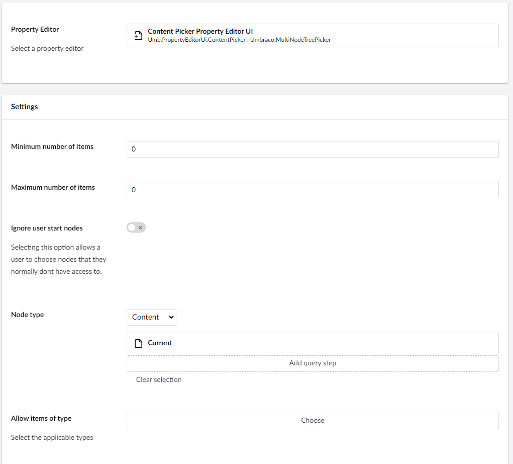

# Element Picker

`Schema Alias: Umbraco.ContentPicker`

`UI Alias: Umb.PropertyEditorUi.DocumentPicker`

`Returns: IEnumerable<IPublishedContent>`

The Content Picker enables choosing the type of content tree to display and which specific part to render. It also allows you to set a dynamic root node for the content based on the current document using the Content Picker.

## Data Type Definition Example



### Config Option1

## MVC View Example

### Without Models Builder

```csharp
@{
    var typedContentPicker = Model.Value<IEnumerable<IPublishedContent>>("featuredArticles");
    if (typedContentPicker != null) {
        foreach (var item in typedContentPicker)
        {
            <p>@item.Name</p>
        }
}
```

### With Models Builder

```csharp
@{
    var typedContentPicker = Model.FeaturedArticles;
    foreach (var item in typedContentPicker)
    {
        <p>@item.Name</p>
    }
}
```

## Add values programmatically

See the example below to see how a value can be added or changed programmatically. To update the value of a property editor you need the [Content Service](https://apidocs.umbraco.com/v18/csharp/api/Umbraco.Cms.Core.Services.ContentService.html).


The example below demonstrates how to add values programmatically using a Razor view. However, this is used for illustrative purposes only and is not the recommended method for production environments.


```csharp
@using Umbraco.Cms.Core
@using Umbraco.Cms.Core.Services
@inject IContentService ContentService
@{
    // Create a variable for the GUID of the page you want to update
    var guid = Guid.Parse("32e60db4-1283-4caa-9645-f2153f9888ef");

    // Get the page using the GUID you've defined
    var content = ContentService.GetById(guid); // ID of your page

    // Get the pages you want to assign to the Content Picker
    var page = Umbraco.Content("665d7368-e43e-4a83-b1d4-43853860dc45");
    var anotherPage = Umbraco.Content("1f8cabd5-2b06-4ca1-9ed5-fbf14d300d59");

    // Create Udi's of the pages
    var pageUdi = Udi.Create(Constants.UdiEntityType.Document, page.Key);
    var anotherPageUdi = Udi.Create(Constants.UdiEntityType.Document, anotherPage.Key);

    // Create a list of the page udi's
    var udis = new List<string>{pageUdi.ToString(), anotherPageUdi.ToString()};

    // Set the value of the property with alias 'featuredArticles'.
    content.SetValue("featuredArticles", string.Join(",", udis));

    // Save the change
    ContentService.Save(content);
}
```

Although the use of a GUID is preferable, you can also use the numeric ID to get the page:

```csharp
@{
    // Get the page using it's id
    var content = ContentService.GetById(1234);
}
```

If Models Builder is enabled you can get the alias of the desired property without using a magic string:

```csharp
@using Umbraco.Cms.Core.PublishedCache
@inject IPublishedContentTypeCache PublishedContentTypeCache
@{
    // Set the value of the property with alias 'featuredArticles'
    content.SetValue(Home.GetModelPropertyType(PublishedContentTypeCache, x => x.FeaturedArticles).Alias, string.Join(",", udis));
}
```
