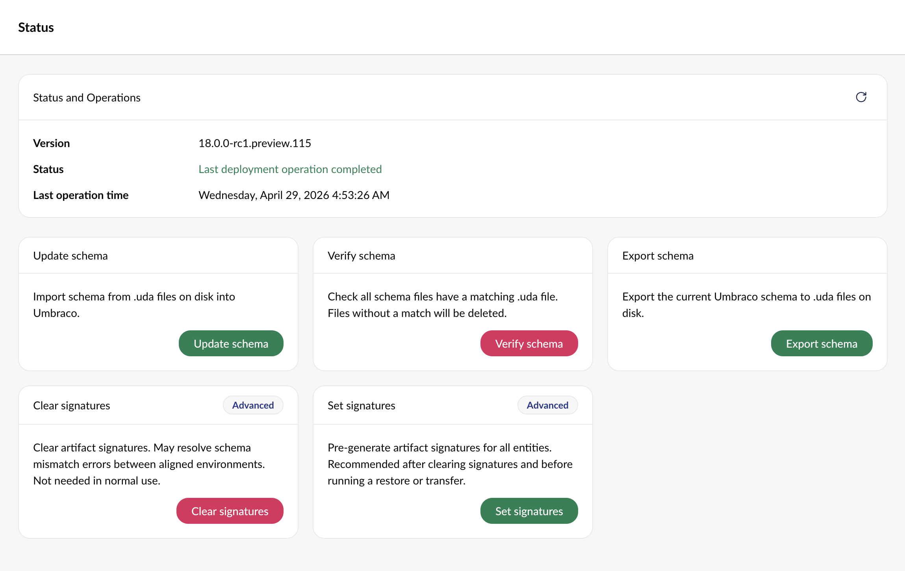
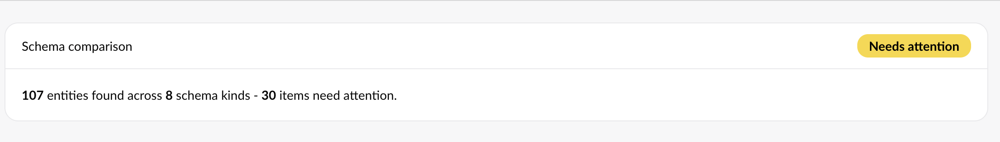
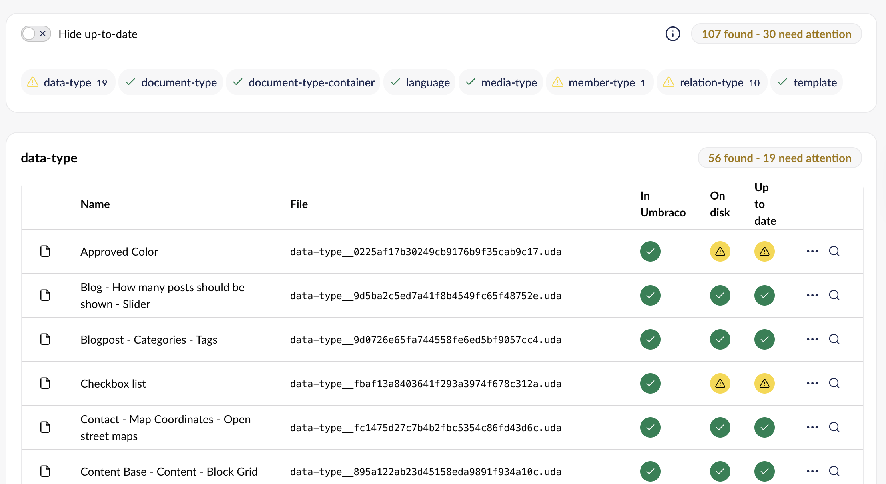
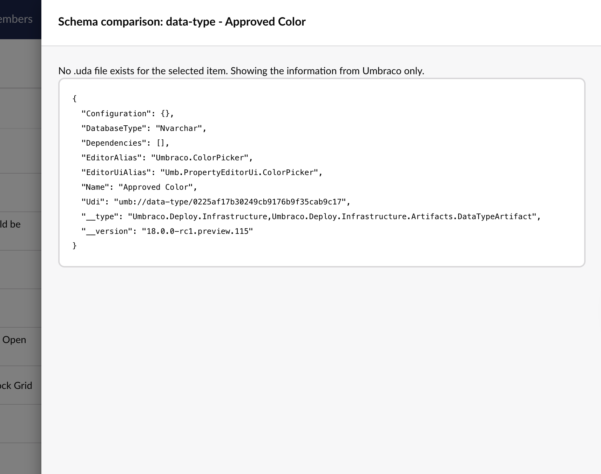
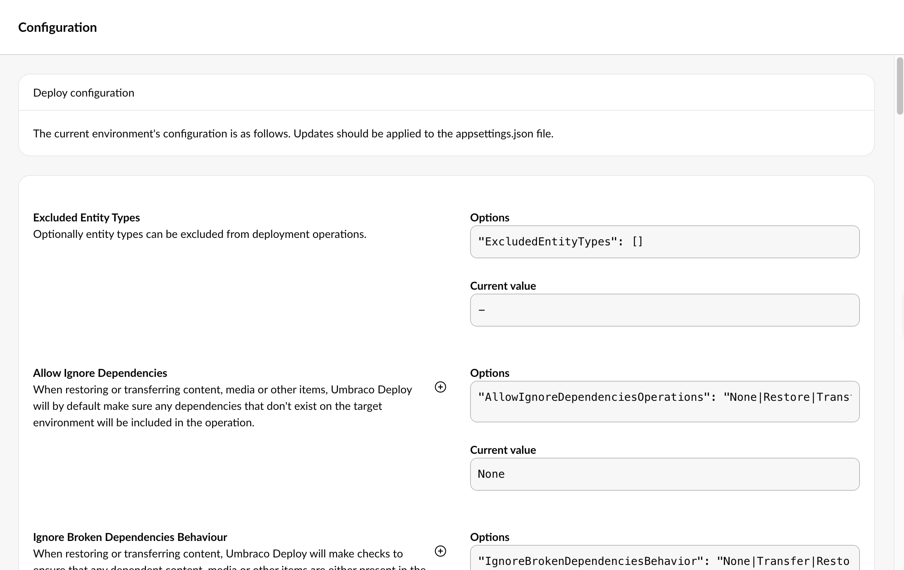

# Deploy Settings

In this article, we will show the different sections under Deploy in the Settings section and how they can be used.

## Status

Here, you can check whether the latest deployment was successful or failed. You can also see the version of Umbraco Deploy in use and the timestamp of the last operation.

### Deploy Operations

The Deploy operations provide the option to run different operations.

Below, you can read what each operation will do when run through the dashboard.

#### Update schema

Running this operation will update the Umbraco Schema based on the information in the `.uda` files on disk.

#### Verify schema

This operation deletes the schema from your current environment if it does not have a matching UDA file. It manually deletes each item in the Schema Comparison overview with an exclamation mark in the 'File Exists' column.

#### Export schema

Running this operation will extract the schema from Umbraco and output it to the `.uda` files on disk.

#### Clear signatures

Running this operation will clear the cached artifact signatures from the Umbraco environment. This should not be necessary; however, it may resolve reports of schema mismatches when transferring content that has been aligned.

#### Set signatures

This operation will set the cached artifact signatures for all entities within the Umbraco environment. Use this when signatures have been cleared, and you want to ensure they are pre-generated before attempting a potentially longer restore or transfer operation.

## Schema

On the Schema page, you get an overview of the state of the schema in your environment.

The first thing you'll see is a summary of the state of the schema. It'll show how many entities were found across how many entities, and it will also highlight if any items require attention.

<figure><figcaption></figcaption></figure>

The following table gives you a full comparison between the information that is held in Umbraco and the information in the `.uda` files on disk.

You have the option to hide the schema that is up-to-date, and use quick-links to zoom in on specific types of schema.

<figure><figcaption>
Document type schema comparison
</figcaption></figure>

The table shows:

* The name of the schema.
* The file name.
* Whether the item exists in Umbraco.
* Whether the file exists on disk.
* Whether the file is up-to-date.

You can also view details about a certain element by clicking on either the ellipses or the loop.

This will show the difference between entities stored in Umbraco and the `.uda` file stored on disk.

<figure><figcaption>
Showing a Schema Comparison for the Data Type Approved Color.
</figcaption></figure>

## Configuration

In the Configuration page, you can see how Deploy has been [configured](../getting-started/deploy-settings.md) for your environment. You get an overview of the configuration options, the current value(s), and notes that help you understand each of the settings. Updates need to be applied in the `appsettings.json` file.

<figure><figcaption>
Example of Umbraco Deploy configuration.
</figcaption></figure>
