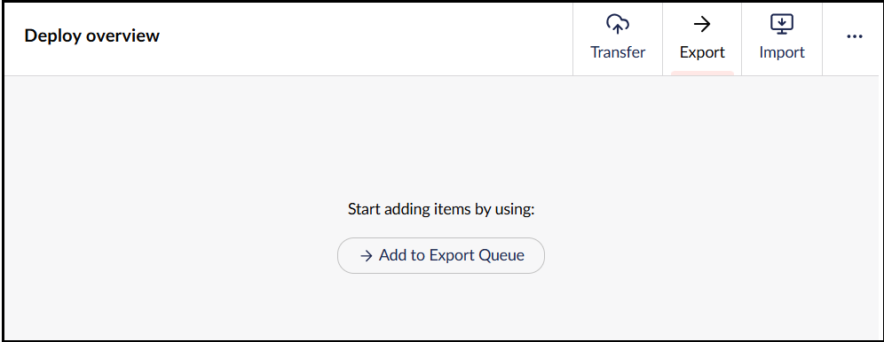
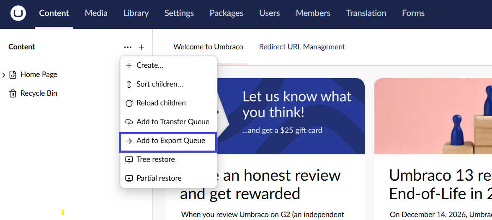
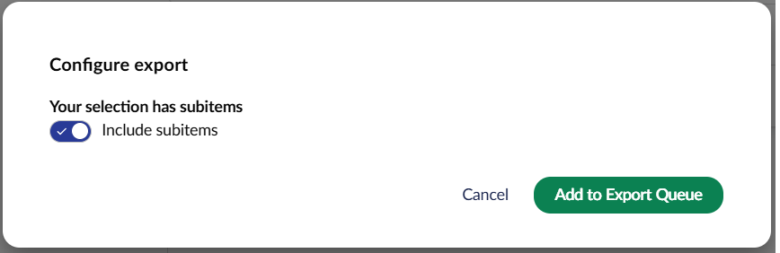
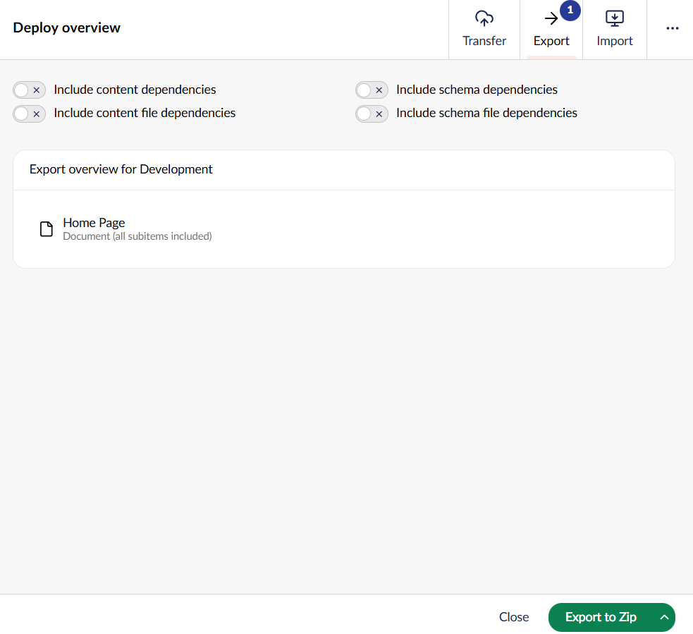
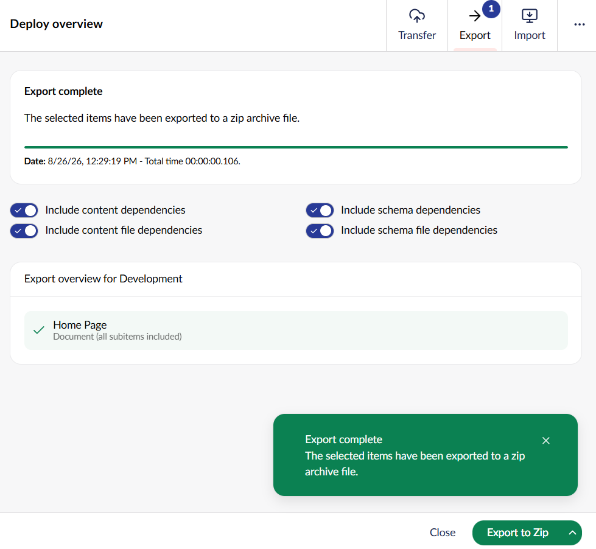
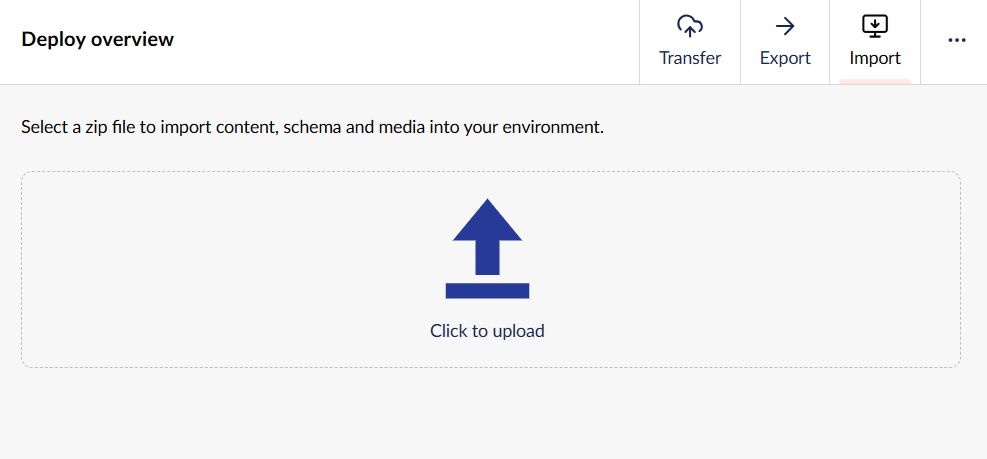
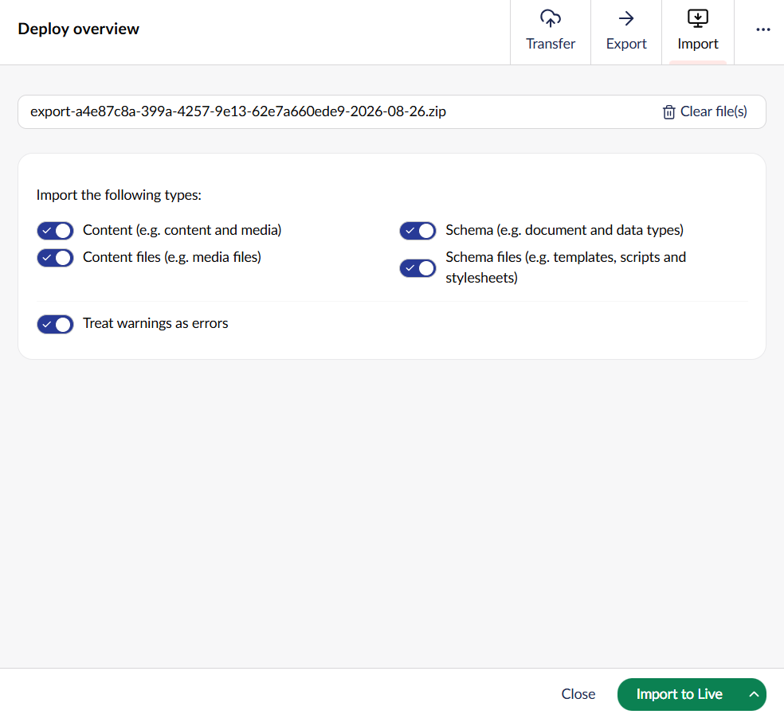
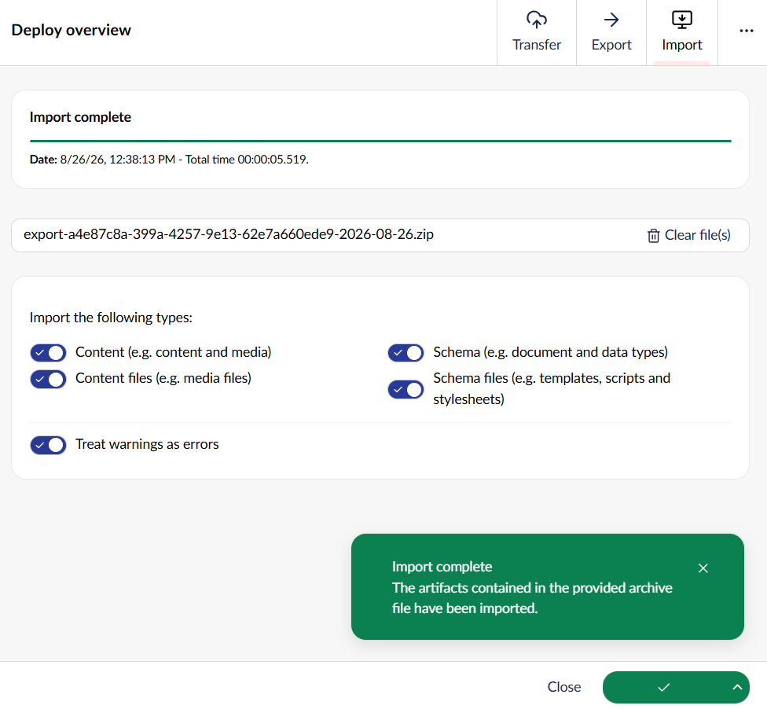
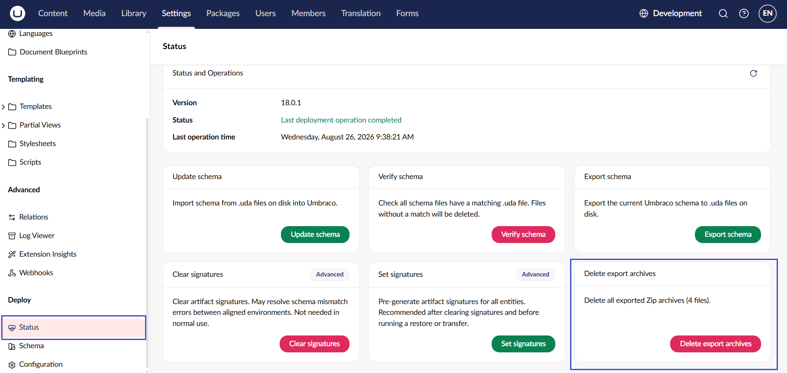
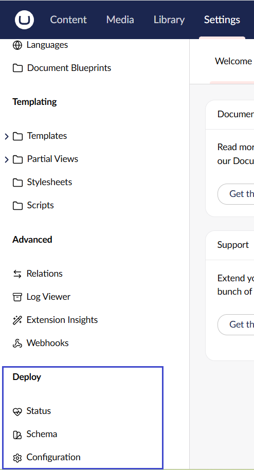

# Import and Export

## What is Import and Export?

The Import and Export feature of Umbraco Deploy allows you to transfer content and schema between Umbraco environments. A `.zip` file is exported from one environment and imported into another to update its Umbraco data.

## When to use import and export

Umbraco Deploy provides two primary workflows for managing different types of Umbraco data:

* Umbraco schema (such as document types and data types) are transferred [as `.uda` files serialized to disk](deploying-changes.md). They are deployed to refresh the schema information in a destination environment along with code and template updates.
* Umbraco content (such as content and media) are [transferred by editors using backoffice operations](content-transfer.md).

It is recommended to use these approaches for day-to-day editorial and developer activities.

Import and export is intended more for larger transfer options, project upgrades, or one-off tasks when setting up new environments.

As import and export is a two-step process, it doesn't require inter-environment communication. This allows to process much larger batches of information without running into hard limits imposed by Cloud hosting platforms.

Hooks are also provided to allow for migrations of artifacts (such as data types) and property data when importing. This should allow you to migrate your Umbraco data from one Umbraco major version to a newer one.

## Accessing import and export

In the top-right corner of the backoffice, click on the current environment name to view the **Deploy overview** panel.


**Import** and **Export** are part of the **Deploy overview** panel.



To export content and schema:

1. Select a specific content node, tree, or workspace you want to export.
2. Click the ... menu next to it.
3. Select **Add to Export Queue**.




The Add to Export Queue shown inside the Deploy overview panel is a label only. It does not queue anything by itself. Use the content node, tree, or workspace to add items.


## Exporting content and schema

To export content and schema, you can add it to the export queue as described above. If the selection has subitems, a **Configure export** dialog appears, letting you choose whether to **Include subitems**.



When exporting an environment, you can include all schema, regardless of whether any content uses it.

Once an item has been successfully queued, a confirmation message is shown. For example: *[Item name] and its descendants have been successfully added to the export queue.*

Open the **Export** tab of the **Deploy overview** panel to review the queue. From here you can:

* Toggle **Include content dependencies**, **Include content file dependencies**, **Include schema dependencies**, and **Include schema file dependencies**.
* Remove individual items from the queue, or clear the whole queue using the dropdown next to Export to Zip.



Remember that including content file dependencies (media files) for a large site can lead to a big zip file. So even with this option, you might want to consider a different method for transferring large amounts of media. For example using direct transfer between Cloud storage accounts or File Transfer Protocol (FTP).

Select **Export to Zip** to run the export. Umbraco Deploy serializes all the selected items to individual files and archives them into a zip file. It shows an **Export complete** confirmation with the date and total time taken.




The exported archive files are saved to the Umbraco temp folder in the `Deploy\Export` sub-directory. This is a temporary (non-persistent) location, local to the backoffice server. It therefore shouldn't be used for long-term storage of exports.


## Importing content and schema

Having previously exported content and schema to a zip file, you can import this into a new environment. Use the **Import** tab in the **Deploy overview** panel.

Select **Click to upload** and choose the exported **.zip** file.




Deploy does not touch the default maximum upload size, but you can [configure this yourself by following the CMS documentation](https://docs.umbraco.com/umbraco-cms/reference/configuration/maximumuploadsizesettings). On Umbraco Cloud, the upload size limit is 500 MB.


Once a file is selected, you can choose which parts of the archive to import:

* Content (for example, content and media)
* Content files (for example, media files)
* Schema (for example, document and data types)
* Schema files (for example, templates, scripts, and stylesheets)
* Treat warnings as errors



The files are validated before importing. Schema items that content depends on must either be in the upload itself or already exist on the target environment with the same details. If there are any issues that mean the import cannot proceed, it will be reported. You may also be given warnings for review. You can choose to ignore these and proceed if they aren't relevant to the action you are carrying out.

Select **Import to [environment name]** to start the import. Progress is shown as artifacts are processed, followed by an **Import complete** confirmation with date and duration.



## Cleaning up export archives

Export archive files should be removed after use, since they are stored temporarily on the backoffice server.

If this is missed, go to **Settings** → **Deploy** → **Status** and select **Delete export archives** to remove all exported zip archives at once.



## The Deploy dashboard in Settings

If your account has access to the **Settings** section, a **Deploy** area is available in the **Settings** tree. It contains:

* **Status**: Shows the current Deploy version, last operation status and time, and action cards for **Update schema**, **Verify schema**, **Export schema**, **Clear signatures**, **Set signatures**, and **Delete export archives**.
* **Schema**: A schema comparison table across all schema kinds (Data Type, Document Type, Language, Media Type, Member Type, Relation Type, Template), showing whether each entity is **In Umbraco**, **On disk**, and **Up to date**.
* **Configuration**: A read-only view of the current environment's Deploy configuration (for example, **Excluded Entity Types**, **Allow Ignore Dependencies**, and so on). Changes must be made in `appsettings.json` file. This page is for reference only.



## Migrating whilst importing

It is possible to migrate schema and content whilst importing. For example, to change Data Type using Nested Content to Block List and ensure content data is imported to the correct Block Editor format.

Deploy contains base classes and implementations to handle common migrations that need to be registered in code, as explained in [Import with migrations](import-with-migrations.md).

### Migrating from Umbraco 7

The import and export feature is not available in Deploy 2 for Umbraco 7. A package has been released to allow creating an export. This needs to be done in code and requires additional legacy migrators to be able to import into a newer version. This is explained in [Migrating from Umbraco 7](import-export-v7.md).

## Service details (programmatically importing and exporting)

Underlying the functionality of import/export with Deploy is the import/export service, defined by the `IArtifactImportExportService`.

You may have need to make use of this service directly if building something custom with the feature. For example you might want to import from or export to some custom storage.

The service interface defines two methods:

* `ExportArtifactsAsync` - takes a collection of artifacts and a storage provider defined by the `IArtifactExportProvider` interface. The artifacts are serialized and exported to storage.
  * `IArtifactExportProvider` defines methods for creating streams for writing serialized artifacts or files handled by Deploy (media, templates, stylesheets etc.).
* `ImportArtifactsAsync` - takes storage provider containing an import defined by the `IArtifactImportProvider` interface. The artifacts from storage are imported into Umbraco.
  * `IArtifactImportProvider` defines methods for creating streams for reading serialized artifacts or files handled by Deploy (media, templates, stylesheets etc.).

Implementations for `IArtifactExportProvider` and `IArtifactImportProvider` are provided for:

* A physical directory.
* An Umbraco file system.
* A zip file.

These are all accessible for use via extension methods available on `IArtifactImportExportService` found in the `Umbraco.Deploy.Infrastructure.Extensions` namespace.

The following example shows this service in use, importing and exporting from a zip file on startup:

<details>

<summary><code>ArtifactImportExportComposer.cs</code> (import and export on startup)</summary>

```csharp
using System.IO.Compression;
using Umbraco.Cms.Core;
using Umbraco.Cms.Core.Composing;
using Umbraco.Cms.Core.Deploy;
using Umbraco.Cms.Core.Events;
using Umbraco.Cms.Core.Extensions;
using Umbraco.Cms.Core.Notifications;
using Umbraco.Deploy.Core;
using Umbraco.Deploy.Core.Connectors.ServiceConnectors;
using Umbraco.Deploy.Infrastructure;
using Umbraco.Deploy.Infrastructure.Extensions;
​
internal class ArtifactImportExportComposer : IComposer
{
    public void Compose(IUmbracoBuilder builder)
        => builder.AddNotificationAsyncHandler<UmbracoApplicationStartedNotification, ArtifactImportExportStartedAsyncHandler>();
​
    private sealed class ArtifactImportExportStartedAsyncHandler : INotificationAsyncHandler<UmbracoApplicationStartedNotification>
    {
        private readonly IHostEnvironment _hostEnvironment;
        private readonly IArtifactImportExportService _diskImportExportService;
        private readonly IServiceConnectorFactory _serviceConnectorFactory;
        private readonly IFileTypeCollection _fileTypeCollection;
​
        public ArtifactImportExportStartedAsyncHandler(IHostEnvironment hostEnvironment, IArtifactImportExportService diskImportExportService, IServiceConnectorFactory serviceConnectorFactory, IFileTypeCollection fileTypeCollection)
        {
            _hostEnvironment = hostEnvironment;
            _diskImportExportService = diskImportExportService;
            _serviceConnectorFactory = serviceConnectorFactory;
            _fileTypeCollection = fileTypeCollection;
        }
​
        public async Task HandleAsync(UmbracoApplicationStartedNotification notification, CancellationToken cancellationToken)
        {
            var deployPath = _hostEnvironment.MapPathContentRoot(Constants.SystemDirectories.Data + "/Deploy");
            await ImportAsync(Path.Combine(deployPath, "import.zip"));
​
            Directory.CreateDirectory(deployPath);
            await ExportAsync(Path.Combine(deployPath, $"export-{DateTimeOffset.UtcNow.ToUnixTimeSeconds()}.zip"));
        }
​
        private async Task ImportAsync(string zipFilePath)
        {
            if (File.Exists(zipFilePath))
            {
                using ZipArchive zipArchive = ZipFile.OpenRead(zipFilePath);
                await _diskImportExportService.ImportArtifactsAsync(zipArchive);
            }
        }
​
        private async Task ExportAsync(string zipFilePath)
        {
            using ZipArchive zipArchive = ZipFile.Open(zipFilePath, ZipArchiveMode.Create);
​
            IEnumerable<Udi> udis = DeployEntityTypes.GetEntityTypes(_fileTypeCollection, DeployEntityTypeCategories.ContentAndSchema).Select(Udi.Create);
            var contextCache = new DictionaryCache();
            string[] dependencyEntityTypes = DeployEntityTypes.GetEntityTypes(_fileTypeCollection, DeployEntityTypeCategories.All);
​
            await _diskImportExportService.ExportArtifactsAsync(_serviceConnectorFactory, udis, Constants.DeploySelector.ThisAndDescendants, contextCache, zipArchive, dependencyEntityTypes: dependencyEntityTypes);
        }
    }
}
```

</details>
