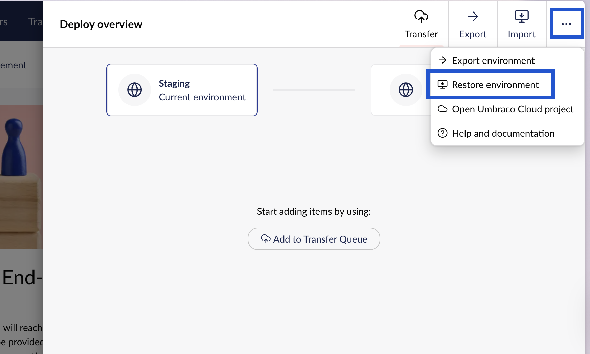
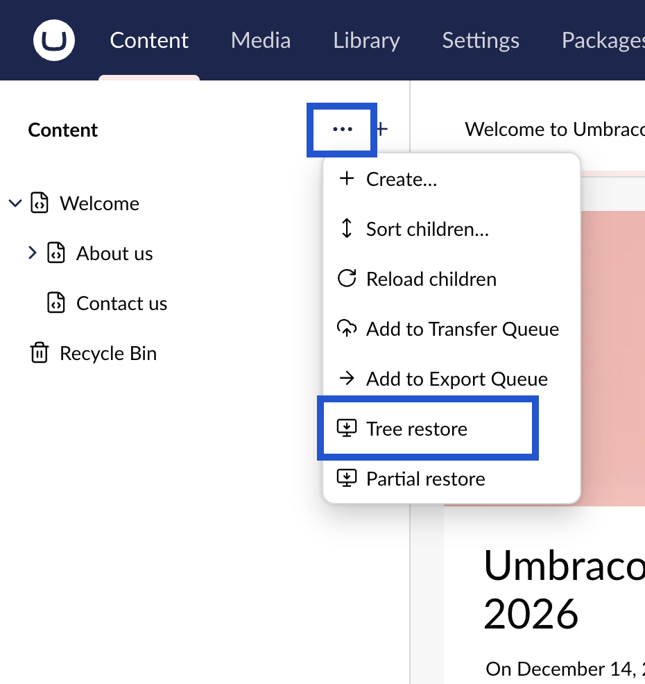

# Restore Items

If your environment already contains content, you need one extra step after cloning your Umbraco project locally.

Restore options are also useful when you have content editors creating content on different environments. You will be able to restore and work with that content on your different environments and locally.

To ensure the restore will succeed, [make sure that your environments have the same metadata and structure files](deploying-changes.md).

There are three options for restoring content:

1. [Restore Environment](restoring-content.md#restore-environment)
2. [Tree Restore](restoring-content.md#tree-restore)
3. [Partial Restore](restoring-content.md#partial-restore)


Restoring content, media, and forms will overwrite any items on the target that also exist in the source. However, it will not delete items that exist on the target but are missing from the source. This is a safety feature to prevent accidental data loss. To achieve a true mirror and remove orphaned items, manually empty the relevant sections, including the Recycle Bins, on the target environment. You can also use the [Import and Export](import-export.md) feature with a full export from the source environment.


## Restore Environment

It is possible to do a full restore of **all** content and media on your project. This is useful on a new instance or clone of your project.

The full environment restore can be done in two ways:

1. [As part of project initialization.](restoring-content.md#as-part-of-project-initialization)
2. [Via the Deploy Overview in the backoffice.](restoring-content.md#via-the-deploy-overview-in-the-backoffice)

### As part of project initialization

The first time you run your project locally, you will have the option to restore your content and media before going to the Umbraco backoffice.

1. Click the green **Restore** button that appears when spinning up your site locally for the first time.
   1. This will restore all content, media, and forms for the project.
2. Wait till the process completes - this might take a while, depending on the amount of content and media you have on your Umbraco site.
3. Select **Open Umbraco** to go to the backoffice.

You will now see all your content and media in the Umbraco backoffice.

### Via the Deploy Overview in the Backoffice

You can use this option on an empty environment or one that already contains content and media. Any restored items will overwrite the existing ones.

1. Click on the **Environment name** in the top-right corner to open the **Deploy Overview**.
2. Click on the ellipses in the top-right corner.

<figure><figcaption></figcaption></figure>

3. Choose **Restore environment** from the menu.
4. Use the dropdown to select the environment you want to restore from.
5. Click **Restore from \[environment name]** to initiate the restore.

When completed, you will see your content reflected in the Content section and the media in the Media section.


In some cases, it might be necessary to refresh the browser window to see the restored items in the backoffice.


## Tree Restore

Tree Restore lets you restore a single tree, like just the content tree or just the Media tree.

For example, if triggered from the content tree, only the content items will be restored. Only referenced (dependencies) elements, media, and forms will be included in the restore.

1. Click the ellipses next to the tree title (Content, Media, Elements, or Forms).
2. Choose **Tree restore** from the menu.

<figure><figcaption></figcaption></figure>

3. Use the dropdown to select the environment you want to restore from.
4. Click **Restore from \[environment name]** to initiate the restore.

When completed, click on the ellipses next to the tree title again and choose **Reload**.&#x20;

## Partial Restore

In some cases, you might not want to restore the entire content tree, but only the parts that you need. **Partial restores** let you restore specific parts of your content instead of everything.

You can use Partial Restore on:

* [Empty environments](restoring-content.md#empty-environment)
* [Environments with existing content or media](restoring-content.md#environment-with-existing-content-or-media)

### Empty environment

In this scenario, you've cloned your environment to your local machine or set up a new environment. The new environment has an empty Content section and empty Forms and Media sections.

Instead of restoring everything, you can restore only what you need and save time.


This feature also restores all dependencies of the selected item.

For example, restoring a content item that references media, elements, or other content will also restore those items, including any ancestors they depend on.


Follow these steps to perform a partial restore to get only the parts you need:

1. Click the ellipses next to the tree title (Content, Media, Elements, or Forms).
2. Choose **Partial Restore**.
3. Select the environment that you would like to restore from.
4. Click **Select content to restore.**
   1. This will open a dialog with a _preview of the content tree_ from the environment you selected.
5. Select the items you would like to restore.
6. Choose whether to restore any available subitems.
7. Click **Restore** to start restoring the items.

To see the restored content, reload the content tree. Click the ellipses next to the tree title, then choose _Reload_.


Keep in mind that if you select an item with ancestors/parents, all the ancestors above it, required for the item to exist, are restored as well.


### Environment with existing content or media

It is possible to use the Partial Restore feature on environments where you already have content and media in place.

For example, you might be working on your project locall. One of your content editors updates a section in the content tree on the production environment. You would like to see how this updated content looks with the new code you are working on.

Follow these steps to do a Partial Restore of the updated content node:

1. Click ellipses next to the item you want to restore.
2. Choose **Partial Restore**.
3. Select the environment that you would like to restore content from.
4. Choose whether to restore any available subitems.
5. Click **Restore** to start restoring the items.

When the restore is done, reload the tree to see the changes.

## Media on Umbraco Cloud

On Umbraco Cloud, each environment uses a separate Azure Blob Storage container. During a restore, Umbraco Deploy handles the server-side copying of blobs between the unique storage containers of each environment. For more details, see the [Media on Cloud](https://docs.umbraco.com/umbraco-cloud/build-and-customize-your-solution/handle-deployments-and-environments/media) article.
